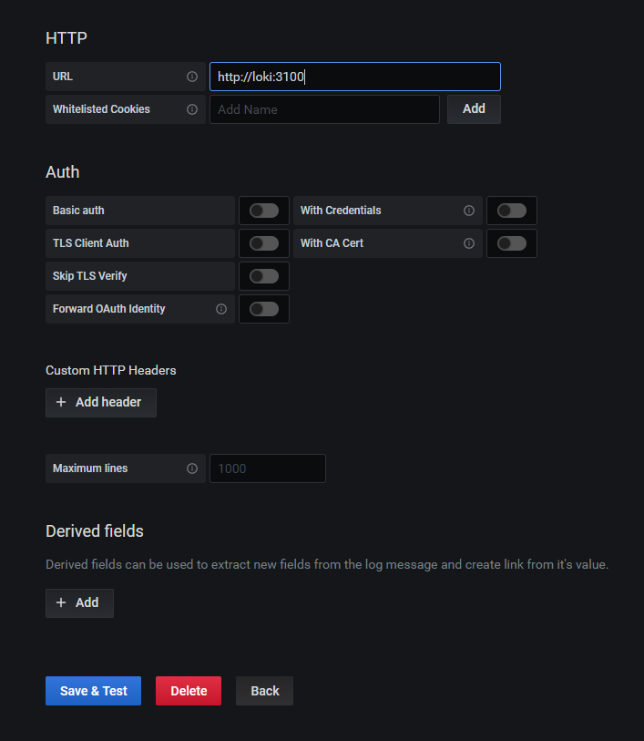
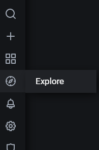
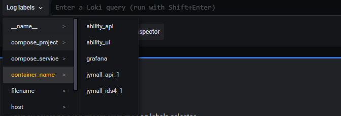

## 收集docker-compose方式部署的docker容器的日志到loki再到granafa


#### 1、安装docker插件

> 主要是让docker认识loki的日志驱动

```shell
docker plugin install registry.docker.com/grafana/loki-docker-driver:main --alias loki --grant-all-permissions
```


#### 2、查看上面的docker插件是否安装成功并启用

```shell
 docker plugin ls
```


#### 3、修改部署的docker-compose.yaml文件

```yaml
version: "3.7"
services:
  charge:
    build:
      context: ./charge
      dockerfile: Dockerfile
    ports:
      - 192.168.0.177:11011:11011
    #      - 8095:8095
    #      - 9095:9095
    restart: always
    container_name: charge
    environment:
      DB_HOST: 121.229.28.212
      DB_PORT: 13306
      DB_NAME: fast-parking
      DB_USERNAME: root
      DB_PASSWORD: xsdfopNdfret
      REDIS_HOST: 121.229.28.212
      REDIS_PORT: 16379
      REDIS_PASSWORD: ZhjsfiortLKsf
    logging:
      driver: loki #docker的日志驱动选择loki
      options:
        loki-url: "http://192.168.0.69:3100/loki/api/v1/push" #这儿会自动将docker的日志往目标地址扔
        max-size: "2g" #日志文件一个最大2g
        max-file: "2" # 日志保留2个文件
```


#### 4、grafana中集成loki

到Add DataSource中新增loki到granafa








就可以找到对应的container的名称，然后去查看日志了！