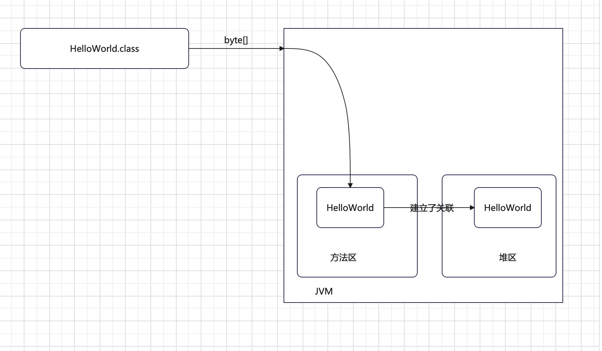

## ClassDefinition类的作用

> 只需要了解即可，我们后续一般都用javassist，不用这个。

#### 1、ClassDefinition类是对CLass和byte[]两个字段的封装

```java
package java.lang.instrument;

public final class ClassDefinition {
    private final Class<?> mClass;
    private final byte[] mClassFile;
}
```


#### 2、ClassDefinition的作用

首先，我们理解一个类被加载到JVM中是如何存放的,如下图




当HelloWorld.class文件被JVM加载到内存中后，.class的byte[]数据被存储到了方法区的一个固定地方，同时被其他类加载，肯定也要在堆区放一个对象。


当我们使用java agent要对HelloWorld.class中的某一个方法进行修改，就需要先构建一个ClassDefinition对象，其中ClassDefinition对象中的`mClass`就是从堆区中读取到的HelloWorld对象、`mClassFile`就是需要修改的内容写到对应类对应的方法区中的字节内容。为什么能写进去呢？因为方法区的内容跟堆区的内容是建立了关联的！