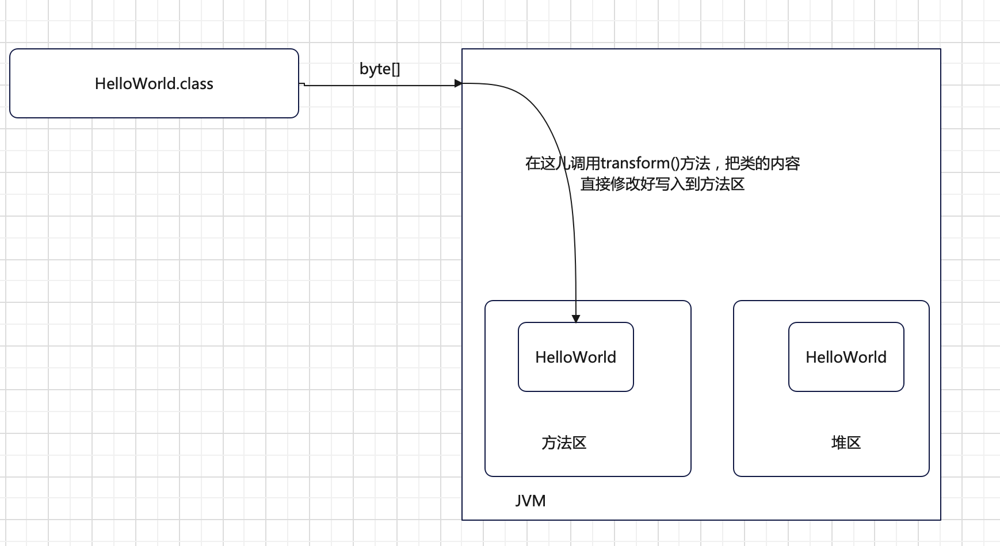
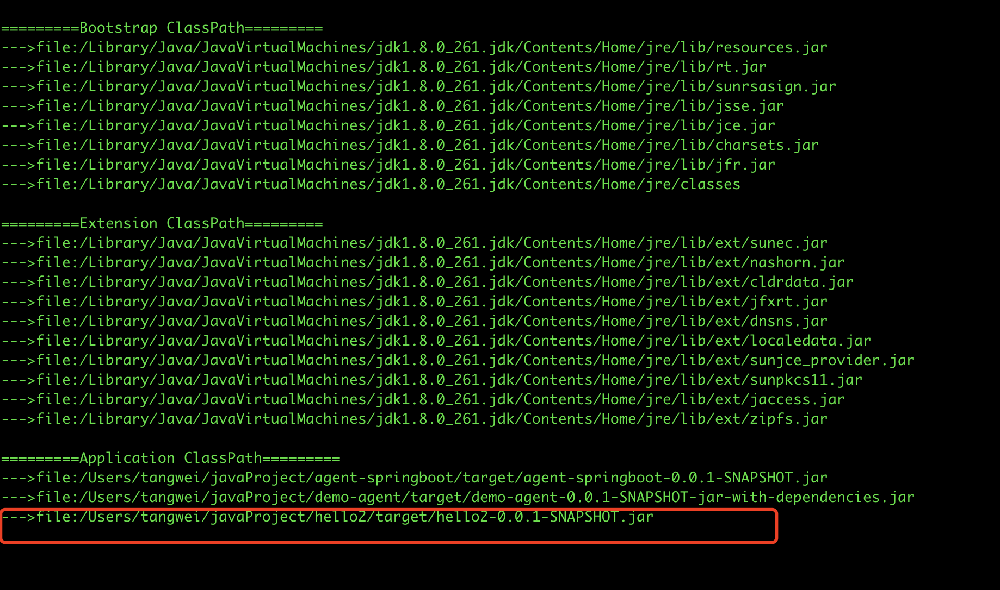
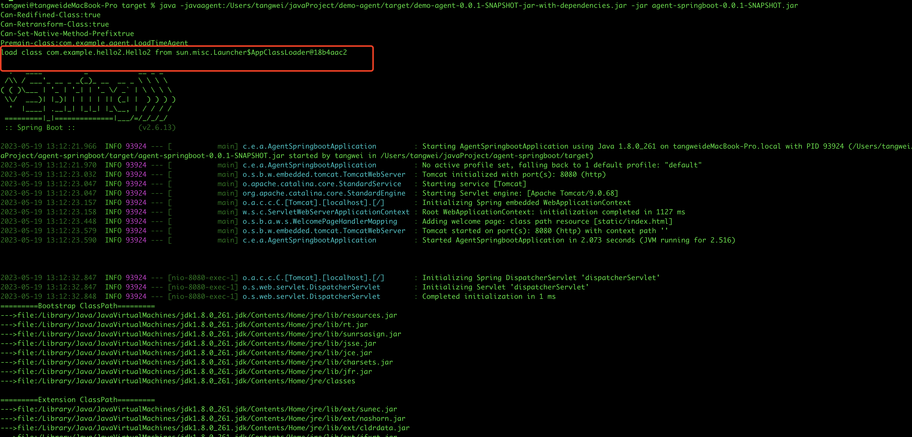

## Instrumentation接口的作用


#### 1、isXxxSupported()方法

有如下几个方法

```java
public interface Instrumentation {
    boolean isRedefineClassesSupported();
    boolean isRetransformClassesSupported();
    boolean isNativeMethodPrefixSupported();
}
```

- isRedefineClassesSupported()方法，首先判断JVM本身是否支持RedefineClass，然后再判断agent jar中设置的(pom文件中设置的)`Can-Redefine-Classes`参数是否支持RedefineClass。
- isRetransformClassesSupported()方法，首先判断JVM本身是否支持RetransformClass，然后再判断agent jar中设置的(pom文件中设置的)`Can-Redefine-Classes`参数是否支持RetransformClass。
- isNativeMethodPrefixSupported()方法，首先判断JVM本身是否支持NativeMethodPrefix，然后再判断agent jar中设置的(pom文件中设置的)`Can-Set-Native-Method-Prefix`参数是否支持NativeMethodPrefix。


示例：

```java
public class LoadTimeAgent {

    public static void premain(String agentArgs, Instrumentation inst){
        System.out.println("Can-Redifined-Class:" + inst.isRedefineClassesSupported());
        System.out.println("Can-Retransform-Class:" + inst.isRetransformClassesSupported());
        System.out.println("Can-Set-Native-Method-Prefix" + inst.isNativeMethodPrefixSupported());

        System.out.println("Premain-class:" + LoadTimeAgent.class.getName());
        System.out.println("agentArgs:" + agentArgs);
        ClassFileTransformer transformer = new InfoTransformer();
        inst.addTransformer(transformer);//将指定的ClassFileTransformer加入到agent中
    }

}
```


#### 2、xxxTransformer()方法

有如下几个方法

```java
public interface Instrumentation {
    void addTransformer(ClassFileTransformer transformer);
    void addTransformer(ClassFileTransformer transformer, boolean canRetransform);
    boolean removeTransformer(ClassFileTransformer transformer);
}
```


- addTransformer()方法，有如下两个具体的方法

  ```java
  void addTransformer(ClassFileTransformer transformer);//这样使用，就相当于下面的方法，不过canRetransform默认传入的false
  
  
  void addTransformer(ClassFileTransformer transformer, boolean canRetransform);
  ```

  addTransformer()方法的具体实现可以去看InstrumentationImpl类重写的addTransformer()方法。

  <font color="red">如果上面的`canRetransform`为true，我们将加入的ClassFileTransformer会成为`retransformation capable transformer`， 如果为fasle，我们将加入的ClassFileTransformer会成为`retransformation incapable transformer`</font>
  
  


被加入的ClassFileTransformer的transform()方法的执行时机：

1. 需要被transform的类正在被加载，在Load-Time Agent模式下<font color="red">自动</font>调用`ClassLoad.defineClass`方法的时候，即如下图：

   

2. 需要被transform的类已经加载，手动调用`Instrumentation.redefineClasses`方法的时候

   

3. 需要被transform的类已经加载，手动调用`Instrumentation.retransformClasses`方法的时候

   


- removeTransformer()方法，移除transformer。


#### 3、redefineClasses()方法

作用是重新定义一个类

> 我们一般不用，后面我们使用javassist，不用这个东西，只需要了解有这个用法！

```java
public interface Instrumentation {
    void redefineClasses(ClassDefinition... definitions)
        throws ClassNotFoundException, UnmodifiableClassException;
}
```

注意传入参数是一个或多个ClassDefinition对象。


redefineClasses的使用实例

>  在Load-Time agent的模式下，以入门中的项目为例。

第一步：在agent中定义Hello类

```java
public class Hello {

    @Override
    public String toString() {
        return "Hello";
    }
}
```

然后对agent项目进行编译打包，将Hello.class文件拷贝到一个固定目录中，这一步只是为了得到一个.class文件


第二步：到springboot中定义Hello类的代码

```java
public class Hello {

    @Override
    public String toString() {
        return "Hello2";
    }
}
```

<font color="red">注意：两个Hello类，虽然在2个不同的项目中，但是要确保他们的类路径一致！</font>


第三步：到springboot项目中，新增一个类，内容如下：

```java
@RestController
public class HelloWorldController {

    @GetMapping("/index")
    public void index() throws InterruptedException {

        Hello obj = new Hello();
        System.out.println(obj);
    }
}
```


第四步：编译打包springboot项目，至此，springboot项目操作完毕


第五步：到agent中编写替换Hello类的代码

```java
package com.example.agent;

import java.io.ByteArrayOutputStream;
import java.io.File;
import java.io.FileInputStream;
import java.io.InputStream;
import java.lang.instrument.ClassDefinition;
import java.lang.instrument.Instrumentation;

/**
 * @Auther: tangwei
 * @Date: 2023/5/6 12:41 PM
 * @Description: 类描述信息
 */
public class LoadTimeAgent {

    public static void premain(String agentArgs, Instrumentation inst) throws ClassNotFoundException {
        System.out.println("Can-Redifined-Class:" + inst.isRedefineClassesSupported());
        System.out.println("Can-Retransform-Class:" + inst.isRetransformClassesSupported());
        System.out.println("Can-Set-Native-Method-Prefix" + inst.isNativeMethodPrefixSupported());

        System.out.println("Premain-class:" + LoadTimeAgent.class.getName());

        try {
            Class<?> clazz = Class.forName("com.example.Hello");
            if (inst.isModifiableClass(clazz)) {
              
                //读取我们在第一步生成的Object.class文件的二进制内容
                byte[] bytes = loadClassData("/Users/tangwei/javaProject/demo-agent/Hello.class");
              
                //对Object.class进行重定义，创建ClassDefinition对象，
                ClassDefinition classDefinition = new ClassDefinition(clazz, bytes);
              	//将Hello类的二进制内容，重写到JVM中。
                inst.redefineClasses(classDefinition);
            }
        } catch (Exception e) {
            e.printStackTrace();
        }
    }

  	//读取.class文件到byte[]中
    private static byte[] loadClassData(String target) {
        InputStream is = null;
        byte[] bytes = null;
        ByteArrayOutputStream os = null;
        int len;
        try {
            is = new FileInputStream(new File(target));
            os = new ByteArrayOutputStream();
            while (-1 != (len = is.read())) {
                os.write(len);
            }
            bytes = os.toByteArray();
        } catch (Exception e) {
            e.printStackTrace();
        }
        return bytes;
    }

}


```


第六步：再次打包agent项目


第七步：使用如下命令带上agent启动springboot项目

```shell
java -javaagent:/Users/tangwei/javaProject/demo-agent/target/demo-agent-0.0.1-SNAPSHOT-jar-with-dependencies.jar -jar agent-springboot-0.0.1-SNAPSHOT.jar
```


第八步：访问springboot的/index路径，看看输出的是什么？

我明明在springboot项目的/index路径下，输出的是Hello2，但是经过探针改成了Hello了！证明探针生效了！


#### 4、retransformClasses()方法

作用是修改一个类的部分代码

> 一般不用这个，后面我们使用javassist，所以这儿只需要了解即可

```java
public interface Instrumentation {
    void retransformClasses(Class<?>... classes) throws UnmodifiableClassException;
}
```

注意传入的参数是 一个或多个Class。


retransformClasses的使用示例

第一步：在agent中定义Hello类

```java
public class Hello {

    @Override
    public String toString() {
        return "Hello";
    }
}
```

然后对agent项目进行编译打包，将Hello.class文件拷贝到一个固定目录中，这一步只是为了得到一个.class文件


第二步：到springboot中定义Hello类的代码

```java
public class Hello {

    @Override
    public String toString() {
        return "Hello2";
    }
}
```

<font color="red">注意：两个Hello类，虽然在2个不同的项目中，但是要确保他们的类路径一致！</font>


第三步：到springboot项目中，新增一个类，内容如下：

```java
@RestController
public class HelloWorldController {

    @GetMapping("/index")
    public void index() throws InterruptedException {

        Hello obj = new Hello();
        System.out.println(obj);
    }
}
```


第四步：编译打包springboot项目，至此，springboot项目操作完毕


第五步：到agent中新增一个ClassFileTransformer的实现类，代码如下：

```java
package com.example.agent;
import java.io.ByteArrayOutputStream;
import java.io.File;
import java.io.FileInputStream;
import java.io.InputStream;
import java.lang.instrument.ClassDefinition;
import java.lang.instrument.ClassFileTransformer;
import java.lang.instrument.IllegalClassFormatException;
import java.security.ProtectionDomain;

/**
 * @Auther: tangwei
 * @Date: 2023/5/6 12:42 PM
 * @Description: 类描述信息
 */
public class InfoTransformer implements ClassFileTransformer {
    private String internalClassName;

    public InfoTransformer(String clazz){
        this.internalClassName = clazz.replace(".", "/");
    }


    public byte[] transform(ClassLoader loader, String className, Class<?> classBeingRedefined, ProtectionDomain protectionDomain, byte[] classfileBuffer) throws IllegalClassFormatException {

        if (className.equals(this.internalClassName)){
            System.out.println("className:" + className);
          	//加载第一步中准备好的.class字节码文件
            return loadClassData("/Users/tangwei/javaProject/demo-agent/Hello.class");
        }

        return null;
    }

    private byte[] loadClassData(String target) {
        InputStream is = null;
        byte[] bytes = null;
        ByteArrayOutputStream os = null;
        int len;
        try {
            is = new FileInputStream(new File(target));
            os = new ByteArrayOutputStream();
            while (-1 != (len = is.read())) {
                os.write(len);
            }
            bytes = os.toByteArray();
        } catch (Exception e) {
            e.printStackTrace();
        }
        return bytes;
    }
}

```


第六步：到agent中，加载agent的逻辑

```java
package com.example.agent;

import java.io.ByteArrayOutputStream;
import java.io.File;
import java.io.FileInputStream;
import java.io.InputStream;
import java.lang.instrument.ClassDefinition;
import java.lang.instrument.Instrumentation;
import java.util.ArrayList;
import java.util.HashMap;
import java.util.List;
import java.util.Map;

/**
 * @Auther: tangwei
 * @Date: 2023/5/9 1:42 PM
 * @Description: 类描述信息
 */
public class DynamicAgent {

    public static void agentmain(String agentArgs, Instrumentation inst) {
        System.out.println("Can-Redifined-Class:" + inst.isRedefineClassesSupported());
        System.out.println("Can-Retransform-Class:" + inst.isRetransformClassesSupported());
        System.out.println("Can-Set-Native-Method-Prefix" + inst.isNativeMethodPrefixSupported());

        System.out.println("Agent-class:" + DynamicAgent.class.getName());

        String classname = "com.example.Hello";

        InfoTransformer infoTransformer = new InfoTransformer(classname);
        inst.addTransformer(infoTransformer, true);

        try {
            Class<?> clazz = Class.forName(classname);
            if (inst.isModifiableClass(clazz)) {
                inst.retransformClasses(clazz);

            }
        } catch (Exception e) {
            e.printStackTrace();
        }
    }

    private static byte[] loadClassData(String target) {
        InputStream is = null;
        byte[] bytes = null;
        ByteArrayOutputStream os = null;
        int len;
        try {
            is = new FileInputStream(new File(target));
            os = new ByteArrayOutputStream();
            while (-1 != (len = is.read())) {
                os.write(len);
            }
            bytes = os.toByteArray();
        } catch (Exception e) {
            e.printStackTrace();
        }
        return bytes;
    }

}
```

第七步：再次打包agent项目


第八步：使用如下命令带上agent启动springboot项目

```shell
java -javaagent:/Users/tangwei/javaProject/demo-agent/target/demo-agent-0.0.1-SNAPSHOT-jar-with-dependencies.jar -jar agent-springboot-0.0.1-SNAPSHOT.jar
```


第九步：访问springboot的/index路径，看看输出的是什么？

我明明在springboot项目的/index路径下，输出的是Hello2，但是经过探针改成了Hello了！证明探针生效了！


#### 5、getAllLoadedClasses()方法

获取**所有已经加载的类**；功能虽然强大，但是要慎重使用，因为它花费的时间也比较多。

有的时候，我们要找到某个类，就想调用`getAllLoadedClasses()`方法，然后遍历查找，这样的执行效率会比较低。如果我们明确的知道要找某个类，可以直接使用`Class.forName()`方法。


#### 6、getInitiatedClasses()方法

获取由某一个initiating class loader已经加载的类

使用示例：

```java
 // 第三步，查看加载的类
ClassLoader systemClassLoader = ClassLoader.getSystemClassLoader();
Class<?>[] initiatedClasses = inst.getInitiatedClasses(systemClassLoader);
```


#### 7、isModifiableClass()方法

判断某一个Class是否可以被修改。因为**Primitive classes**和**array classes**是不能被修改的。

要对一个已经加载的类进行修改，需要考虑四个因素：

- 第一，JVM是否支持？
- 第二，Agent Jar是否支持？在`MANIFEST.MF`文件中，是否将`Can-Redefine-Classes`和`Can-Retransform-Classes`设置为`true`？
- 第三，`Instrumentation`和`ClassFileTransformer`是否支持？是否将`addTransformer(ClassFileTransformer transformer, boolean canRetransform)`的`canRetransform`参数设置为`true`？
- 第四，当前的Class是否为可修改的？`boolean isModifiableClass(Class<?> theClass)`是否返回`true`？


#### 8、getObjectSize()方法

获取一个对象的内存占用大小，注意，得到的是一个粗略的对象大小，不同的虚拟机实现可能是不同的。


#### 9、appendToXxxClassLoaderSearch()方法

当系统中需要用到某个jar包中的某个类的时候，我们如果不写在pom文件中，可以通过这种方式，将jar包添加到项目的classpath中，然后就可以加载jar包中class文件。

有如下几个方法

```java
public interface Instrumentation {
    // 1.6
    void appendToBootstrapClassLoaderSearch(JarFile jarfile);
    // 1.6
    void appendToSystemClassLoaderSearch(JarFile jarfile);
}
```

这两个方法很相似，都是将`JarFile`添加到class path当中，不同的地方在于：一个是添加到bootstrap classloader，另一个是添加到system classloader。


示例用法，以Load-Time agent为例：

第一步：在springboot项目中的某个方法中写入如下代码

```java
package com.example.agentspringboot;

import com.example.Hello;
import org.springframework.web.bind.annotation.GetMapping;
import org.springframework.web.bind.annotation.RestController;
import sun.misc.Launcher;
import sun.misc.URLClassPath;

import java.net.URL;
import java.net.URLClassLoader;
import java.util.Formatter;

/**
 * @Auther: tangwei
 * @Date: 2023/5/6 12:33 PM
 * @Description: 类描述信息
 */
@RestController
public class HelloWorldController {

    @GetMapping("/index")
    public void index() throws InterruptedException {

//        Hello obj = new Hello();
//        System.out.println(obj);

        //引导类加载器加载的所有jar包
        URLClassPath bootstrapClassPath = Launcher.getBootstrapClassPath();
        URL[] urls = bootstrapClassPath.getURLs();
        printURLS("Bootstrap ClassPath", urls);


        //扩展类加载器加载的所有jar包
        ClassLoader systemClassLoader = ClassLoader.getSystemClassLoader();
        ClassLoader extensionClassLoader = systemClassLoader.getParent();
        URLClassLoader urlClassLoader = (URLClassLoader) extensionClassLoader;
        URL[] urlss = urlClassLoader.getURLs();
        printURLS("Extension ClassPath", urlss);

        //引用类加载器加载的所有的jar包
        URLClassLoader appClassLoader = (URLClassLoader) systemClassLoader;
        URL[] urlsss = appClassLoader.getURLs();
        printURLS("Application ClassPath", urlsss);

    }

    private static void printURLS(String title, URL[] urls) {
        StringBuilder sb = new StringBuilder();
        Formatter fm = new Formatter(sb);
        fm.format("=========%s=========%n", title);
        for (URL url : urls) {
            fm.format("--->%s%n", url.toExternalForm());
        }
        System.out.println(sb);
    }
}

```

启动springboot项目，查看访问/index路径，看看是否输出3个类加载器分别加载了哪些jar包，大致输出如下

```shell
=========Bootstrap ClassPath=========
--->file:/Library/Java/JavaVirtualMachines/jdk1.8.0_201.jdk/Contents/Home/jre/lib/resources.jar
--->file:/Library/Java/JavaVirtualMachines/jdk1.8.0_201.jdk/Contents/Home/jre/lib/rt.jar
--->file:/Library/Java/JavaVirtualMachines/jdk1.8.0_201.jdk/Contents/Home/jre/lib/sunrsasign.jar
--->file:/Library/Java/JavaVirtualMachines/jdk1.8.0_201.jdk/Contents/Home/jre/lib/jsse.jar
--->file:/Library/Java/JavaVirtualMachines/jdk1.8.0_201.jdk/Contents/Home/jre/lib/jce.jar
--->file:/Library/Java/JavaVirtualMachines/jdk1.8.0_201.jdk/Contents/Home/jre/lib/charsets.jar
--->file:/Library/Java/JavaVirtualMachines/jdk1.8.0_201.jdk/Contents/Home/jre/lib/jfr.jar
--->file:/Library/Java/JavaVirtualMachines/jdk1.8.0_201.jdk/Contents/Home/jre/classes

=========Extension ClassPath=========
--->file:/Library/Java/JavaVirtualMachines/jdk1.8.0_201.jdk/Contents/Home/jre/lib/ext/sunec.jar
--->file:/Library/Java/JavaVirtualMachines/jdk1.8.0_201.jdk/Contents/Home/jre/lib/ext/nashorn.jar
--->file:/Library/Java/JavaVirtualMachines/jdk1.8.0_201.jdk/Contents/Home/jre/lib/ext/cldrdata.jar
--->file:/Library/Java/JavaVirtualMachines/jdk1.8.0_201.jdk/Contents/Home/jre/lib/ext/jfxrt.jar
--->file:/Library/Java/JavaVirtualMachines/jdk1.8.0_201.jdk/Contents/Home/jre/lib/ext/dnsns.jar
--->file:/Library/Java/JavaVirtualMachines/jdk1.8.0_201.jdk/Contents/Home/jre/lib/ext/localedata.jar
--->file:/Library/Java/JavaVirtualMachines/jdk1.8.0_201.jdk/Contents/Home/jre/lib/ext/sunjce_provider.jar
--->file:/Library/Java/JavaVirtualMachines/jdk1.8.0_201.jdk/Contents/Home/jre/lib/ext/sunpkcs11.jar
--->file:/Library/Java/JavaVirtualMachines/jdk1.8.0_201.jdk/Contents/Home/jre/lib/ext/jaccess.jar
--->file:/Library/Java/JavaVirtualMachines/jdk1.8.0_201.jdk/Contents/Home/jre/lib/ext/zipfs.jar

=========Application ClassPath=========
--->file:/Library/Java/JavaVirtualMachines/jdk1.8.0_201.jdk/Contents/Home/jre/lib/charsets.jar
--->file:/Library/Java/JavaVirtualMachines/jdk1.8.0_201.jdk/Contents/Home/jre/lib/deploy.jar
--->file:/Library/Java/JavaVirtualMachines/jdk1.8.0_201.jdk/Contents/Home/jre/lib/ext/cldrdata.jar
--->file:/Library/Java/JavaVirtualMachines/jdk1.8.0_201.jdk/Contents/Home/jre/lib/ext/dnsns.jar
--->file:/Library/Java/JavaVirtualMachines/jdk1.8.0_201.jdk/Contents/Home/jre/lib/ext/jaccess.jar
--->file:/Library/Java/JavaVirtualMachines/jdk1.8.0_201.jdk/Contents/Home/jre/lib/ext/jfxrt.jar
...........
...........
```


第二步，再新建一个springboot项目，并添加一个Hello2类，内容随便写,然后打成jar包，供后面使用。

```java
public class Hello2 {

    public void index(){
        System.out.println("hello2 class index function");
    }
}
```


第三步，到agent项目中，修改permain()方法的代码，并打包agent项目

```java
public static void premain(String agentArgs, Instrumentation inst) throws ClassNotFoundException, IOException {
  System.out.println("Can-Redifined-Class:" + inst.isRedefineClassesSupported());
  System.out.println("Can-Retransform-Class:" + inst.isRetransformClassesSupported());
  System.out.println("Can-Set-Native-Method-Prefix" + inst.isNativeMethodPrefixSupported());

  System.out.println("Premain-class:" + LoadTimeAgent.class.getName());

	//引入jar包的操作
  JarFile jarFile = new JarFile("/Users/tangwei/javaProject/hello2/target/hello2-0.0.1-SNAPSHOT.jar");
  inst.appendToSystemClassLoaderSearch(jarFile);//这儿就是把上面第二步的jar包引入进来
  
  
}
```


第四步，使用如下命令启动第一步中的springboot项目

```shell
java -javaagent:/Users/tangwei/javaProject/demo-agent/target/demo-agent-0.0.1-SNAPSHOT-jar-with-dependencies.jar -jar agent-springboot-0.0.1-SNAPSHOT.jar
```


第五步，访问第四步启动的springboot项目的/index路径，查看，第三步操作的jar包是否被正常引入




第六步，如果成功引入了，那么后续我们能不能在后面的代码中使用呢？继续修改agent项目的premain方法，并打包agent项目

```java
public static void premain(String agentArgs, Instrumentation inst) throws ClassNotFoundException, IOException {
  System.out.println("Can-Redifined-Class:" + inst.isRedefineClassesSupported());
  System.out.println("Can-Retransform-Class:" + inst.isRetransformClassesSupported());
  System.out.println("Can-Set-Native-Method-Prefix" + inst.isNativeMethodPrefixSupported());

  System.out.println("Premain-class:" + LoadTimeAgent.class.getName());

	
  //引入jar包的操作
  JarFile jarFile = new JarFile("/Users/tangwei/javaProject/hello2/target/hello2-0.0.1-SNAPSHOT.jar");
  inst.appendToSystemClassLoaderSearch(jarFile);//这儿就是把上面第二步的jar包引入进来


  //加载上面的引入了的jar包中的类
  Class<?> clazz = Class.forName("com.example.hello2.Hello2");//这儿的Hello2就是hello2的jar包中的类
  ClassLoader loader = clazz.getClassLoader();
  String message = String.format("load class %s from %s", clazz.getName(), loader);
  System.out.println(message);
}
```


第七步，使用如下命令启动第一步中的springboot项目

```shell
java -javaagent:/Users/tangwei/javaProject/demo-agent/target/demo-agent-0.0.1-SNAPSHOT-jar-with-dependencies.jar -jar agent-springboot-0.0.1-SNAPSHOT.jar
```

注意观察启动输出，



发现Hello2的jar包中的Hello2类确实被load了！


#### 10、redefineModule()方法

> 在java9之后，有了模块的概念，这个方法可以对 module 的访问权限进行修改

有如下2个方法

```java
public interface Instrumentation {
    boolean isModifiableModule(Module module);
    void redefineModule (Module module,
                         Set<Module> extraReads, 
                         Map<String, Set<Module>> extraExports,
                         Map<String, Set<Module>> extraOpens,
                         Set<Class<?>> extraUses,
                         Map<Class<?>, List<Class<?>>> extraProvides);
}
```

- isModifiableModule()方法，查看指定的module能不能修改
- redefineModule()方法，重新定义module，


使用示例：

第一步：在springboot项目中写入如下代码：

> 注意要使用java9及以上版本

```java
@RestController
public class HelloWorldController {

    @GetMapping("/index")
    public void index() throws InterruptedException {

        Module baseModule = Object.class.getModule();
        Module instrumentModule = Instrumentation.class.getModule();

        boolean canRead = baseModule.canRead(instrumentModule);
        String message = String.format("%s can read %s: %s", baseModule.getName(), instrumentModule.getName(), canRead);
        System.out.println(message);


    }

}
```

然后启动下springboot项目，访问/index的地址，输出如下：

```shell
java.base can read java.instrument: false
```


第二步：在agent项目中，的premain()方法中，添加如下代码

> 注意要使用java9及以上版本

```java
public class LoadTimeAgent {

    public static void premain(String agentArgs, Instrumentation inst) throws ClassNotFoundException, IOException {
        System.out.println("Can-Redifined-Class:" + inst.isRedefineClassesSupported());
        System.out.println("Can-Retransform-Class:" + inst.isRetransformClassesSupported());
        System.out.println("Can-Set-Native-Method-Prefix" + inst.isNativeMethodPrefixSupported());

        System.out.println("Premain-class:" + LoadTimeAgent.class.getName());


        // 判断一个module是否可以读取另一个module
        Module baseModule = Object.class.getModule();
        Module instrumentModule = Instrumentation.class.getModule();
        boolean canRead = baseModule.canRead(instrumentModule);

        // 第三步，使用inst：修改module权限
        if (!canRead && inst.isModifiableModule(baseModule)) {
            Set<Module> extraReads = Set.of(instrumentModule);
            inst.redefineModule(baseModule, extraReads, Map.of(), Map.of(), Set.of(), Map.of());
        }

    }
}
```

然后打包agent项目


第三步：使用如下命令启动springboot

```shell
java -javaagent:/Users/tangwei/javaProject/demo-agent/target/demo-agent-0.0.1-SNAPSHOT-jar-with-dependencies.jar -jar agent-springboot-0.0.1-SNAPSHOT.jar
```

然后启动下springboot项目，访问/index的地址，输出如下：

```shell
java.base can read java.instrument: true
```

证明module的权限已经修改成功了！