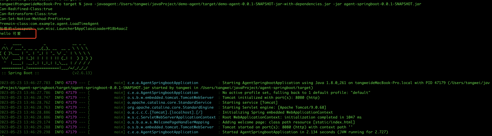

## 使用javassist创建一个类并完成调用


#### 1、在agent项目中写入如下代码

```java
public class LoadTimeAgent {

    public static void premain(String agentArgs, Instrumentation inst) throws ClassNotFoundException, IOException, NotFoundException, CannotCompileException, InstantiationException, IllegalAccessException {
        System.out.println("Can-Redifined-Class:" + inst.isRedefineClassesSupported());
        System.out.println("Can-Retransform-Class:" + inst.isRetransformClassesSupported());
        System.out.println("Can-Set-Native-Method-Prefix" + inst.isNativeMethodPrefixSupported());

        System.out.println("Premain-class:" + LoadTimeAgent.class.getName());


        //创建一个ClassPool对象然后追加系统搜索路径到其中。
        ClassPool classPool = new ClassPool(true);
        //插入类路径，通过这儿加进去的类路劲，才能搜索到我们需要修改的类
        System.out.println("添加的classLoader：" + LoadTimeAgent.class.getClassLoader().toString());
        classPool.insertClassPath(new LoaderClassPath(LoadTimeAgent.class.getClassLoader()));
        //classPool.appendClassPath() //也可以使用appendClassPath()方法

        //构建一个新的对象
        CtClass targetClass = classPool.makeClass("com.example.Hhhh");

        //表名该对象实现一个接口
        targetClass.addInterface(classPool.get(IHhh.class.getName()));

        CtClass reternType = classPool.get(void.class.getName());
        String mname = "sayHello";
        CtClass[] parameters = new CtClass[]{classPool.get(String.class.getName())};
        //构建一个方法
        // 第一个参数为：方法返回值
        // 第二个参数为：方法名称
        // 第三个参数为：方法参数
        // 第四个参数为：方法需要加入到哪个类中
        CtMethod method = new CtMethod(reternType, mname, parameters, targetClass);

      	//方法体中 花括号不能少
        String src = "{ " +

                "System.out.println(\"hello \" + $1); " +

                "}";
        //设置方法的方法体
        // 第一个参数： 是方法的源代码
        method.setBody(src);

        //将方法写入到对应的类中
        targetClass.addMethod(method);

        //写入到JVM中
        Class cla = targetClass.toClass();

        //从JVM中获取到刚刚写入的类，并调用方法
        IHhh hh = (IHhh) cla.newInstance();
        hh.sayHello("可爱");


    }

  	//这个接口也可以单独拿出来 需要写在这个类中。
    public interface IHhh{
        public void sayHello(String name);
    }
}
```

然后打包agent项目


#### 2、用如下命令启动springboot项目

```shell
java -javaagent:/Users/tangwei/javaProject/demo-agent/target/demo-agent-0.0.1-SNAPSHOT-jar-with-dependencies.jar -jar agent-springboot-0.0.1-SNAPSHOT.jar
```

看看是否打印出来了东西



