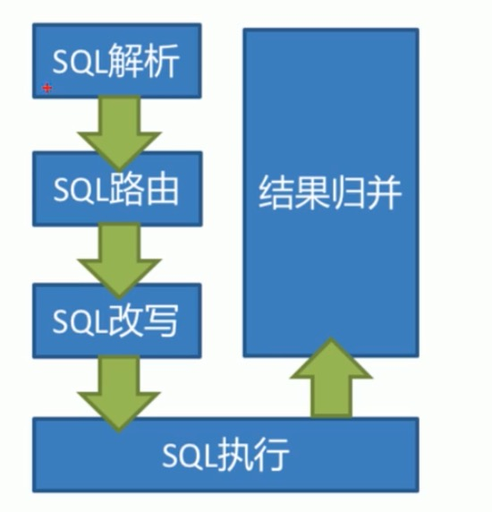
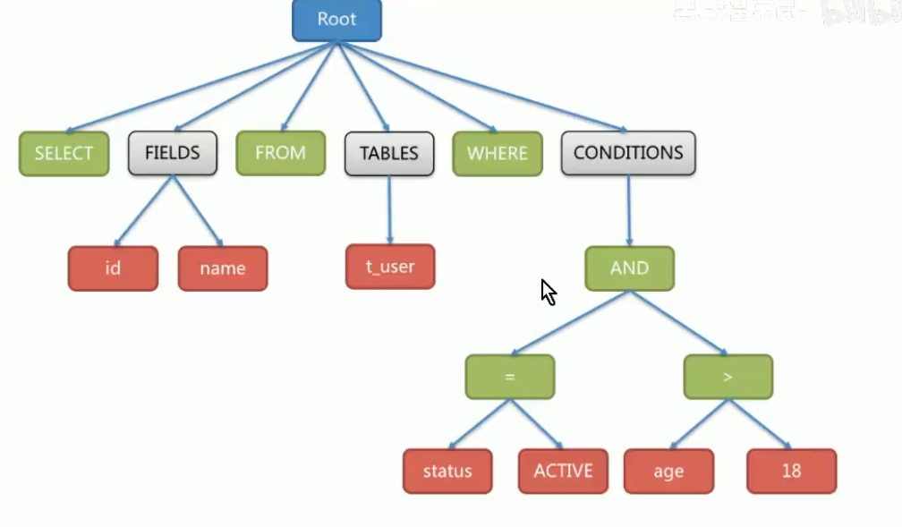

## shardingsphere Jdbc的执行流程

当shardingjdbc接收到一条sql语句时，会陆续执行SQL解析===>查询优化===>SQL改写===>SQL执行===>结果归并，最终返回执行结果。

#### 一、SQL解析：

分为**词法解析**和**语法解析**。词法解析器用于将SQL拆解为不可再分的原子符号，成为Token。并根据不同数据库方言所提供的字典，将其归类为关键字，表达式，字面量和操作符。再使用语法解析器将SQL转换为抽象语法树。

例如：以下SQL：

SELECT id, name FROM t_user WHERE status = ‘ACTIVE’ AND age > 18

解析之后的为抽象语法树见下图：

为了便于理解，抽象语法树中的关键字的Token用绿色表示，变量的Token用红色表示，灰色表示需要进一步拆分。

最后，通过对抽象语法树的遍历去提炼分片所需的“上下文”，并标记有可能需要SQL改写（后面介绍）的位置。

#### 二、SQL路由

**SQL路由就是把针对逻辑表的数据操作映射到对数据结点操作的过程。**

根据解析上下文匹配数据库和表的分片策略,并生成路由路径。对于携带分片键的SQL ,根据分片键操作符不同可以划分为单片路由(分片键的操作符是等号)、多片路由(分片键的操作符是IN)和范围路由(分片键的操作符是BETWEEN) ,不携带分片键的SQL则采用广播路由。根据分片键进行路由的场景可分为直接路由、标准路由、笛卡尔路由等。

1、标准路由

标准路由是Sharding-jdbc最为推荐使用的分片方式,它的适用范围是不包含关联查询或仅包含绑定表之间关联查询的SQL。当分片运算符是等于号时 ,路由结果将落入单库(表) , 当分片运算符是BETWEEN或IN时,则路由结果不一-定落入唯一的库(表) ,因此一条逻辑SQL最终可能被拆分为多条用于执行的真实SQL。举例说明 ,如果按照order_ id的奇数和偶数进行数据分片,一个单表查询的SQL如下:

SELECT * FROM t_ order WHERE order_ _id IN (1, 2);

那么路由的结果应为:

SELECT * FROM t_ _order_ 0 WHERE order_ id IN (1, 2);

SELECT * FROM t_ _order_ 1 WHERE order_ id IN (1, 2);

2、笛卡尔路由

笛卡尔路由是最复杂的情况,它无法根据绑定表的关系定位分片规则,因此非绑定表之间的关联查询需要拆解为笛卡尔积组合执行。如果上个示例中的SQL并未配置绑定表关系,那么路由的结果应为:

SELECT * FROM t_ _order_ 0。JOIN t_ order_ item 0 i ON o.order_ _id=i .order_ id WHERE order_ id IN (1,2);

SELECT * FROM t_ _order_ 0。JOIN t_ order_ item_ 1 i ON o.order_ _id=i .order_ id WHERE order_ id IN (1,2);

SELECT * FROM t_ order_ 1。JOIN t_ order_ item 0 i ON o.order_ id=i.order_ id WHERE order_ id IN (1,2);

SELECT * FROM t_ order. _1。JOIN t_ order_ item 1 i ON o.order_ id=i.order_ id WHERE order. id IN (1,2);

3、全库表路由（广播路由）

对于不携带分片键的SQL ,则采取广播路由的方式。根据SQL类型又可以划分为全库表路由、全库路由、实例路由、单播路由和阻断路由这5种类型。其中全库表路由用于处理对数据库中与其逻辑表相关的所有真实表的操作,主要包括不带分片键的DQL(数据查询)和DML (数据操纵) ,以及DDL (数据定义)等。例如:

SELECT * FROM t_ order WHERE good_ prority IN (1, 10);

则会遍历所有数据库中的所有表,逐- -匹配逻辑表和真实表名,能够匹配得上则执行。路由后成为

SELECT * FROM t_ order. 0 WHERE good_ prority IN (1, 10);

SELECT * FROM t_ _order_ 1 WHERE good_ prority IN (1, 10);

SELECT * FROM t_ order_ 2 WHERE good_ prority IN (1, 10);

SELECT * FROM t_ order 3 WHERE good_ prority IN (1, 10);

#### 三、SQL改写：

工程师面向逻辑表书写的SQL ,并不能够直接在真实的数据库中执行, SQL改写用于将逻辑SQL改写为在真实数据库中可以正确执行的SQL.

如一个简单的例子,若逻辑SQL为:

SELECT order_ id FROM t_ order WHERE order_ id=1;

假设该SQL配置分片键order. id ,并且order_ id=1的情况,将路由至分片表1。那么改写之后的SQL应该为:

SELECT order_ id FROM t_ order_ 1 WHERE order_ id=1;

再比如, ShardingJDBC需要在结果归并时获取相应数据,但该数据并未能通过查询的SQL返回。这种情况主要是针对GROUP BY和ORDER BY。结果归并时,需要根据GROUP BY 和ORDER BY的字段项进行分组和排序,但如果原始SQL的选择项中若并未包含分组项或排序项,则需要对原始SQL进行改写。先看一下原始SQL 中带有结果归并所需信息的场景:

SELECT order_ id, user_ id FROM t_ order ORDER BY user_ id;

由于使用user_ id进行排序,在结果归并中需要能够获取到user. id的数据,而上面的SQL是能够获取到user_ id数据的，因此无需补列。

如果选择项中不包含结果归并时所需的列,则需要进行补列,如以下SQL :

SELECT order_ id FROM t_ order ORDER BY user_ _id;

由于原始SQL中并不包含需要在结果归并中需要获取的user_ id ,因此需要对SQL进行补列改写。补列之后的SQL是:

SELECT order_ id, user_ _id AS ORDER_ _BY_ _DERIVED_ 0 FROM t_ order ORDER BY user_ id;

#### 四、SQL执行：

ShardingJDBC采用一套自动化的执行引擎,负责将路由和改写完成之后的真实SQL安全且高效发送到底层数据源执行。它不是简单地将SQL通过JDBC直接发送 至数据源执行;也并非直接将执行请求放入线程池去并发执行。它更关注平衡数据源连接创建以及内存占用所产生的消耗,以及最大限度地合理利用并发等问题。执行引擎的目标是自动化的平衡资源控制与执行效率,他能在以下两种模式自适应切换:

1、内存限制模式

使用此模式的前提是, Sharding-JIDBC对一次操作所耗费的数据库连接数量不做限制。如果实际执行的SQL需要对某数据库实例中的200张表做操作,则对每张表创建一个 新的数据库连接,并通过多线程的方式并发处理,以达成执行效率最大化。

2、连接限制模式

使用此模式的前提是, Sharding-JDBC严格控制对一-次操作所耗费的数据库连接数量。如果实际执行的SQL需要对某数据库实例中的200张表做操作,那么只会创建唯一的数据库连接,并对其200张表串行处理。如果一 -次操作中的分片散落在不同的数据库,仍然采用多线程处理对不同库的操作,但每个库的每次操作仍然只创建一个唯一的数据库连接。

内存限制模式适用于OLAP操作,可以通过放宽对数据库连接的限制提升系统吞吐量;连接限制模式适用于

OLTP操作, OLTP通常带有分片键,会路由到单一的分片,因此严格控制数据库连接,以保证在线系统数据库资源能够被更多的应用所使用,是明智的选择。

#### 五、结果归并：

用SQL执行的结果，因为可能是从多表中读取的数据，所以要操作归并。