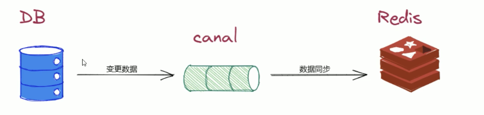
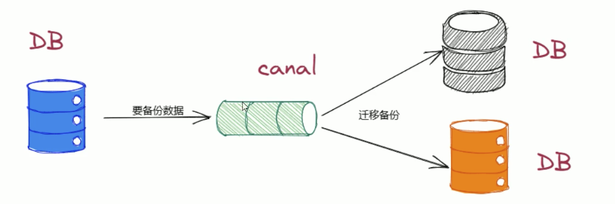
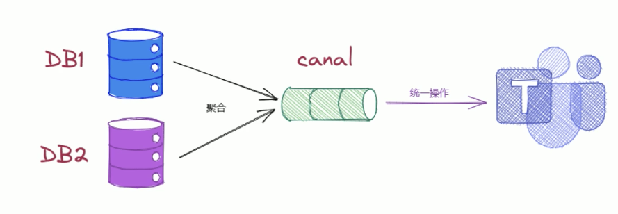
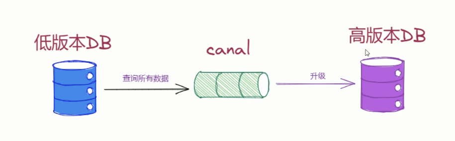

## Canal的使用场景

#### 1、数据同步

实时同步mysql中的数据到es、redis中，有个应用场景叫 mysql-redis的双写一致！

#### 2、数据库实时监控

监控mysql中敏感数据，如果发现了变化，及时通知相关人员

#### 3、数据分析与挖掘

将mysql到的数据实时投递到kafka中，为数据挖掘提供数据来源

#### 4、数据库备份

将mysql主库的数据备份到备库中

#### 5、数据集成

将多个mysql数据库中的数据进行集成，为数据处理提供更加高效的解决方案

#### 6、数据迁移

