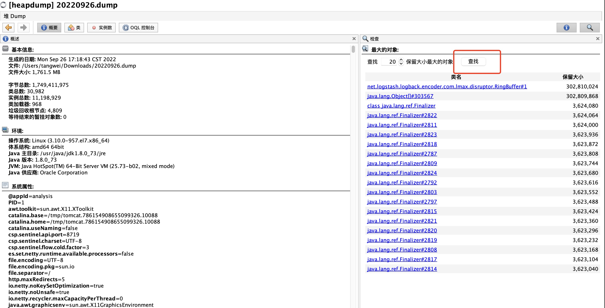

## 分析dump文件

#### 1、导入dump的文件

#### 2、需要先点击”查找“，查找下dump文件中的大对象

#### 3、点击上图中的”类“，可以看到如下图，但是只能看出char[]、byte[]、String、Object[]经过GC之后还有很大的残留，但是没法确定是哪个类导致的，我们需要按照保留排序去查看，哪个类的保留最高！

所谓的”保留“，是指经过一次GC之后，关联该对象的残留数据！上图可以看出logstash有很大的问题，就可以对照去找问题了！

#### 4、双击上图的`RingBuffer`类，会出现入下图

左侧为系统中当前类的实例数，右侧字段栏是选中实例中的字段信息。然后可以逐级点开查看残留比较多的进行查看

