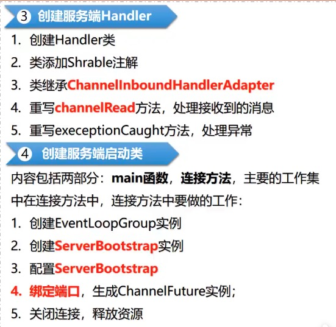
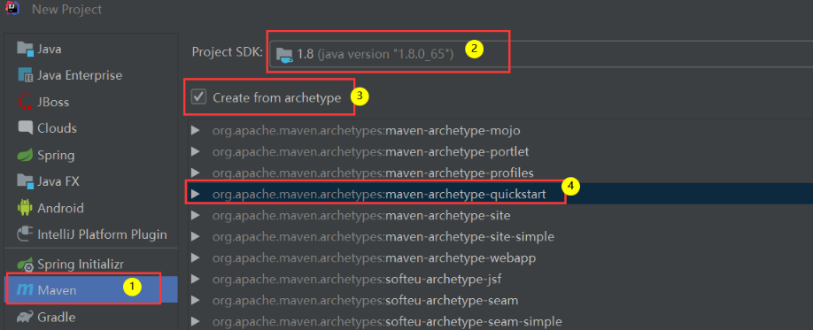
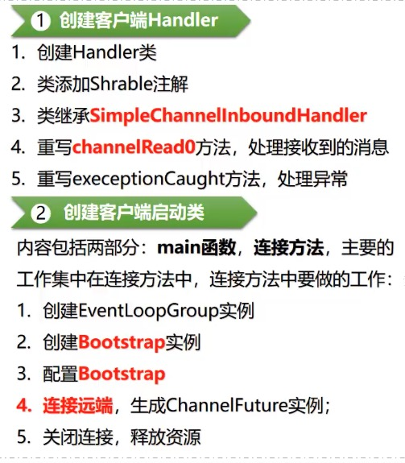

## 使用netty传输一个字符串


#### 一、创建服务端

- 创建的大致流程图

  

- 创建项目工程

  

- 引入依赖

  ```xml
  <!-- https://mvnrepository.com/artifact/io.netty/netty-all -->
  <dependency>
    <groupId>io.netty</groupId>
    <artifactId>netty-all</artifactId>
    <version>4.1.65.Final</version>
  </dependency>
  ```

- 创建服务端Handler：（实现自己的业务逻辑）

  ```java
  @ChannelHandler.Sharable //为了线程安全
  public class ServerHandler extends ChannelInboundHandlerAdapter {
  
      @Override
      public void channelRead(ChannelHandlerContext ctx, Object msg) throws Exception {
  
          //接收客户端传递的数据。具体是什么类型的数据，根据客户端发送的数据的类型而定。
          ByteBuf in = (ByteBuf) msg;
          System.out.println("接收到客户端传递的消息：" + in.toString(CharsetUtil.UTF_8));
  
          //写入并发送信息到客户端
          ctx.writeAndFlush(Unpooled.copiedBuffer("你好，我是服务端，我已经接收到了你发送消息！", CharsetUtil.UTF_8));
  
      }
  
      @Override
      public void exceptionCaught(ChannelHandlerContext ctx, Throwable cause) throws Exception {
          //出现异常的时候执行的动作（打印并关闭听到）
          cause.printStackTrace();
          ctx.close();
      }
  }
  ```

- 创建服务端启动类

  ```java
  public class ServerServer {
  
      private int port;
  
      public ServerServer(int port){
          this.port = port;
      }
  
      public void run() throws InterruptedException {
          //Netty的Reactor线程池
          NioEventLoopGroup group = new NioEventLoopGroup();
  
          try {
              ServerBootstrap b = new ServerBootstrap();
              b.group(group)
                			//使用非阻塞的socket连接
                      .channel(NioServerSocketChannel.class)
                      .localAddress(new InetSocketAddress(port))
                			//通道的初始化配置
                      .childHandler(new ChannelInitializer<SocketChannel>() {
                          @Override
                          protected void initChannel(SocketChannel ch) throws Exception {
                              ch.pipeline().addLast(new ServerHandler());
                          }
                      });
            	//阻塞等待绑定服务器完成，channelFuture将提供有关IO操作的结果或状态信息
              ChannelFuture channelFuture = b.bind().sync();
            
            	//阻塞操作，这儿的sync()方法是DefaultChannelPromise类的sync方法，最终执行DefaultPromise的sync方法，会调用Object的wait()方法，挂起线程，为什么要挂起？因为需要等待链路关闭之后继续执行。
              channelFuture.channel().closeFuture().sync();
          } catch (InterruptedException e) {
              throw new RuntimeException(e);
          } finally {
            	//关闭NioEventLoopGroup并释放所有资源
              group.shutdownGracefully().sync();
          }
      }
  
      public static void main(String[] args) throws InterruptedException {
          new ServerServer(10000).run();
      }
  }
  ```

- 启动服务端


#### 二、创建客户端

- 创建的大致流程图

  

- 创建项目工程

  

- 引入依赖

  ```xml
  <!-- https://mvnrepository.com/artifact/io.netty/netty-all -->
  <dependency>
    <groupId>io.netty</groupId>
    <artifactId>netty-all</artifactId>
    <version>4.1.65.Final</version>
  </dependency>
  ```

- 创建客户端Handler（实现自己的业务逻辑）

  ```java
  @ChannelHandler.Sharable
  public class ClientHandler extends SimpleChannelInboundHandler<ByteBuf> {
  
  
      @Override
      protected void channelRead0(ChannelHandlerContext ctx, ByteBuf msg) throws Exception {
        
        	//注意转出什么类型的数据，需要根据服务端传过来的类型处理
          String str = msg.toString(CharsetUtil.UTF_8);
          System.out.println("接收到服务端的消息：" + str);
      }
  
      @Override
      public void exceptionCaught(ChannelHandlerContext ctx, Throwable cause) throws Exception {
          cause.printStackTrace();
  
          ctx.close();
      }
  }
  ```

- 创建客户端启动类

  ```java
  public class ClientServer {
  
      private final String host;
      private final int port;
  
      public ClientServer(String host, int port){
          this.host = host;
          this.port = port;
      }
  
      public void run() throws InterruptedException {
          NioEventLoopGroup nioEventLoopGroup = new NioEventLoopGroup();
  
          try{
            	//初始化客户端启动类
              Bootstrap b = new Bootstrap();
            	
              b.group(nioEventLoopGroup)
                			//指定使用非阻塞的socket连接
                      .channel(NioSocketChannel.class)
                      .remoteAddress(new InetSocketAddress(this.host, this.port))
                			//通道的初始化配置
                      .handler(new ChannelInitializer<SocketChannel>() {
                          @Override
                          protected void initChannel(SocketChannel ch) throws Exception {
                              ch.pipeline().addLast(new ClientHandler());
                          }
                      });
  						
            	//阻塞，同步等待建立连接
              ChannelFuture channelFuture = b.connect().sync();
  
            	//channelFuture.channel()获取到当前连接，writeAndFlush是把数据写入到本地缓冲区，然后flush冲刷到缓冲区(发送出去)
              channelFuture.channel().writeAndFlush(Unpooled.copiedBuffer("你好，我要跟你建立连接", CharsetUtil.UTF_8));
  
            	//阻塞操作，这儿的sync()方法是DefaultChannelPromise类的sync方法，最终执行DefaultPromise的sync方法，会调用Object的wait()方法，挂起线程，为什么要挂起？因为需要等待链路关闭之后继续执行。
              channelFuture.channel().closeFuture().sync();
  
  
          } catch (InterruptedException e) {
              throw new RuntimeException(e);
          } finally {
            	//关闭相关资源
              nioEventLoopGroup.shutdownGracefully().sync();
          }
      }
  
      public static void main(String[] args) throws InterruptedException {
          new ClientServer("127.0.0.1", 10000).run();
      }
  
  }
  ```

- 启动客户端