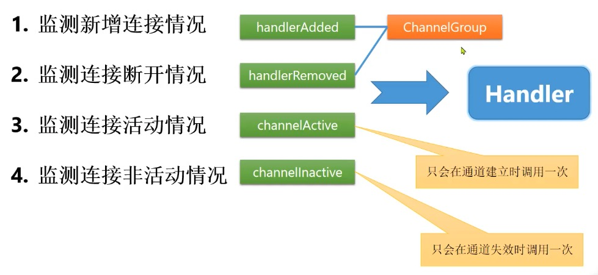
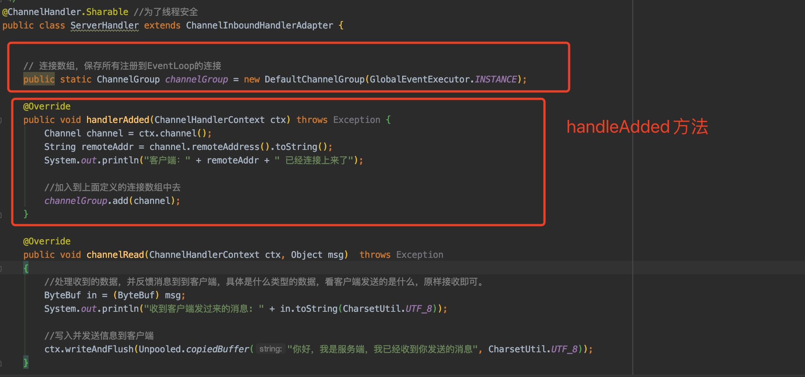
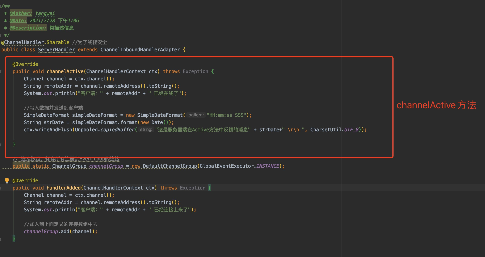
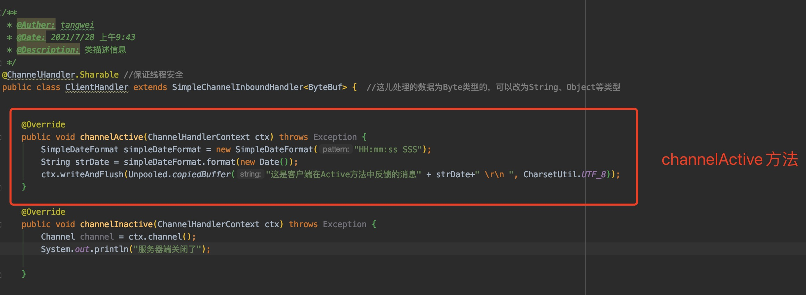
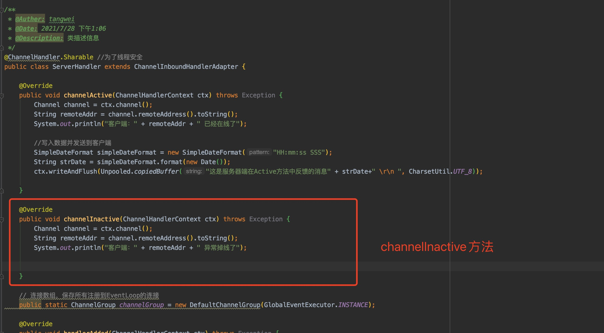
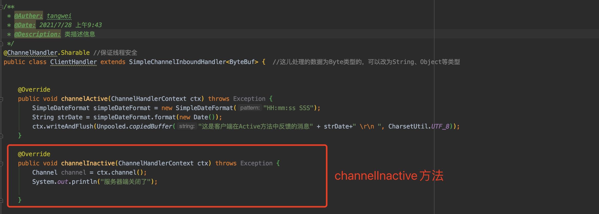

## netty监测连接及活动状态

#### 一、图解

#### 二、详细说明

> 这些方法都是写在client/server的Handler类中的

1. handlerAdded，服务器端每当有新的socket连接到服务器端，就会触发一次这个方法

2. handlerRemoved，服务器端每当有socket连接断开，就会触发一次这个方法

   

3. channelActive，服务器端和客户端当socket建立连接完毕，就会触发这个方法，且只会触发一次

   - 服务端

     

     

   - 客户端

     

4. channelnactive，服务器端和客户端当对端socket关闭（通道失效）时，就会触发这个方法，且只会触发一次

- 服务端

  

- 客户端

  