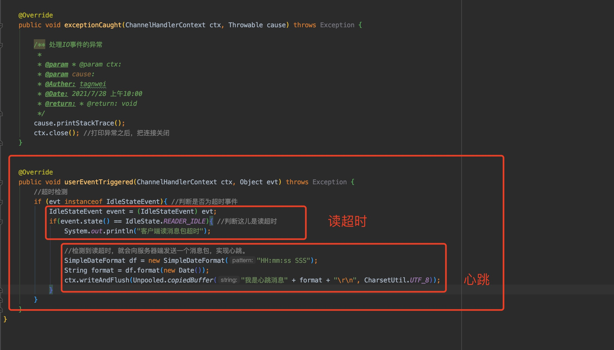
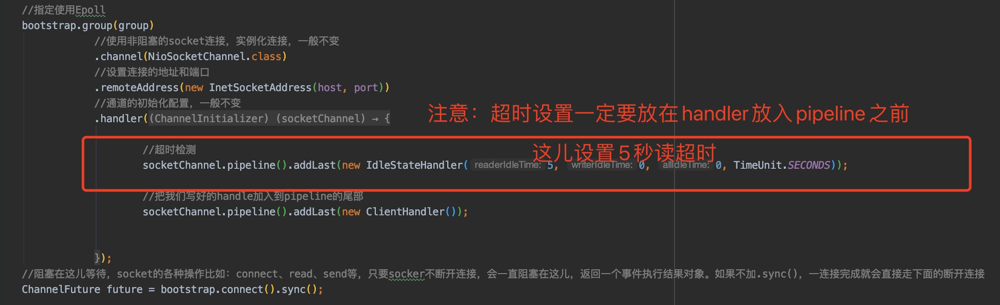

## netty中的超时检测和心跳机制

#### 一、概念

1. 超时检测：

- 分类：

  读超时：从通道中多少秒没有读到信息了，叫读超时

  写超时：已经超过多少秒了还没往通道中写数据，叫写超时

  读写超时：上述两种情况结合

- 操作步骤（**客户端、服务端步骤一致**）：

  第一步：Handler中重写userEventTriggered方法

  第二步：在Pipeline中增加IdleStateHandler实例，该实例的构造函数有四个：

  I、readerIdleTime: 读超时，设置为0时，表示不启用

  II、writeIdleTime：写超时，设置为0时，表示不启用

  III、allIdleTime，读写超时，设置为0时，表示不启用

  IV、时间单位，该参数可不设置，默认为秒

  

2. 心跳机制：

   为什么要有心跳机制？

   I、发现长期不用的连接就关闭掉，减轻服务器的连接压力

   II、检测异常连接，在很多异常场合，表面上看连接还存在，其实已经挂掉了，所以一般发送一个空数据包来测试下链路是否还有效。

   

   如何建立心跳机制？

   I、利用超时检测，检测到超时后就会向对方发送一个心跳包。

   II、超时和心跳实现既可以在客户端，也可以在服务器端，根据实际场景来定。

   III、上述的情况实际是一种心律不齐的心跳机制，可以利用定时任务来实现真正的心跳机制。

#### 2、从客户端发送心跳包到服务端

- 在客户端Handler中重写userEventTriggered方法

  

- 在客户端在Pipeline中增加IdleStateHandler实例

  