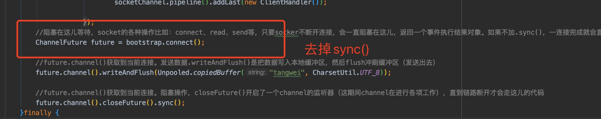
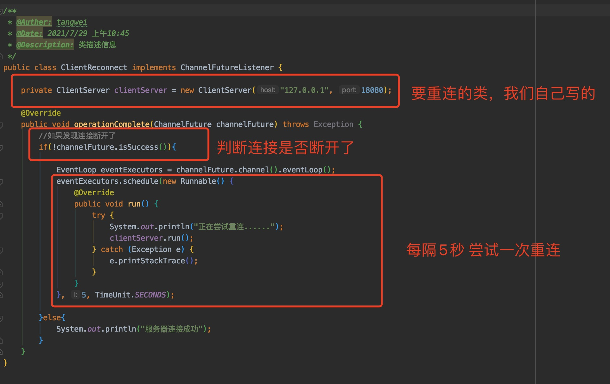
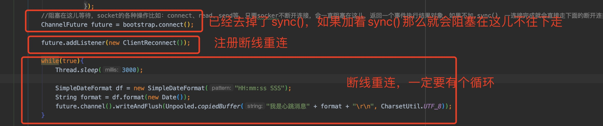
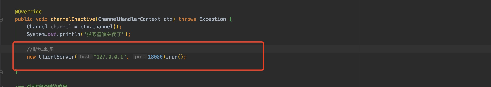

## netty的断线重连

#### 一、断线重连概念

> 由客户端发起

1. 断线重连需要考虑到两种情况？

   I、客户端启动时，服务器端还未启动或已经崩掉，需要客户端自动不断发起连接，而不是退出程序

   II、服务器端正常，但是客户端断开连接了，这时也需要自动发送重新连接的请求

2. 如何实现断线重连：

   第一步：客户端连接由同步阻塞改为异步阻塞（去掉连接的sync()）

   第二步：创建监听类，该类**实现ChannelFutureListener接口**，在该类中发起重连。

   第三步：在**ChannelFuture的实例中增加监听**，把我们自定义的监听类添加进去。

#### 二、client端实现断线重连

1. 去掉连接的sync()

   

2. 创建监听类xxxxListener

   

3. 把我们自定义的监听类添加入系统

   

4. 在Handler的channelInactive方法中

   