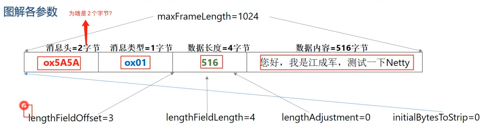
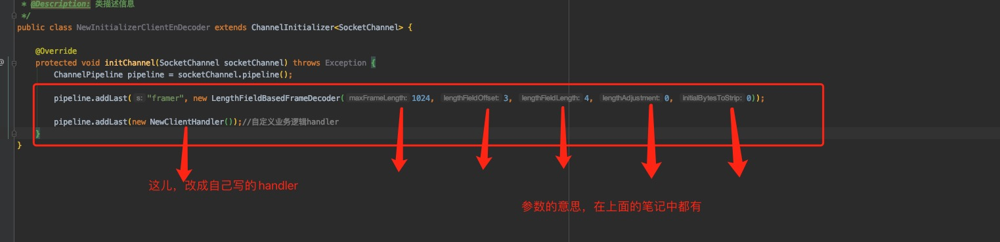
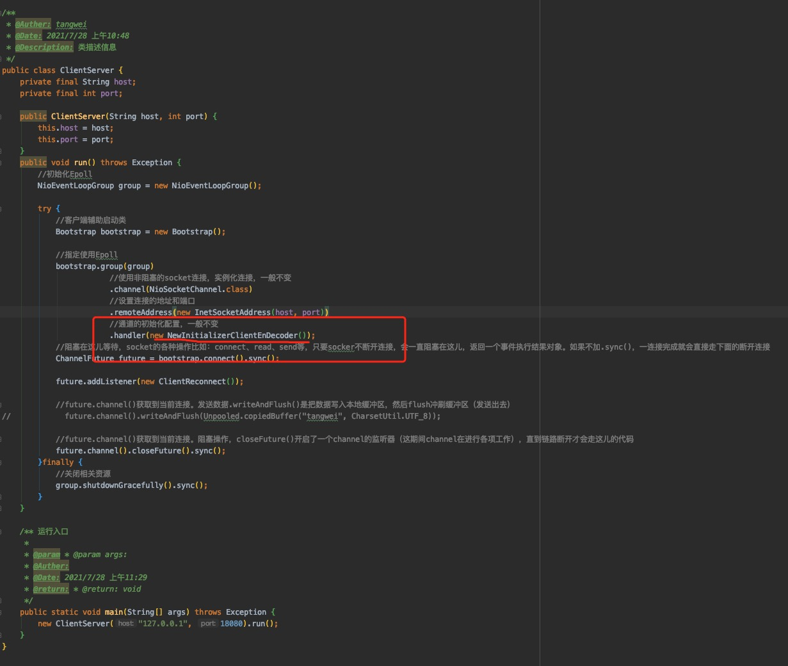
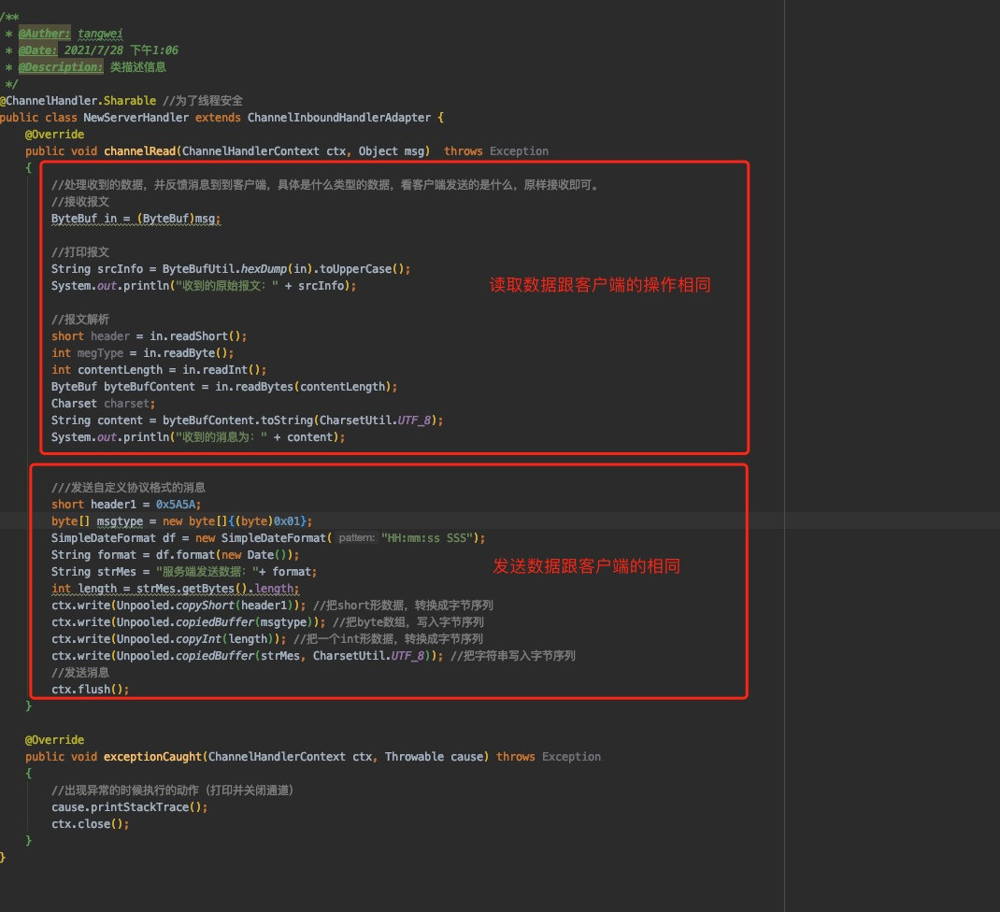

## netty的自定义长度解码器的使用案例

#### 1、自定义长度解码器的具体参数

maxFrameLength:消息的最大长度，超过最大长度抛出异常，**这个长度尽量设置大一点没关系！！**;

lengthFieldOffset:长度域偏移量，指的是长度域位于整个数据包字节数组中的下标;

lengthFieldLength:长度域自己的字节数长度;

lengthAdjustment:默认值0字节,长度域的偏移量矫正，长度域的长度值是否要减去其它长度才是内容的值;

initialBytesToStrip:默认值0字节，丢弃的起始字节数，去掉要丢弃的数据再去解析数据;

failFast:默认值true,超过消息最大长度是否立即抛出异常;

ByteOrder:字节序列模式，默认是**大端模式，也可以设置为小端模式****，网络字节序是大端字节序，由小到大。**

#### 2、使用注意点

 **组装要发送的数据的时候：单个字节用字节数组byte[]、两个字节用short、4个字节整形用int、4个字节浮点型用float、8个字节用double。解析的时候也是这样** 

#### 3、代码实现

- 客户端修改

  - 修改客户端Handler

    

  - 修改客户端handler初始化配置类InitializerClientEnDecoder。

    

  - 修改客户端server

    

- 服务端修改

  - 修改服务端的Handler

    

  - 修改服务端handler初始化配置类InitializerServerEnDecoder（**下面贴的是客户端的代码图片，只要改相同的地方即可**）。

    

  - 修改服务端server（**下面贴的是客户端的代码图片，只要改相同的地方即可**）：

    