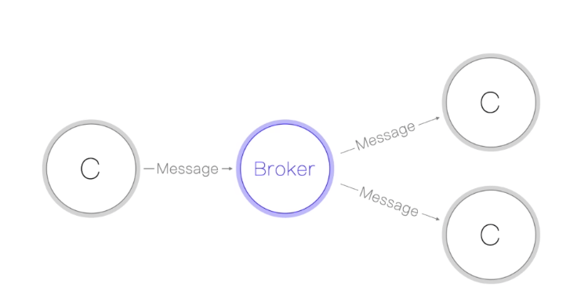
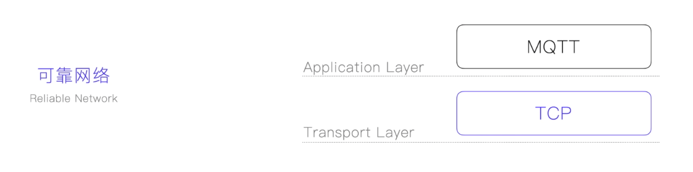
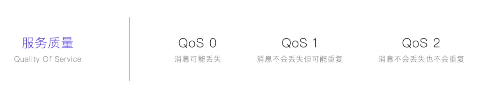
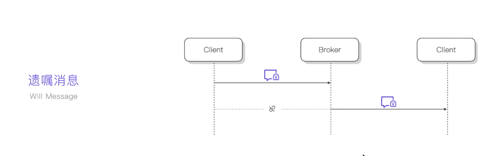
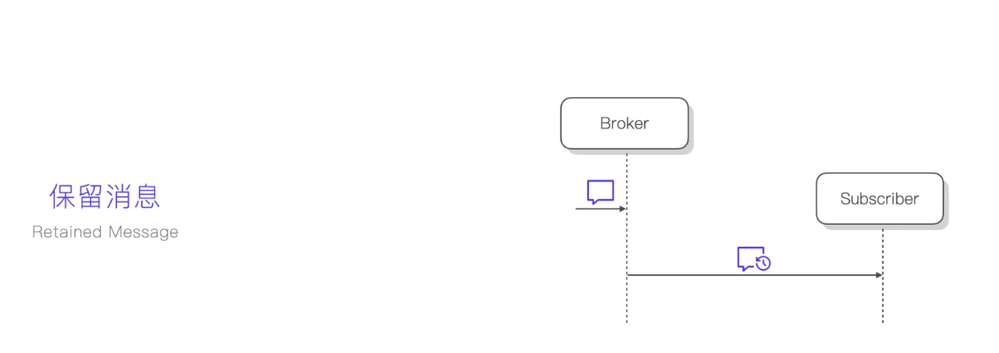

## MQTT的概念和主要特性的概念

#### MQTT的概念

MQTT是一种基于发布订阅模式的“轻量级”通讯协议，全名为消息队列遥测传输协议。

图中的broker充当消息发布者与消息接收者的中间代理角色！消息会被广播到所有的订阅端！

#### MQTT的传输协议

MQTT协议是基于TCP/IP协议做为数据传输层的

为什么是基于TCP的呢？而不是UDP的呢？

因为MQTT底层是需要保证通讯的可靠性的，所以要保证消息不能丢失，而UDP是非可靠的传输协议！

#### MQTT的服务质量等级

尽管已经使用了TCP做为传输协议，但是MQTT也有可能在网络断开时出现消息丢失。那么如何处理呢？

可以通过MQTT的服务质量等级来处理！

#### MQTT的心跳保活

MQTT可以使用在不稳定的网络环境中，而不稳定的网络环境会有一系列的问题，比如我们的连接会进入假死状态等。那么怎么解决这个问题呢？

可以通过MQTT的心跳保活机制！MQTT的发送方和订阅方都需要跟Broker端建立心跳，确保Broker和客户端是处于连接状态的！帮助代理尽快处理断开连接的客户端！

#### MQTT的遗嘱消息

由于是使用发布订阅模式，通讯的双方都连接在代理（Broker Server）上，双方不会直接通讯，那么如果发布消息的客户端如果断开连接了，消息的接收方如何知道消息的发布者已经断开了呢？

可以通过MQTT的遗嘱消息。

当消息发送方断开连接，被Broker感知，Broker会把对应消息发送方的遗嘱消息广播所有给该发送方的所有的订阅者，订阅者就知道发送端已经断开连接了！

遗嘱消息是通过消息发送方设置到Broker上的！

#### MQTT的保留消息

当发送端发送了消息到Broker后，Broker会把消息广播到对应的所有订阅者，但是当有些订阅者不在线，那么订阅者就会错过这条消息，消息错过是找不回来的，怎么解决呢？

可以使用MQTT的保留消息的功能，让Broker保留对应的订阅者错过的消息，等订阅者重新上线了，Broker再把消息下发给订阅者。

