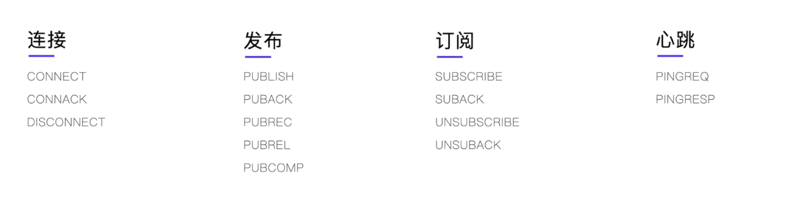
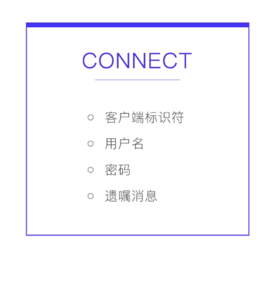
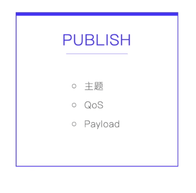
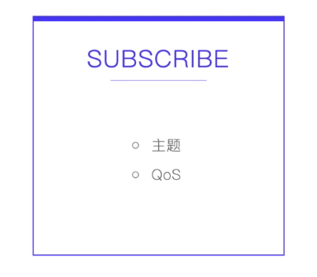
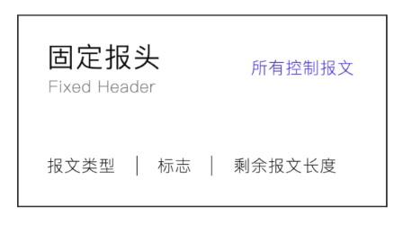
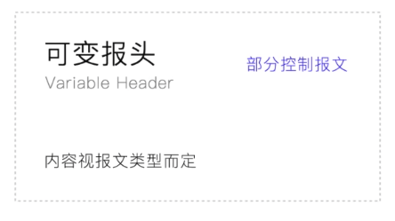
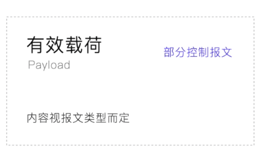
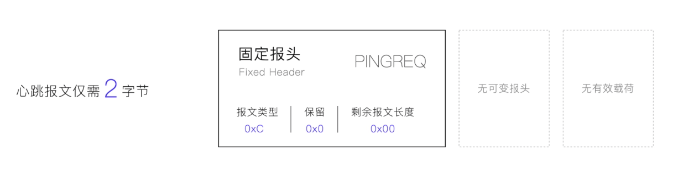
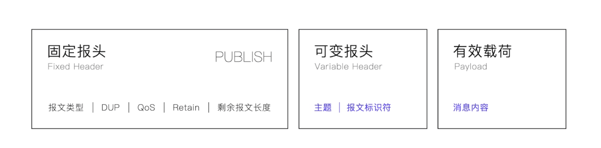

## MQTT的报文

#### 什么叫报文

网络中交换与传输的数据单元，即网络上一次要发送的数据块，简单理解就是要发送的数据

#### MQTT的报文类型

- CONNECT报文：

  用于客户端(消息发送方、订阅方)向Broker(代理)发起连接。

  报文中包含如下数据：

  

  客户端标识符即ClientID，可以为空，这样在创建连接的时候Broker会帮我们创建一个clientID。Broker创建的clientID会在客户端每次连接的时候都创建，所以无法使用连接的持久会话！

  

- PUBLISH报文：

  用于消息发送方向Broker(代理)发送消息

  报文中包含如下数据：

  

- SUBSCRIBE报文：

  用于订阅方向Broker(代理)订阅一个主题

  报文中包含如下数据：

  

#### MQTT报文格式

MQTT中将报文分为，3个部分

1. 固定报头

   在MQTT的所有的报文中都有一个固定的报头，报头中包含的数据有如下

   

2. 可变报头

   跟在固定报头后面，根据报文的内容而变化，内容如下

   

   可变报头中会包含如下图的4部分内容

   

3. 有效载荷

   报文中的有效数据，我们要发送的信息就放在这儿

   

报文举例：

- 心跳消息报文如下：

  
  心跳报文中只有固定报头，没有可变报头和有效载荷

- PUBLIS报文如下：

  

