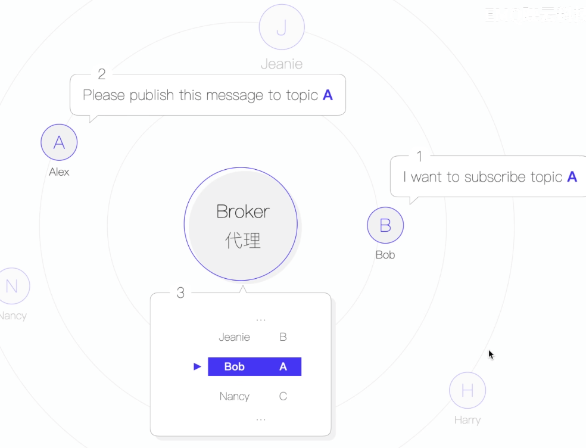

## MQTT主题的概念及注意点

A是消息发送方，B是消息的订阅者，A和B通过Broker进行通讯，那么如何确保A发送的消息经过Broker后准备的被B获取呢？这其中就是MQTT主题的作用！

A在发送消息的时候，消息中带着消息的主题，Broker接收到A发送的消息会把消息放到A指定的主题中，B通过Broker订阅了一个主题，那么A发送消息的时候Broker会遍历对应主题的所有订阅者，把消息发送给订阅者！

#### MQTT中主题的注意点

1. 类型：UTF-8的字符串

2. 最大长度：65535字节

3. 区分大小写： example ≠ Example

4. 主题具有分层结构，通过分隔符 "/" 来分层主题：

   所以， /example、example、example/ 是三个不同的主题

   配合订阅端订阅时的主题通配符可以实现一次订阅多个主题

5. 主题禁止使用"$"符号

