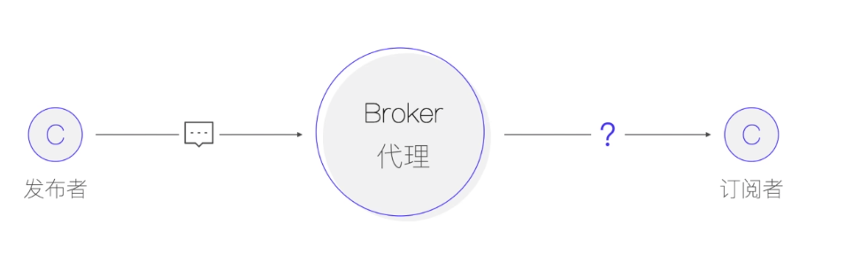
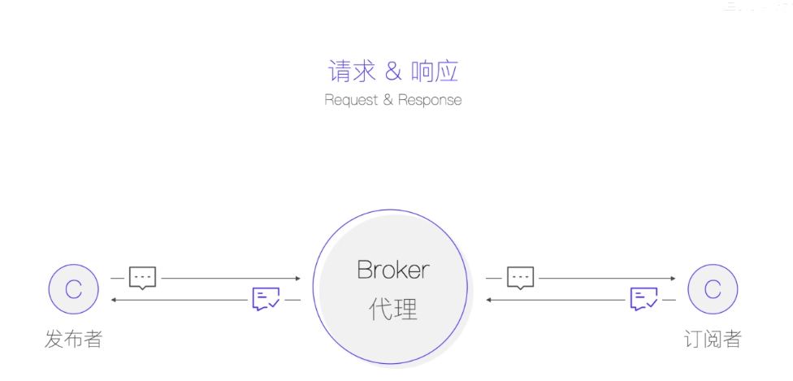
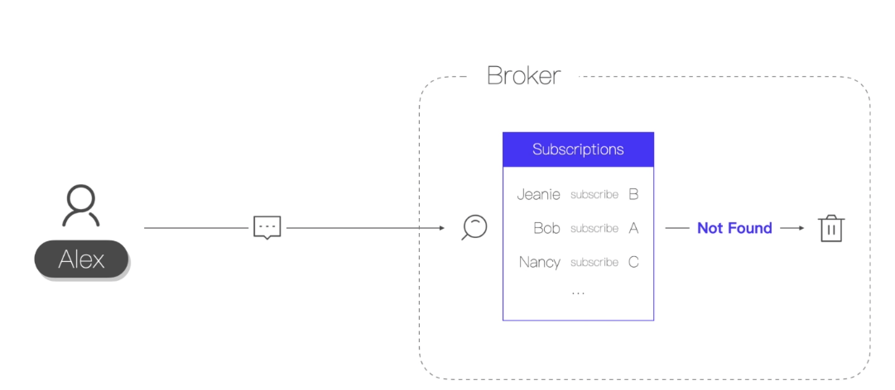
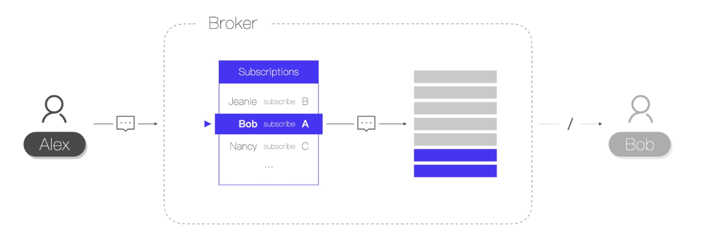

## MQTT消息发送和消费的重要注意点

#### 对于发送方

发送方发送消息到Broker后就认为消息已经发送成功了，但是消息最终是否被订阅者消费，发送方是感知不到的！（如果一个主题没有订阅者，那么消息将被直接丢弃！）

如果需要确保让发送方感知消息被订阅者接收了，需要进行一些特殊的处理，加入请求应答机制！

#### 对于订阅方

如果发送方发送了一个主题的消息，但是对于这个主题，没有订阅者，消息将被直接丢弃

如果订阅者网络不稳定，发送方发送的消息到达Broker后，Broker发现订阅者网络断开了，会把要发送给这个订阅者的消息缓存在连接会话中（连接会话是根据clientID来创建的，如果在建立连接的时候由Broker自动生成clientID，那么每次连接的clientID都是不一样的，会造成不能使用持久会话！），等待订阅者重新连接，然后读取缓存中的消息！

