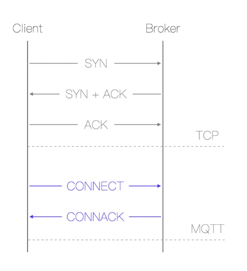
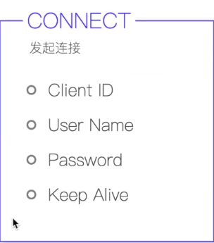
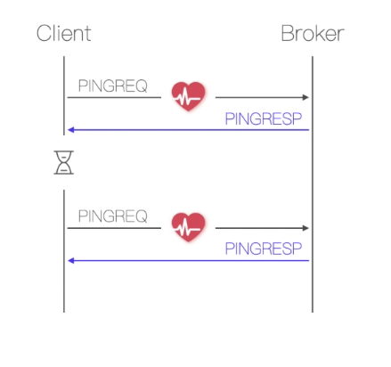
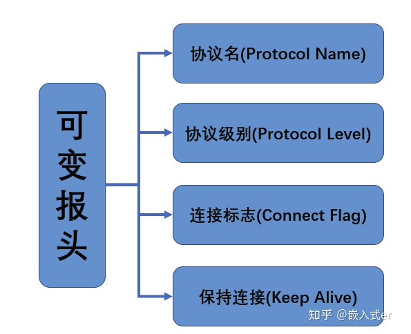
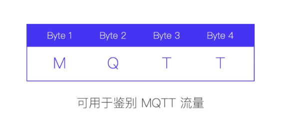
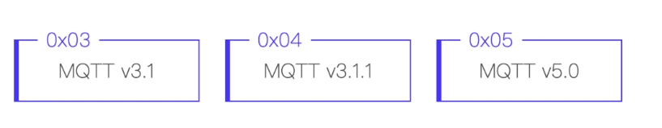
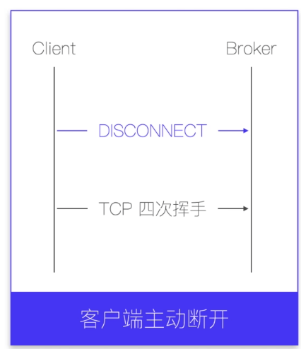
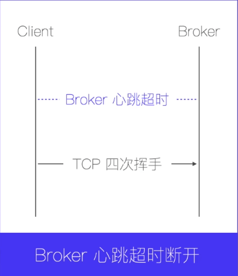

## MQTT如何与Broker建立连接、断开连接及报文全面分析

#### 1、如何建立连接

MQTT协议是基于TCP/IP协议的，所以在建立连接的时候需要先进行一个TCP的3次握手，然后客户端再发送CONNECT报文给Broker，Broker再发回CONNACK报文给客户端，随后MQTT的连接才正式建立！

为什么要发送一次CONNECT报文呢？

这就需要看看CONNECT报文中的荷载信息了！

是因为

1. ClientID信息，Broker会使用客户端的ClientID存储会话信息，即便客户端断开重连数据也不会丢失！客户端标识符即ClientID，可以为空，这样在创建连接的时候Broker会帮我们创建一个clientID。Broker创建的clientID会在客户端每次连接的时候都创建，所以无法使用连接的持久会话！

2. CONNECT的报文中有Username、Passowrd信息，注意，这儿的密码是会用明文发送的，容易造成安全问题！建议配合ssl证书使用更安全！

3. CONNECT的报文中有遗嘱消息

4. Keep Alive，2个字节长度的无符号整形，用于表示客户端发送完一次消息后，到下一次发送消息，这中间最大的时间间隔。如果2次发送数据超过了时间间隔，客户端必须发送一个PINGREQ报文。服务端在收到PINGREQ报文后都会返回一个PINGRESP报文。Broker会在设置的Keep Alive的时间的1.5倍的时候后，还没有收到任何消息，就判断为连接断开！如果Keep Alive设置为0，那么保活机制就关闭了！

   

5. 遗嘱消息

   遗嘱消息是在连接建立之后，就会被客户端发送给Broker端，并被Broker端存储，当Broker判断客户端异常断开，就会把遗嘱消息发布给订阅者。

   遗嘱消息涉及的字段：

   - Will Topic，遗嘱消息的主题
   - Will QoS
   - Will Retain
   - Will Properties
     - Will Delay Interval
   - Will Payload

看完了CONNECT报文的荷载信息，我们接着看看它的可变报头中的信息：

我们之前说过，可变报头中会有如下图的信息

那么在CONNECT报文中，它们的各自的内容是什么

1. Protocol Name

   协议的名称

   

2. Protocol Level

   协议级别，一个字节长度的无符号整形，用于表名MQTT协议的版本

   

   

   

#### 2、如何断开连接：

1. 客户端主动断开连接，客户端需要先发送DISCONNECT报文到Broker，然后进行TCP的四次挥手，客户端就断开了连接，Broker就知道是客户端主动断开的！

   

2. 客户端等待Broker回复心跳响应报文超时的情况下，客户端直接断开连接

   

3. Broker在任何情况下都可以主动断开连接

   

