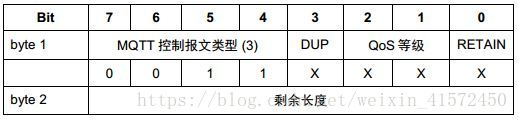
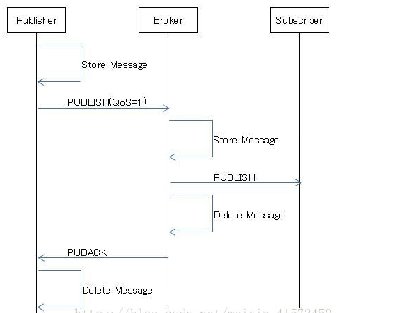
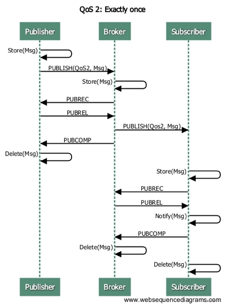
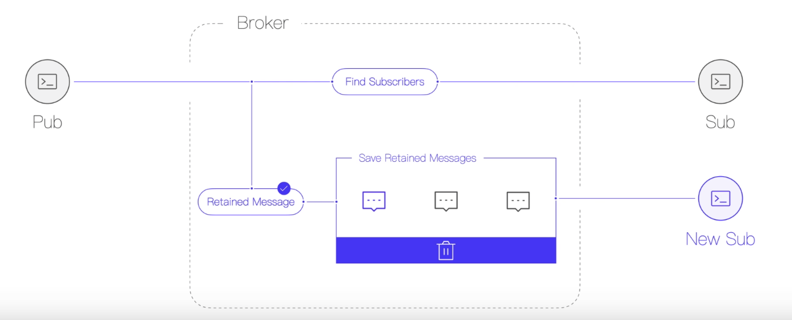

## MQTT如何发布消息及报文全面分析

客户端向Broker发送消息，Broker向订阅端发送消息，都需要使用PUBLIS报文。

#### 详细了解PUBLISH报文

1. 固定报头

   

   - QoS：是一个数字，表示PUBLISH报文的服务质量等级

     - 值为0：消息只发送一次，消息发布完全依赖底层 TCP/IP 网络，因此会发生消息丢失

       

     - 值为1：消息至少发送一次，确保消息到达，但消息可能会重复发送

       

       发送端发送消息给Broker，每次发送消息后，客户端会等待Broker的PUBACK的响应，如果在一段时间内没有得到PUBACK的响应，那么会再次发送消息，再次发送的报文中的DUP会被设置为1。Broker端不做重复消息的识别，会把重发的消息也发送给订阅者，所以发送端多次发送了同样的消息，订阅端会收到多条消息！Broker端把消息发给所有的订阅端会等待订阅端的PUBACK响应，如果等待一段时间还没有收到PUBACK响应，会重发PUBLISH报文。如果Broker端收到了订阅端的PUBACK报文，随后会给发送端发送PUBACK报文，发送端收到了Broker的PUBACK响应，客户端本地就会删除消息不再发送。

       重点：

       Broker端为什么不做重复消息的识别？

       因为Broker端做不了，消息的唯一性是可变报头中的Packet ID决定的，而发送端不能保证不同的消息的Packet ID一定不同，因为在发送端即便没有接收到PUBACK报文也会释放被前一个报文占用的Packet ID，有可能导致新创建的报文与前一个报文的Packet ID一致。所以Broker端无法处理消息重复，所以发送端发了多少消息，Broker端就会发送多少消息！

       

     - 值为2：消息仅被接收一次，消息不会丢失也不会重复

       

       

       发送端发送消息给Broker，每次发送消息后，客户端会等待Broker的PUBREC报文，如果在一段时间内没有收到PUBREC报文客户端会重新PUBLISH报文，不管客户端重复发送多少次消息，Broker端自己会去重，消息实际上只会被接收一次，Broker接收到消息后，会响应PUBREC报文给发送端，发送端获取到Broker端的PUBREC报文后，发送端会发送PUBREL报文给Broker端，Broker端拿到发送端的PUBREL报文后，Broker端会发送PUBLISH报文给所有的订阅端，并响应PUBCOMP报文给发送端，发送端接收到Broker端的PUBSOMP报文就结束了发送端的所有工作！Broker端把PUBLISH发送给订阅端后会一直等待订阅端响应PUBREC报文，如果等待不到，则会重新发送PUBLISH报文，订阅端拿到PUBLISH报文需要响应一个PUBREC报文，Broker端拿到PUBREC报文后会发送PUBREL报文给订阅端，订阅端然后响应PUBCOMP报文给Broker端！

       

       重点：

       发送消息端（客户端或Broker端），会重复发送消息，那么接收端是如何保证消息只被接收一次的？

       因为，消息的唯一性是可变报头中的Packet ID决定的，在发送端发送了PUBLISH报文后，在等待PUBREC报文的过程中允许消息重发，消息虽然重发了，在等待PUBREC报文的时候发送消息端能保证Packet ID的唯一性（即一个消息的packet ID不会改变，那么接收端就可以对消息进行去重了！），而Packet ID的释放是发送消息端接收到PUBREL报文后才会开始的工作！同时接收端在响应PUBREL报文之前已经把消息处理掉了。

       

   - RETAIN：Broker端是否保留的标志位

     如果被置为1，服务端必须存储这个topic和它的QoS ，以便它可以被Broker分发给未来的和主题名匹配的订阅者。

     但是RETAIN=1的Qos=0的PUBLISH的报文发送服务器后，保留消息可能会被服务器选择丢弃保留消息。

     保留消息能使新订阅的客户端立即收到最新的状态消息，而不用等待发布者发送下一个更新。

     如果客户端发给服务端的 PUBLISH 报文的保留标志位为0， 服务端不能存储这个消息也不能移除或替换任何现存的保留消息。

     如果要删除保留消息，只需向该topic重新publish数据，RETAIN=TRUE，Payload为空，新订阅者就不会收到保留消息。

     一个主题下只能存储一条保留消息！所以才有了上面的替换一说！

     可以通过Message Expiry Interval 设置保留消息的过期时间，这个是MQTT5.0中的新特性！

     

     

   - DUP：重发标志

     当DUP被设置为0，表示客户端或者服务器是第一次发送这个PUBLISH报文
     当DUP被设置为1，表示这可能是一个早期报文的重发
     当Qos=0时，DUP **必须**为0

     

2. 可变报头
   - Topic Name：位于PUBLISH报文的可变报头中，是一个UTF-8编码的字符串，用于指定发送消息的主题，每个PUBLISH报文必须有且只有一个Topic Name。
   - Packet ID：PUBLISH报文的唯一标识符，只有在QoS为1和2的时候使用。

3. 荷载信息
   - Payload：位于荷载信息中，数据格式可以是多种的，入json字符串、xml、二进制数据等等，用于指定消息的实际内容

