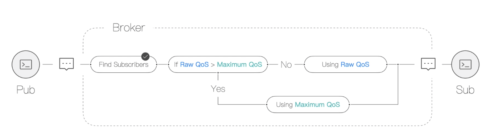
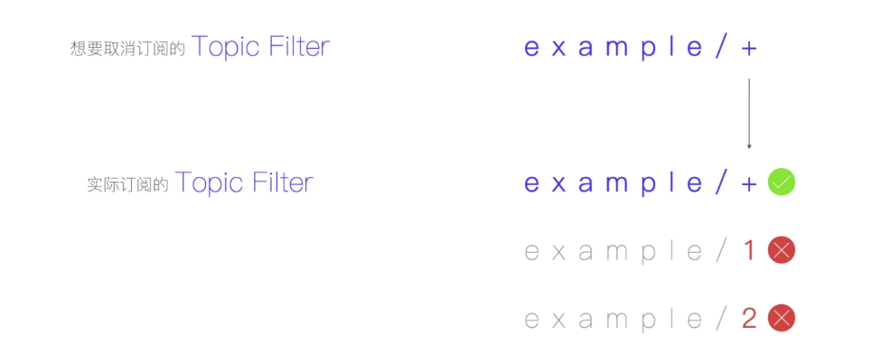

## MQTT如何订阅主题、取消订阅主题及报文全面分析


#### 一、SUBSCRIBE报文

- 固定报头

  这个不重要，有兴趣自己找资料看

- 可变报头

  - Packet ID：SUBSCRIBE报文的唯一标识符

- 荷载数据

  必须包含至少一对主题过滤器 和 QoS等级字段组合

  - 主题过滤器：表示客户端想要订阅的主题，**必须**是UTF-8字符串。服务端**应该**支持包含通配符的主题过滤器。如果服务端选择不支持包含通配符的主题过滤器，**必须**拒绝任何包含通配符过滤器的订阅请求。通配符规则：单层通配符'+'、多层通配符'#'。使用包含通配符的主题名可以订阅满足匹配条件的所有主题。

    <font color="red">重点：主题过滤器中的通配符的使用</font>

    ```java
    当我们订阅主题的时候，可以使用通配符来匹配订阅的多个主题。
    MQTT 的主题是具有层级概念的，不同的层级之间用'/'分割。
    
    单层通配符'+'：用来指代任意一个层级。
      例如'home/2ndfloor/+/temperature'，可匹配：
    
      home/2ndfloor/201/temperature
    
      home/2ndfloor/202/temperature
    
      不可匹配：
    
      home/2ndfloor/201/livingroom/temperature
    
      home/3ndfloor/301/temperature
    
    多层通配符'#'：可以用来指定任意多个层级
      '#'和'+'的区别在于：
        1）'+'用来指代任意一个层级；而'#'：可以用来指定任意多个层级
        2）但是'#'必须是 Topic Filter 的最后一个字符，同时它必须跟在'/'后面，除非 Topic Filter 只包含'#'这一个字符。
    
      例如'home/2ndfloor/#'，可匹配：
    
        home/2ndfloor
    
        home/2ndfloor/201
    
        home/2ndfloor/201/temperature
    
        home/2ndfloor/202/temperature
    
        home/2ndfloor/201/livingroom/temperature
    
        不可匹配：
    
        home/3ndfloor/301/temperature
    ```

    

  - QoS：每一个过滤器后面跟着一个字节，这个字节被叫做 服务质量要求（Requested QoS）。它给出了服务端向客户端发送应用消息所允许的最大QoS等级。

    当Broker向订阅者发送消息的时候，Broker的PUBLISH报文中的QoS等级大于订阅者订阅时的最大QoS等级，那么PUBLISH中的QoS等级会发生降级。

    

​			

使用订阅的注意点：

1. 在同一个客户端使用相同的主题过滤器进行订阅，新的订阅会覆盖旧的订阅，不会出现一个消息发给2个订阅者
2. 在同一个客户端使用不同的主题过滤器进行订阅，但是这些主题过滤器能匹配到同一个主题时，每个订阅都会收到一次消息！


#### 二、SUBACK报文

Broker接收到客户端发送的SUBSCRIBE报文返回给客户端订阅结果的报文。

- 固定报头

  这个不重要，有兴趣自己找资料看

- 可变报头

  - Packet ID：值等于SUBSCRIBE报文的唯一标识符，用于客户端获取后，可以识别是对哪个SUBSCRIBE报文的响应！

- 荷载数据：

  包含一个返回码清单（n个返回码）。每个返回码对应等待确认的SUBSCRIBE报文中的一个主题过滤器。

  每一个返回码占用1个字节，允许的返回码值：

  - 0x00 - 最大QoS 0
  - 0x01 - 成功 – 最大QoS 1
  - 0x02 - 成功 – 最大 QoS 2
  - 0x80 - Failure 失败


#### 三、UNSUBSCRIBE报文

客户端发送UNSUBSCRIBE报文给服务端，用于取消订阅主题。

- 固定报头

  这个不重要，有兴趣自己找资料看

- 可变报头

  Packet ID：UNSUBSCRIBE报文的唯一标识符

- 荷载数据：

  包含客户端想要取消订阅的主题过滤器列表，**必须**包含至少1个要取消订阅的主题过滤器。

  主题过滤器：表示客户端想要订阅的主题，**必须**是UTF-8字符串。要取消订阅的主题过滤器必须与已经订阅的主题过滤器的名称完全匹配！

  


#### 四、UNSUBACK报文

Broker接收到客户端发送的UNSUBSCRIBE报文返回给客户端取消订阅结果的报文。

- 固定报头

  这个不重要，有兴趣自己找资料看

- 可变报头

  Packet ID：值等于UNSUBSCRIBE报文的唯一标识符，用于客户端获取后，可以识别是对哪个UNSUBSCRIBE报文的响应！