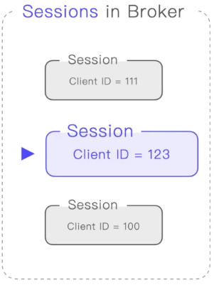

## MQTT中Client端与Broker建立连接之后的持久会话全面分析

#### 什么是会话

Client端跟Broker端建立了连接，就会创建一个会话，后续的消息收发都会在这个会话上进行，Broker端会根据客户端的Client ID将会话（session）保存起来，以便客户端断开连接后重新连接，不会重新创建会话，而是根据Client ID 复用之前的会话(session)。

#### Broker端会围绕会话(session)存储哪些信息

1. 订阅端的订阅信息：客户端断开连接后，重新连接，无需重新订阅。
2. 发送端发送到Broker后等待发送给订阅端的消息：因为会话被保存，发送端发送过来的消息也不会随着订阅端断开连接而丢失消息，消息会被保存在会话中。
3. Broker端已经发送给订阅端，但还未完成确认的QoS1和QoS2消息
4. 遗嘱消息

#### 发送端围绕会话(session)存储哪些消息

1. 已发送但未完成确认QoS1、QoS2的消息

#### 订阅端围绕会话(session)存储哪些消息

1. 从服务端收到的但未完成确认的QoS2消息

#### MQTT5.0在CONNECT报文中设置会话的字段

1. clean start：

   设置为0，并且存在一个关联此客户端标识符的会话，服务端必须基于此会话的状态恢复与客户端的通信。如果不存在任何关联此客户端标识符的会话，服务端必须创建一个新的会话。

   设置为1，客户端和服务端必须丢弃任何已存在的会话，并开始一个新的会话。

2. Session Expiry Interval：

   以秒为单位，如果Session Expiry Interval设置为0或者未指定，会话将在网络连接关闭时结束。如果为0xFFFFFFFF，则会话永不过期。