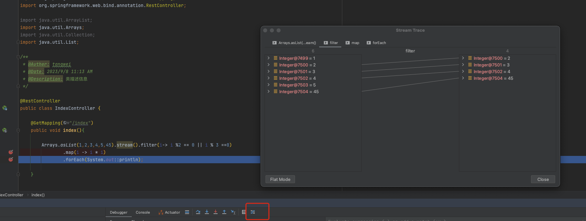

## 流式编程如何调试


有如下代码

```java
@GetMapping("/index")
public void index(){

  Arrays.asList(1,2,3,4,5,45).stream().filter(i-> i %2 == 0 || i % 3 ==0)
    .map(i -> i * i)
    .forEach(System.out::println);

}
```

给stream打上断点，进入断点后，点击`trace current stream chain`，会有如下入的效果，方便查看stream的流程和结果

