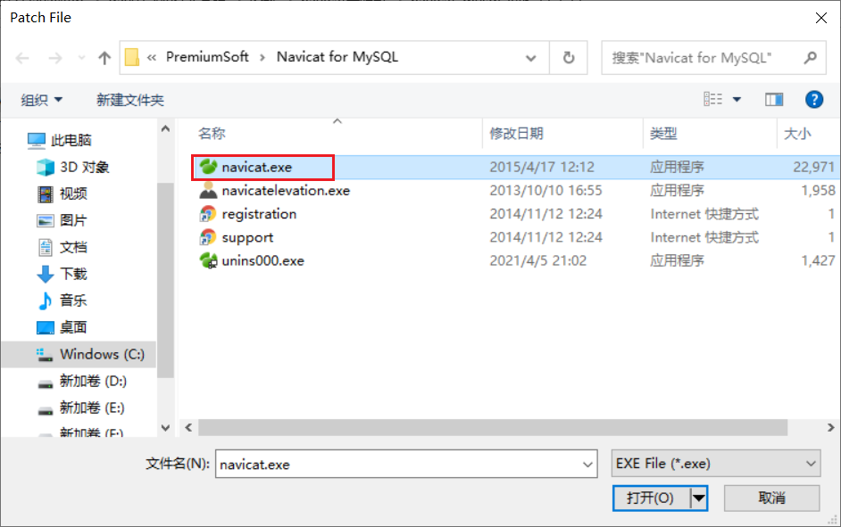

## Navicate安装

双击`navicat111_mysql_cs_x86.exe` ，然后一路下一步。安装成功

二、激活

双击`PatchNavicat.exe`，选择安装目录中的navicat.exe 。完成激活。

navicat默认安装路径： `C:\Program Files (x86)\PremiumSoft\Navicat for MySQL`

看到Successfully，证明激活成功

