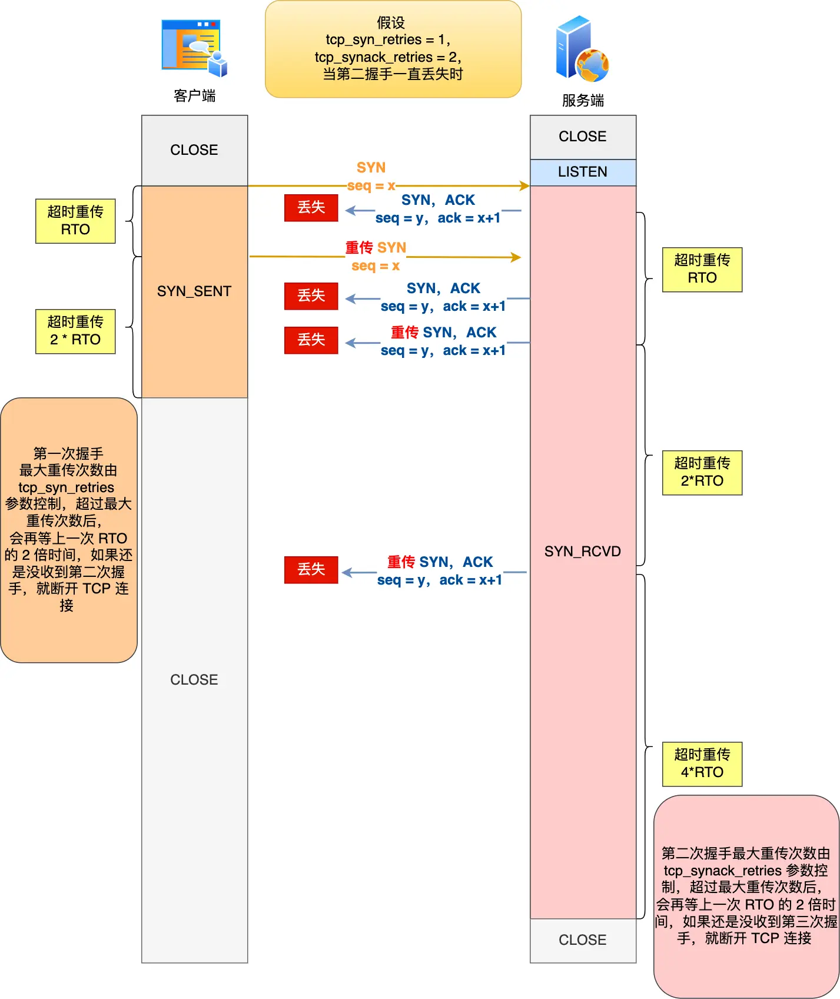

## 第二次握手丢失了，会发生什么？

当服务端收到客户端的第一次握手后，就会回 SYN-ACK 报文给客户端，这个就是第二次握手，此时服务端会进入 `SYN_RCVD` 状态。

如果第二次握手丢失了

- 客户端会重传 SYN 报文，也就是第一次握手，最大重传次数由 `tcp_syn_retries`内核参数决定；

- 服务端会重传 SYN-ACK 报文，也就是第二次握手，最大重传次数由 `tcp_synack_retries` 内核参数决定。

  ```shell
  # cat /proc/sys/net/ipv4/tcp_synack_retries
  5
  ```


举个例子，假设 tcp_syn_retries 参数值为 1，tcp_synack_retries 参数值为 2，那么当第二次握手一直丢失时，发生的过程如下图：



具体过程：

- 当客户端超时重传 1 次 SYN 报文后，由于 tcp_syn_retries 为 1，已达到最大重传次数，于是再等待一段时间（时间为上一次超时时间的 2 倍），如果还是没能收到服务端的第二次握手（SYN-ACK 报文），那么客户端就会断开连接。
- 当服务端超时重传 2 次 SYN-ACK 报文后，由于 tcp_synack_retries 为 2，已达到最大重传次数，于是再等待一段时间（时间为上一次超时时间的 2 倍），如果还是没能收到客户端的第三次握手（ACK 报文），那么服务端就会断开连接。