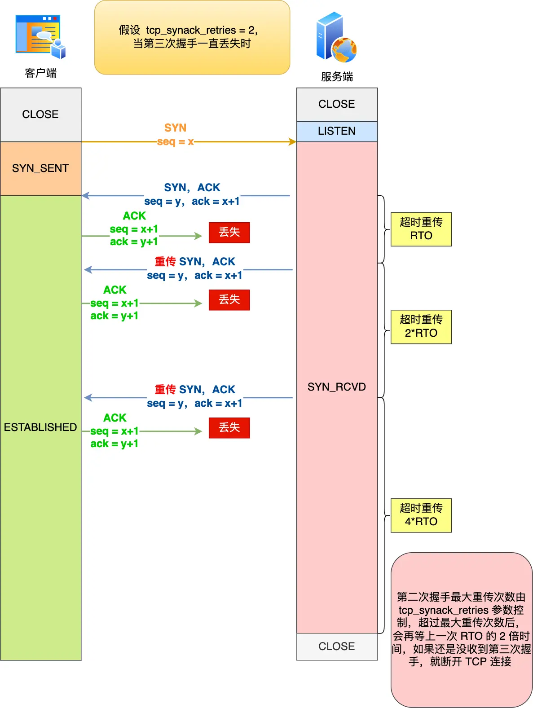

## 第三次握手丢失了，会发生什么？

第三次握手的 ACK 是对第二次握手的 SYN 的确认报文，所以当第三次握手丢失了，如果服务端那一方迟迟收不到这个确认报文，就会触发超时重传机制，重传 SYN-ACK 报文，直到收到第三次握手，或者达到最大重传次数。

注意：**ACK 报文是不会有重传的，当 ACK 丢失了，就由对方重传对应的报文**。

举个例子，假设 tcp_synack_retries 参数值为 2，那么当第三次握手一直丢失时，发生的过程如下图：

具体过程：

- 当服务端超时重传 2 次 SYN-ACK 报文后，由于 tcp_synack_retries 为 2，已达到最大重传次数，于是再等待一段时间（时间为上一次超时时间的 2 倍），如果还是没能收到客户端的第三次握手（ACK 报文），那么服务端就会断开连接。