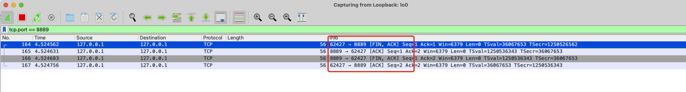

## python代码验证TCP四次挥手


server端代码：

```python
# -*- coding: utf-8 -*-

import socket

server_socket = socket.socket(socket.AF_INET, socket.SOCK_STREAM)

host = socket.gethostname()
port = 8889

# 将socket对象绑定到指定的主机和端口上
server_socket.bind((host, port))

# 开始监听连接
server_socket.listen(1)


# 等待客户端连接
print("等待客户端连接...")
client_socket, client_address = server_socket.accept()

print("连接来自: ", client_address)

while True:
    # 接收客户端发送的数据
    data = client_socket.recv(1024)

    if len(data) > 0:
        print("收到的数据为" + data.decode("utf-8"))
        client_socket.send("hhhh".encode())
    elif len(data) < 0:
        print("读取出错！")

    else:
        # print("客户端断开连接")
        client_socket.close()
        break


```

调用`close()`方法会发送FIN报文！


client代码：

```python
import socket

client = socket.socket()
client.connect(('127.0.0.1', 8889))

while True:
    msg = input(">>>")
    if msg != 'q':
        client.send(msg.encode())
        data = client.recv(1024)
        print('收到的数据{}'.format(data.decode()))
    else:
        client.close()
        print('close client socket')
        break
```

调用`close()`方法会发送FIN报文！


启动server端

```shell
python3.8 server.py
```


启动client端

```shell
python3.8 client.py
```


启动wireshark，因为我们上面将ip绑定在了回环网卡上，所以我们在wireshark中选择回环网卡，输入过滤条件(tcp.port == 8889)，当客户端关闭的时候，是不是四次挥手

