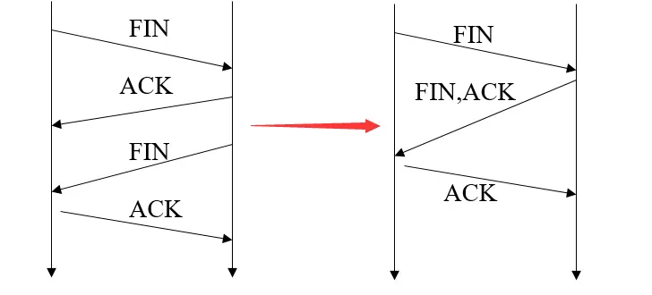

## TCP的四次挥手可不可以变成三次挥手

虽然我们在学习 TCP 挥手时，学到的是需要四次来完成 TCP 挥手，但是**在一些情况下， TCP 四次挥手是可以变成 TCP 三次挥手的**。

当Server端接收到Client端的FIN包后，Server端会响应一个ACK包给Client端，Server端就会进入CLOSED_WAIT阶段。但是Server端默认开启了TCP的延时确认机制，这个ACK包并不会在接收到Client端的FIN包之后立马响应给Client端。而是会经过如下的判断逻辑

- 当有响应数据要发送时，ACK 会随着响应数据一起立刻发送给对方
- 当没有响应数据要发送时，ACK 将会延迟一段时间，以等待是否有响应数据可以一起发送
- 如果在延迟等待发送 ACK 期间，对方的第二个数据报文又到达了，这时就会立刻发送 ACK

所以：「**没有数据要发送」并且「开启了 TCP 延迟确认机制」，那么第二和第三次挥手就会合并传输，这样就出现了三次挥手。**

