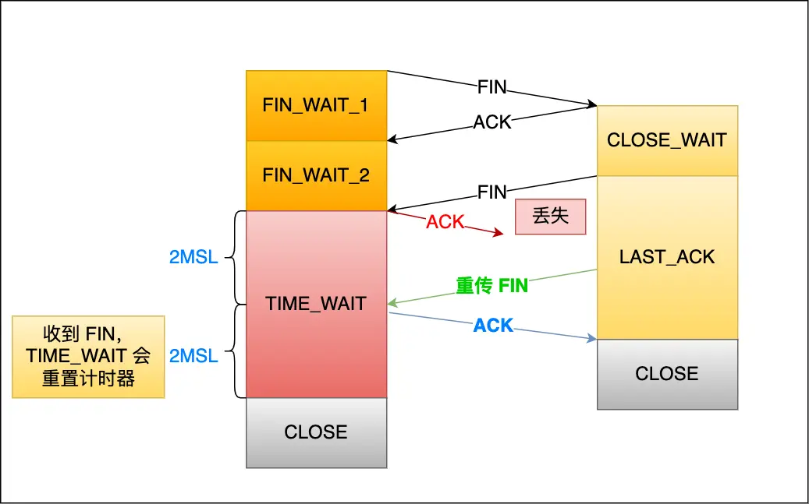

## 为什么需要有个TIME_WAIT状态且等待时间是2MSL

#### 什么是MSL和2MSL

`MSL` 是 Maximum Segment Lifetime，**报文最大生存时间**，它是任何报文在网络上存在的最长时间，超过这个时间报文将被丢弃。

TIME_WAIT 等待 2 倍的 MSL，比较合理的解释是： 网络中可能存在来自发送方的数据包，当这些发送方的数据包被接收方处理后又会向对方发送响应，所以**一来一回需要等待 2 倍的时间**。

#### 为什么需要TIME_WAIT状态

- 当Server端在正常连接阶段发送了SEQ包，由于网络波动Client端并没有收到，然后过了端时间Server又重发了SEQ包，这次的SEQ包被Client端收到了，但是之前发送的SEQ包可能还在网络中Client端一直没有收到。这时候，Client开始了断开连接的过程，如果断开Client直接Close了，然后一个新连接接入到了Server端，有极小的可能会复用上个连接的连接数据，当新连接正常接入后，之前网络中的FIN包会被新连接正常接收，导致数据错乱！

  

  所以必须要有一个TIME_WAIT状态，等待2MSL，等到网络没有被消费的报文都自动过期了，才能正常退出！

- TIME-WAIT 作用是**等待足够的时间以确保最后的 ACK 能让被动关闭方接收，从而帮助其正常关闭。**

  如果客户端（主动关闭方）最后一次 ACK 报文（第四次挥手）在网络中丢失了，那么按照 TCP 可靠性原则，服务端（被动关闭方）会重发 FIN 报文。

  假设客户端没有 TIME_WAIT 状态，而是在发完最后一次回 ACK 报文就直接进入 CLOSE 状态，如果该 ACK 报文丢失了，服务端则重传的 FIN 报文，而这时客户端已经进入到关闭状态了，在收到服务端重传的 FIN 报文后，就会回 RST 报文。

  

  服务端收到这个 RST 并将其解释为一个错误（Connection reset by peer），这对于一个可靠的协议来说不是一个优雅的终止方式。

  为了防止这种情况出现，客户端必须等待足够长的时间，确保服务端能够收到 ACK，如果服务端没有收到 ACK，那么就会触发 TCP 重传机制，服务端会重新发送一个 FIN，这样一去一来刚好两个 MSL 的时间。

  

  客户端在收到服务端重传的 FIN 报文时，TIME_WAIT 状态的等待时间，会重置回 2MSL。

  

