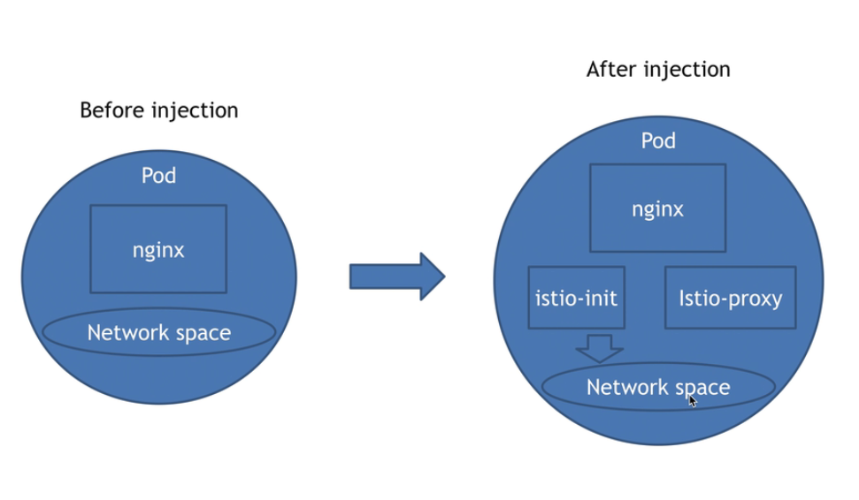

## istio的工作原理（注入的概念）

#### 1、istio的工作原理，即注入的概念

将istio的组件istio-init、istio-proxy注入到目标的pod中，从而接管pod内的网络流量，从而达到使用istio进行流控、限流等操作

#### 2、istio注入的过程

被istio注入之后，会在pod内部产生一个istio-init、一个istio-proxy的容器，istio-init的容器启动之后，会修改pod的网络策略，开放一些端口之后就消亡了，留下istio-proxy。istio-proxy和默认的容器是使用同一个网络的。

#### 3、哪些k8s资源可以被istio注入

- Job/CronJob下的pod、DaemonSet下的pod、直接创建的Pod、Deployment下的pod
- Service、Secrets、ConfigMap 被istio注入之后，不会有任何变动，但是确实是被istio注入了！

