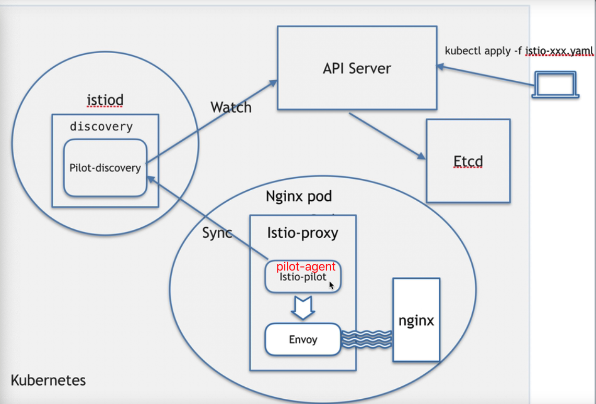

## istio注入后pod中的istio-proxy是如何工作的


#### 1、istio-proxy的工作原理



1. pilot-agent进程负责从istiod这个pod的pilot-discovery中去拉取最近的流控策略，然后监控和操作envoy
2. envoy进程可以类比为nginx的反向代理，网络流量先进入envoy中，然后被envoy反向代理到pod中的另一个容器（此时为nginx）。envoy在本pod中打开多个端口，用于通讯。


#### 2、验证Pilot-discovery在istiod中是否真的存在

运行如下命令，查看istiod的pod中是否真的有Pilot-discovery

```shell
kubectl exec -ti istiod-7469ddf46f-wghgk -n istio-system -c discovery -- ps -ef
UID         PID   PPID  C STIME TTY          TIME CMD
istio-p+      1      0  0 00:42 ?        00:00:36 /usr/local/bin/pilot-discovery #Pilot-discovery在istiod中真的存在
istio-p+     15      0  0 06:29 pts/0    00:00:00 ps -ef
```


#### 3、验证pilot-agent、envoy在istio-proxy中是否真的存在

运行如下命令查看

```shell
[root@control-plane ~]# kubectl exec -ti nginx-7cbb8cd5d8-gnspm  -n test -c istio-proxy -- ps -ef
UID         PID   PPID  C STIME TTY          TIME CMD
istio-p+      1      0  0 06:12 ?        00:00:00 /usr/local/bin/pilot-agent pro
istio-p+     18      1  0 06:12 ?        00:00:05 /usr/local/bin/envoy -c etc/is
istio-p+     59      0  0 06:30 pts/0    00:00:00 ps -ef
```

