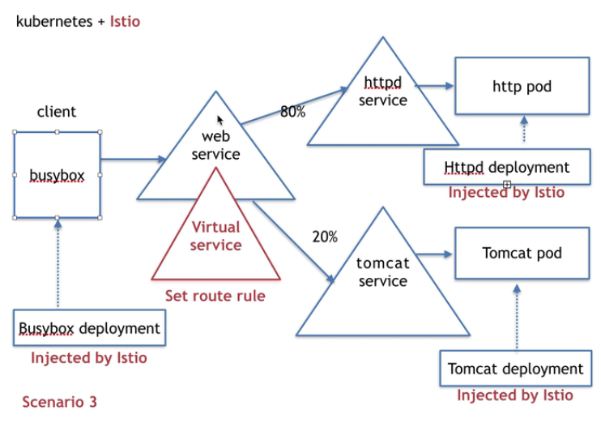

## istio中virtual service的概念

#### 1、virtual service是做什么用的

所有被istio注入的pod，形成了istio的流量网格，virtual service注入到某一个k8s的普通service中，拦截所有经过该普通service的流量，同时virtual service中会配置一系列的流量匹配规则，被拦截的流量会经过流量匹配规则的匹配，确定流量最终转发到哪个下层service！

#### 2、virtual service作用案例

如下图：

使用virtual service我们可以控制流量，80%转到http的pod，20%转到tomcat的pod。