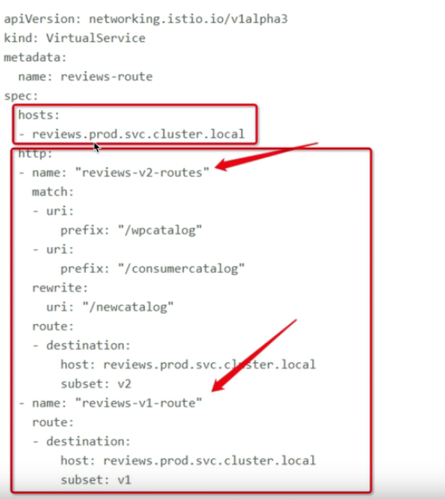
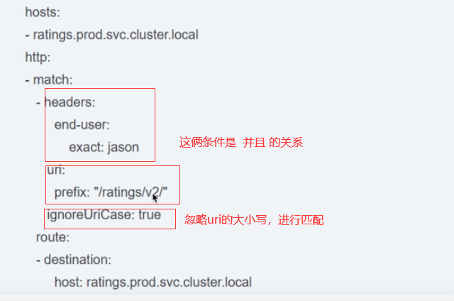
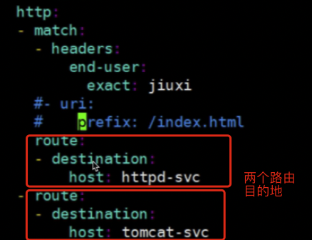

## istio中virtual service的配置范例


#### virtual service的配置范例



- hosts的配置：

  填入k8s内一个存在的目标，如果请求（流量）走到当前的这个目标了，那么就按照底下的配置规则走。

  可以写到具体的：

  1. 某个service，service的短域名（就是service的名称，流量入口跟service在同一个namespace中）
  2. 某个service，service的长域名（流量入口跟service不在同一个namespace中）
  3. service的内部IP
  4. 某个ingress的IP或者配置给ingress的域名

- http的配置：

  配置各个路由规则（一旦按规则匹配成功，就不会继续匹配）

  可以具体配置如下规则：

  1. 匹配条件（非必填）

     情形1：对http请求头进行规则判断

     ```yaml
     http:
     - match:
     	- header:
     		end-user:
     			exact: tangwei
     ```

     判断请求头中有key为end-user，值为tangwei的数据。exact是全完匹配！

     

     情形2：多条件匹配

     

     

  2. 路由目的地：

     

     上图。如果满足match信息，请求就会进httpd-svc，如果不满足就会进tomcat-svc，同样的这儿的host，如果是在同一命名空间中，可以写短的，如果不在的话就需要写长域名比如：service的名称.命名空间名称.svc.cluster.local

  

  

  