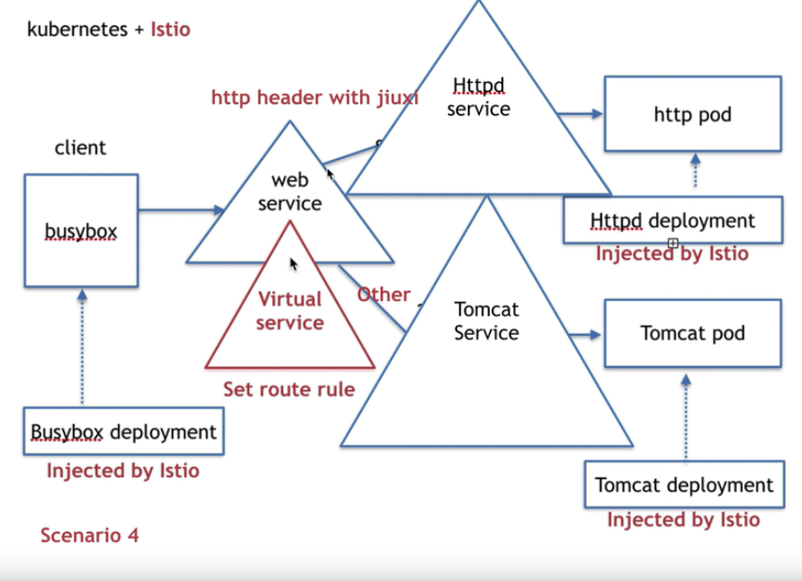

## 使用istio的virtual service根据请求头判断将流量引入到不同的Service中


#### 1、最终要实现的效果



确保busybox的pod、http的pod、tomcat的pod已经被istio注入过了。


#### 2、具体操作步骤

<font color="red">以下所有步骤都是在自动注入下完成</font>

- 部署client端的busybox

  

  资源配置文件内容如下：

  ```yaml
  apiVersion: apps/v1
  kind: Deployment
  metadata:
    labels:
      app: busybox
    name: busybox
    namespace: tangwei
  spec:
    replicas: 1
    selector:
      matchLabels:
        app: busybox
    template:
      metadata:
        labels:
          app: busybox
      spec:
        containers:
        - image: busybox
          name: busybox
          imagePullPolicy: IfNotPresent
          command: ["/bin/sh", "-c", "sleep 3600"]
  
  ```

  使用`kubectl apply -f 上面的资源配置文件` 即可完成安装！

  

- 部署服务端httpd（只是名字叫httpd服务，镜像还是busybox）

  资源配置文件内容如下：

  ```yaml
  apiVersion: apps/v1
  kind: Deployment
  metadata:
    labels:
      server: httpd
      app: web
    name: httpd
    namespace: tangwei
  spec:
    replicas: 1
    selector:
      matchLabels:
        server: httpd
        app: web
    template:
      metadata:
        name: httpd
        labels:
          server: httpd
          app: web
      spec:
        containers:
        - image: busybox
          name: httpd
          imagePullPolicy: IfNotPresent
          command: ["/bin/sh", "-c", "echo 'hello httpd' > /var/www/index.html; httpd -f -p 8080 -h /var/www"]
  ```

  使用`kubectl apply -f 上面的资源配置文件` 即可完成安装！

  

- 部署tomcat服务

  资源配置文件内容如下：

  ```yaml
  apiVersion: apps/v1
  kind: Deployment
  metadata:
    labels:
      server: tomcat
      app: web
    name: tomcat
    namespace: tangwei
  spec:
    replicas: 1
    selector:
      matchLabels:
        server: tomcat
        app: web
    template:
      metadata:
        name: tomcat
        labels:
          server: tomcat
          app: web
      spec:
        containers:
        - image: docker.io/kubeguide/tomcat-app:v1
          name: tomcat
          imagePullPolicy: IfNotPresent
  ```

  使用`kubectl apply -f 上面的资源配置文件` 即可完成安装！

  

- 部署以上httpd和tomcat服务的service

  资源配置文件内容如下：

  ```yaml
  kind: Service
  apiVersion: v1
  metadata:
    name: tomcat
    namespace: tangwei
    labels:
      app: tomcat
  spec:
    ports:
      - name: http
        protocol: TCP
        port: 8080
        targetPort: 8080
    selector:
      server: tomcat
  ---
  kind: Service
  apiVersion: v1
  metadata:
    name: httpd
    namespace: tangwei
    labels:
      app: httpd
  spec:
    ports:
      - name: http
        protocol: TCP
        port: 8080
        targetPort: 8080
    selector:
      server: httpd
  
  ```

  使用`kubectl apply -f 上面的资源配置文件` 即可完成安装！

  

- 检查service与httpd、tomcat的pod是否已经完成绑定

  运行`kubectl get all -n tangwei `，可以得到，如下的反馈

  ```shell
  [root@control-plane ~]# kubectl get all -n tangwei
  NAME                          READY   STATUS    RESTARTS   AGE
  pod/busybox-7db4456f9-lkhkj   2/2     Running   0          12m
  pod/httpd-69f87cdc89-w27gf    2/2     Running   0          9m6s
  pod/tomcat-8484c667bf-7gsx5   2/2     Running   0          7m45s
  
  NAME             TYPE        CLUSTER-IP       EXTERNAL-IP   PORT(S)    AGE
  service/httpd    ClusterIP   10.110.96.177    <none>        8080/TCP   4m53s
  service/tomcat   ClusterIP   10.102.238.129   <none>        8080/TCP   4m53s
  
  NAME                      READY   UP-TO-DATE   AVAILABLE   AGE
  deployment.apps/busybox   1/1     1            1           12m
  deployment.apps/httpd     1/1     1            1           9m6s
  deployment.apps/tomcat    1/1     1            1           7m45s
  
  NAME                                DESIRED   CURRENT   READY   AGE
  replicaset.apps/busybox-7db4456f9   1         1         1       12m
  replicaset.apps/httpd-69f87cdc89    1         1         1       9m6s
  replicaset.apps/tomcat-8484c667bf   1         1         1       7m45s
  ```

  可以看到service那儿，有httpd、tomcat两个service，他们分别有自己的ip，可以通过 `curl http://IP:8080`看看能不能获取到数据，能获取到数据，证明部署成功了！

  

- 进入busybox的pod中，测试能不能正常访问到tomcat、httpd的service

  使用`kubectl exec -ti busybox的具体名称 -n tangwei -- sh`, 随后输入 `wget -q -O - http://tomcat:8080`、`wget -q -O - http://httpd:8080`。

  如果一切顺利，我们继续下面的操作！

  

- 再建一个service，注意这个service的标签选择器为app:web，而上面部署的httpd和tomcat的pod有两个标签的其中一个就是app:web，那么这个service底下就管理着2个pod，从这个service发出的请求就会随机的进入到这2个pod中的一个。

  <font color="red">因为，这个service还是属于k8s自带的service，无法做到按比例走不同的pod</font>

  资源配置文件内容如下：

  ```yaml
  kind: Service
  apiVersion: v1
  metadata:
    name: web
    namespace: tangwei
    labels:
      app: web
  spec:
    ports:
      - name: http
        protocol: TCP
        port: 8080
        targetPort: 8080
    selector:
      app: web
  ```

  然后，查看新建service的IP地址

  ```shell
  [root@control-plane ~]# kubectl get all -n tangwei
  NAME                          READY   STATUS    RESTARTS   AGE
  pod/busybox-7db4456f9-lkhkj   2/2     Running   0          25m
  pod/httpd-69f87cdc89-w27gf    2/2     Running   0          21m
  pod/tomcat-8484c667bf-7gsx5   2/2     Running   0          20m
  
  NAME             TYPE        CLUSTER-IP       EXTERNAL-IP   PORT(S)    AGE
  service/httpd    ClusterIP   10.110.96.177    <none>        8080/TCP   17m
  service/tomcat   ClusterIP   10.102.238.129   <none>        8080/TCP   17m
  service/web      ClusterIP   10.104.144.201   <none>        8080/TCP   59s
  
  NAME                      READY   UP-TO-DATE   AVAILABLE   AGE
  deployment.apps/busybox   1/1     1            1           25m
  deployment.apps/httpd     1/1     1            1           21m
  deployment.apps/tomcat    1/1     1            1           20m
  
  NAME                                DESIRED   CURRENT   READY   AGE
  replicaset.apps/busybox-7db4456f9   1         1         1       25m
  replicaset.apps/httpd-69f87cdc89    1         1         1       21m
  replicaset.apps/tomcat-8484c667bf   1         1         1       20m
  ```

  使用`curl http://10.104.144.201:8080` 看看是不是随机走到tomcat、httpd 这俩pod中！

  

- 新建istio提供的virtual service

  <font color="red">virtual service的命名空间一定要跟被注入的资源在同一个命名空间中！因为，下面的资源配置文件中，host写的是service的名称</font>

  virtual service的资源配置文件如下：

  ```yaml
  apiVersion: networking.istio.io/v1alpha3
  kind: VirtualService
  metadata:
    name: web-vs
    namespace: tangwei
  spec:
    hosts:
      - web # web.namespace名称.svc.cluster.local
    http:
      - match:
          - headers:
              api-version:
                exact: v1
        route:
          - destination:
              host: httpd # httpd.namespace名称.svc.cluster.local
      - route:
          - destination:
              host: tomcat # tomcat.namespace名称.svc.cluster.local
  ```

  使用`kubectl apply -f 上面的资源配置文件` 即可完成安装！

  

  安装完成了之后，必须使用`kubectl get virtualservice -n namespace名称`，才能查到上面创建的虚拟service

  ```shell
  [root@control-plane ~]# kubectl get virtualservice -n tangwei
  NAME         GATEWAYS   HOSTS     AGE
  web-svc-vs              ["web"]   29s
  ```

  

- 再次进入Busybox的pod中，测试使用`wget -q -O - http://web:8080` 分别带 `--header api-version:v1` 和不带是不是会分别走不同的service

  使用`kubectl exec -ti busybox的具体名称 -n tangwei -- sh`, 进入busybox的容器中。
