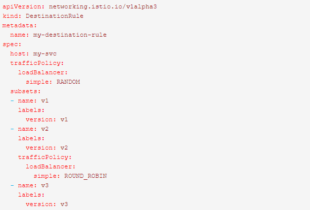
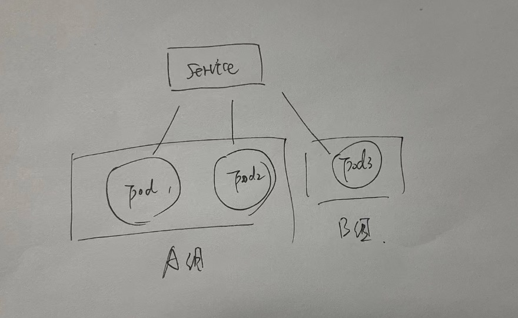

## istio中destination rule的概念

#### 1、destination rule的概念

当请求（流量）经过virtual service配置之后，就指明了，需要具体的服务转发目标了！那么在转发到不同的service之后，还可以通过destination rule配置更多的转发规则，比如：

- 转发到具体的service下，如何负载均衡所有的pod
- 转发到具体的service下，如何指定规定哪些pod可以提供服务，哪些pod不可以提供服务（ 有点类似于灰度发布 ）

#### 2、destination rule的使用前提

destination rule不能独自使用，必须跟 Virtual Service 共同发挥作用

#### 3、destination rule的使用说明

- destination rule的配置关键字

  

  关键字含义：

  1. host：一定要指到k8s的某个service

  2. trafficPolicy: 流量策略，包括负载均衡，连接池策略，异常点检查等

  3. subsets: 定义一个service的子集。

     1. name: 定义一个子集的名称，主要供 VirtualService 里destination 使用
     2. labels：根据labels定义的标签，会将host配置的service下，所有拥有这些标签的pod归到当前的subset中。就是类似于对pod进行分组

     

     

- virtual service配合destination rule的使用

  