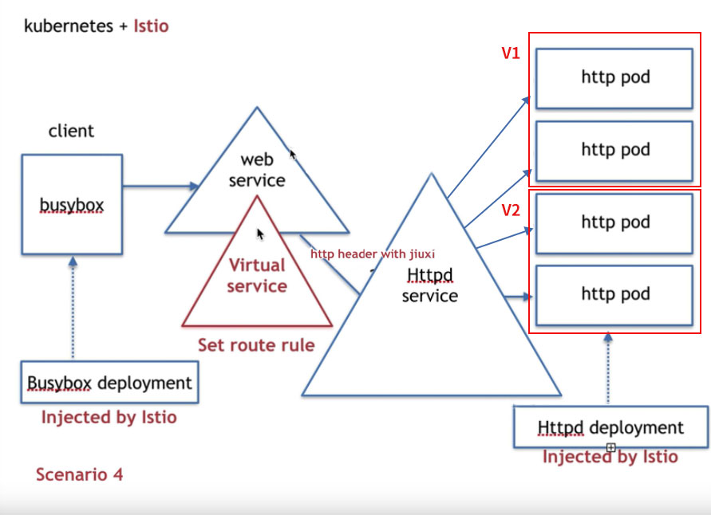

## 使用istio的virtual service和destination rule做灰度发布


#### 1、最终要实现的效果



确保busybox的pod、http的pod已经被istio注入过了。


#### 2、具体操作步骤

<font color="red">以下所有步骤都是在自动注入下完成</font>

- 部署client端的busybox

  资源配置文件内容如下：

  ```yaml
  apiVersion: apps/v1
  kind: Deployment
  metadata:
    labels:
      app: busybox
    name: busybox
    namespace: tangwei
  spec:
    replicas: 1
    selector:
      matchLabels:
        app: busybox
    template:
      metadata:
        labels:
          app: busybox
      spec:
        containers:
        - image: busybox
          name: busybox
          imagePullPolicy: IfNotPresent
          command: ["/bin/sh", "-c", "sleep 3600"]
  
  ```

  使用`kubectl apply -f 上面的资源配置文件` 即可完成安装！

  

- 部署上图httpd的v1版本

  资源配置文件如下：

  ```yaml
  apiVersion: apps/v1
  kind: Deployment
  metadata:
    labels:
      server: httpd-v1
      type: httpd-service
      app: web
      version: v1
    name: httpd-v1
    namespace: tangwei
  spec:
    replicas: 2
    selector:
      matchLabels:
        server: httpd-v1
        type: httpd-service
        app: web
        version: v1
    template:
      metadata:
        name: httpd-v1
        labels:
          server: httpd-v1
          type: httpd-service
          app: web
          version: v1
      spec:
        containers:
        - image: busybox
          name: httpd
          imagePullPolicy: IfNotPresent
          command: ["/bin/sh", "-c", "echo 'hello httpd v1' > /var/www/index.html; httpd -f -p 8080 -h /var/www"]
  
  ```

  使用`kubectl apply -f 上面的资源配置文件` 即可完成安装！

  

- 部署上图httpd的v2版本

  资源配置文件如下：

  ```yaml
  apiVersion: apps/v1
  kind: Deployment
  metadata:
    labels:
      server: httpd-v2
      type: httpd-service
      app: web
      version: v2
    name: httpd-v2
    namespace: tangwei
  spec:
    replicas: 2
    selector:
      matchLabels:
        server: httpd-v2
        type: httpd-service
        app: web
        version: v2
    template:
      metadata:
        name: httpd-v2
        labels:
          server: httpd-v2
          type: httpd-service
          app: web
          version: v2
      spec:
        containers:
        - image: busybox
          name: httpd
          imagePullPolicy: IfNotPresent
          command: ["/bin/sh", "-c", "echo 'hello httpd v2' > /var/www/index.html; httpd -f -p 8080 -h /var/www"]
  
  ```

  使用`kubectl apply -f 上面的资源配置文件` 即可完成安装！

  

- 部署上图httpd service

  资源配置文件如下：

  ```yaml
  kind: Service
  apiVersion: v1
  metadata:
    name: httpd
    namespace: tangwei
    labels:
      type: httpd-service
  spec:
    ports:
      - name: http
        protocol: TCP
        port: 8080
        targetPort: 8080
    selector:
      type: httpd-service
  
  ```

  使用`kubectl apply -f 上面的资源配置文件` 即可完成安装！

  

- 部署上图web service

  ```yaml
  kind: Service
  apiVersion: v1
  metadata:
    name: web
    namespace: tangwei
    labels:
      app: web
  spec:
    ports:
      - name: http
        protocol: TCP
        port: 8080
        targetPort: 8080
    selector:
      app: web
  ```

  

- 部署istio的destination rule，给上面部署的httpd的v1、v2版本划分为v1、v2分组（注意分组的host是httpd service）

  ```yaml
  apiVersion: networking.istio.io/v1alpha3
  kind: DestinationRule
  metadata:
    name: destination-httpd
    namespace: tangwei
  spec:
    host: httpd # httpd.tangwei.svc.cluster.local
    trafficPolicy:
      loadBalancer:
        simple: RANDOM
    subsets:
      - name: v1
        labels:
          version: v1
      - name: v2
        labels:
          version: v2 
  
  ```

  通过`kubectl get destinationrule -n tangwei` 可以查看一个namespace下的所有的destinationrule

  

- 创建virtual service(流量经过web service的时候会进行规则判断，注意这儿定义了子集，流量根据判断走到了httpd service，会走不同的子集（分组）的pod中去)

  ```yaml
  apiVersion: networking.istio.io/v1alpha3
  kind: VirtualService
  metadata:
    name: web-vs
    namespace: tangwei
  spec:
    hosts:
      - web # web.tangwei.svc.cluster.local
    http:
      - match:
          - headers:
              api-version:
                exact: v1
        route:
          - destination:
              host: httpd # httpd.tangwei.svc.cluster.local
              subset: v1
      - match:
          - headers:
              api-version:
                exact: v2
        route:
          - destination:
              host: httpd # httpd.tangwei.svc.cluster.local
              subset: v2
  
  ```

  安装完成了之后，必须使用`kubectl get virtualservice -n namespace名称`，才能查到上面创建的虚拟service

  

- 使用`kubectl exec -ti busybox的具体名称 -n tangwei -- sh` 进入到busybox的pod中，输入如下命令：

  wget -q -O - http://web:8080 --header 'api-version: v2'，会进入v2版本

  wget -q -O - [http://web:8080](http://web) --header 'api-version: v1' ,会进入v1版本

  

  

  

  

  

  

  