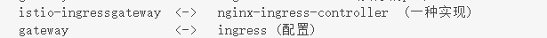

## istio中ingressgateway、egressgateway的概念

> 官方参考：https://istio.io/latest/zh/docs/tasks/traffic-management/ingress/ingress-control/

在k8s中，使用ingress，会将流量引入到k8s中去，但是被istio注入的服务需要流量咋办？

就需要使用istio-gateway了，istio-gateway分为 istio-ingressgateway和istio-engressgateway，分别用来处理入口流量和出口流量。ingress gateway本质也是被istio注入的pod，其中也运行着envoy。

stio ingressgateway与k8s ingress的对比：

