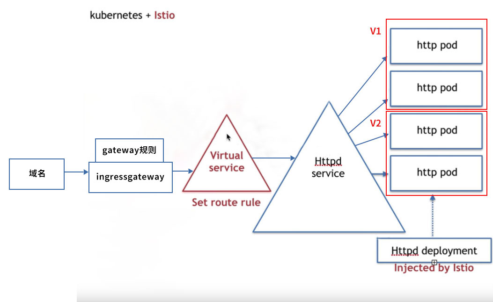

## 使用istio的ingressgateway把流量从入口引入到目标服务中


#### 1、最终要实现的效果




#### 2、具体操作步骤

需要在 使用istio的virtual service、destinationrule做好的灰度发布（即 httpd下的pod分为了v1、v2组）的前提下，才能继续操作！

- 部署好ingressgateway服务

  ```yaml
  apiVersion: networking.istio.io/v1alpha3
  kind: Gateway
  metadata:
    name: lanzhen-gateway
    namespace: tangwei
  spec:
    selector:
      istio: ingressgateway # 使用 Istio 默认网关实现
    servers:
    - port:
        number: 80   #监听的是ingressgateway的80端口
        name: http
        protocol: HTTP
      hosts:
      - "tw.lzmes.cn"
  
  ```

  

- 修改virtual service，注意 virtual service的hosts一定要是第二步中gateway.yaml中配置的hosts，否则会不生效！具体文件如下:

  ```yaml
  apiVersion: networking.istio.io/v1alpha3
  kind: VirtualService
  metadata:
    name: web-vs
    namespace: tangwei
  spec:
    gateways:
      - lanzhen-gateway     #关联gateway的名称
    hosts:
      - "tw.lzmes.cn"   #这儿一定要填写gateway指定的域名，否则会导致virtualservice无效
    http:
      - match:
          - headers:
              api-version:
                exact: v1
        route:
          - destination:
              host: httpd #httpd.tangwei.svc.cluster.local  #这儿写的是destination rule中配置好的host
              subset: v1
      - match:
          - headers:
              api-version:
                exact: v2
        route:
          - destination:
              host: httpd # httpd.tangwei.svc.cluster.local  #这儿写的是destination rule中配置好的host
              subset: v2
  
  ```

- 经过上面两步，gateway的配置会被pilot discovery推到所有的istio-ingressgateway的pod中去。

  通过如下命令暴露ingressgateway的pod中的envoy的15000端口到15009端口，

  ```shell
  [root@control-plane ~]# kubectl port-forward --address 0.0.0.0 -n istio-system istio-ingressgateway-7759d56fbd-59tgd 15009:15000
  Forwarding from 0.0.0.0:15009 -> 15000
  
  Handling connection for 15009
  Handling connection for 15009
  Handling connection for 15009
  ```

  然后用网页打开 http://IP:15009 找到`config dump`，点击进去，找到dynamic_route_configs中查找gateway.yaml中配置的域名，如果没有证明是有问题的！

  

- 测试访问

  到局域网内任意电脑上修改hosts，把域名做好映射，然后运行

  ```shell
  [root@control-plane ~]# wget -q -O - http://tw.lzmes.cn:30656  --header 'api-version: v2'
  hello httpd v2
  [root@control-plane ~]# wget -q -O - http://tw.lzmes.cn:30656  --header 'api-version: v2'
  hello httpd v2
  [root@control-plane ~]# wget -q -O - http://tw.lzmes.cn:30656  --header 'api-version: v2'
  hello httpd v2
  [root@control-plane ~]# wget -q -O - http://tw.lzmes.cn:30656  --header 'api-version: v1'
  hello httpd v1
  [root@control-plane ~]# wget -q -O - http://tw.lzmes.cn:30656  --header 'api-version: v1'
  hello httpd v1
  [root@control-plane ~]# wget -q -O - http://tw.lzmes.cn:30656  --header 'api-version: v1'
  hello httpd v1
  ```

  注意上面的30656端口是，ingressgateway的service的80端口映射到宿主机的端口。

  看看是否能正常运行！

