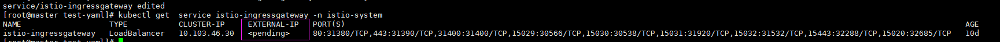
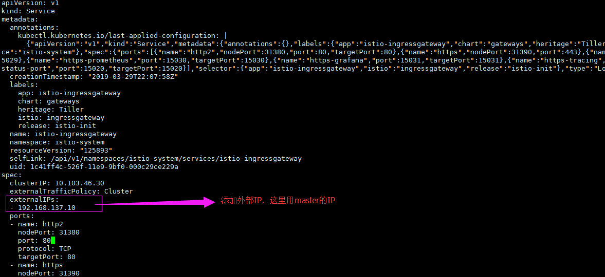
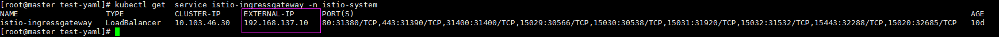

## 修改istio的ingressgateway使用外部负载均衡器（即LoadBalance模式）

我们之前为了方便测试，我们把ingressgateway改成了nodeport模式，这样的访问方式即便是使用了域名也要指定ingressgateway的pod的pod端口映射的端口才能访问应用，这样很明显是不符合我们的要求的，所以，我们就会使用外部负载均衡器（ingressgateway改成LoadBalance模式）

#### 1、确认istio-ingressgateway是否有对外的IP

如果 EXTERNAL-IP 有值（IP 地址或主机名），则说明您的环境具有可用于 Ingress 网关的外部负载均衡器。如果 EXTERNAL-IP 值是 <none>（或一直是 <pending> ），则说明可能您的环境并没有为 Ingress 网关提供外部负载均衡器的功能。

#### 2、通过以下方法添加外部IP

运行：`kubectl edit service istio-ingressgateway -n istio-system`

查看修改之后的ingressgateway：`kubectl get service istio-ingressgateway -n istio-system`

