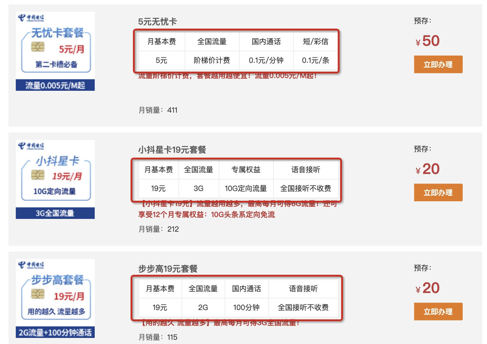
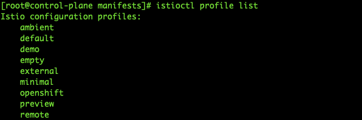
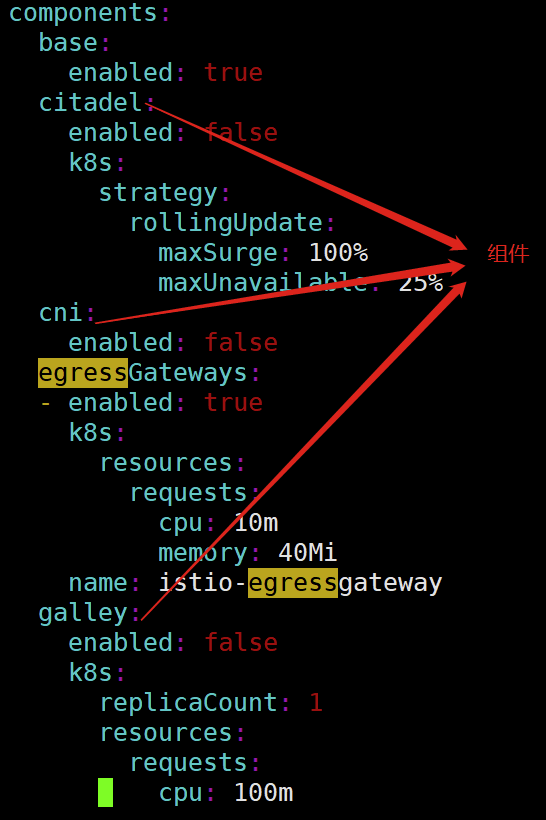

## istio中profile的概念及详述


#### 1、profile的基本概念

说profile之前，我们先来看看下图



我们去电信开通手机业务时，一般都会选择手机套餐，不同的手机套餐会提供不同的增值服务。如上图所示，每个套餐就是一个 profile。istioctl 在安装 istio 时提供的 profile 概念与此类似，不同 profile 定义了不同的 istio 控制面行为，<font color="red">不同的profile安装的组件也不一样。</font>


#### 2、查看所有的profile

可以使用如下命令，查看所有的profile

```shell
istioctl profile list
```




#### 3、如何查看一个具体的profile安装了哪些组件？

参考官方文档：https://istio.io/latest/zh/docs/setup/additional-setup/config-profiles/

可以使用如下命令，将具体的profile的安装信息保存到一个文件中，然后打开文件对比是否与官方文档上的一致

```shell
istioctl profile dump profile类型 > xxxx.yaml 
```

打开生成的xxxx.yaml文件，最重要的是`components`中的内容，规定了profile需要安装哪些组件




#### 4、不同的profile的详述

- **default**：根据`IstioOperatorAPI` 的默认设置启动组件。 建议用于生产部署和 Multicluster Mesh中的 Primary Cluster。

  您可以运行 `istioctl profile dump` 命令来查看默认设置。

- **demo**：这一配置具有适度的资源需求，旨在展示 Istio 的功能。 它适合运行 Bookinfo应用程序和相关任务。 这是通过[快速开始](https://istio.io/latest/zh/docs/setup/getting-started/)指导安装的配置。

- **minimal**：与默认配置文件相同，但只安装了控制平面组件。 它允许您使用 [Separate Profile](https://istio.io/latest/zh/docs/setup/additional-setup/gateway/#deploying-a-gateway) 配置控制平面和数据平面组件（例如 Gateway）。

- **remote**：用于配置一个 Remote Cluster， 这个从集群由 External Control Plane 管理， 或者由 [Multicluster Mesh](https://istio.io/latest/zh/docs/ops/deployment/deployment-models/#multiple-clusters) 的 Primary Cluster 中的控制平面管理。

- **empty**：不部署任何内容。可以作为自定义配置的基本配置文件。

- **preview**：预览文件包含的功能都属于实验性阶段。该配置文件是为了探索 Istio 的新功能。 确保稳定性、安全性和性能（使用风险需自负）。


#### 5、不管是什么profile，无外乎选择性的安装如下的工具

- Kiali istio的dashboard，具体的安装文件在解压包中的samples/addons中
- Tracing 全链路监控工具
- Pilot  服务发现服务配置工具
- Telemetry 远程的从物理设备或虚拟设备上高速采集数据的工具
- Galley  istio的配置中心，类似nacos
- IngressGateway  入口网关
- EgressGateway   出口网关
- Citadel  流量加密、身份认证的工具
- Injector  注入
- Policy  通讯策略，比如黑名单、白名单等等
- Grafana 展示的组件，具体的安装文件在解压包中的samples/addons中
- Jaeger 全链路监控，具体的安装文件在解压包中的samples/addons中


