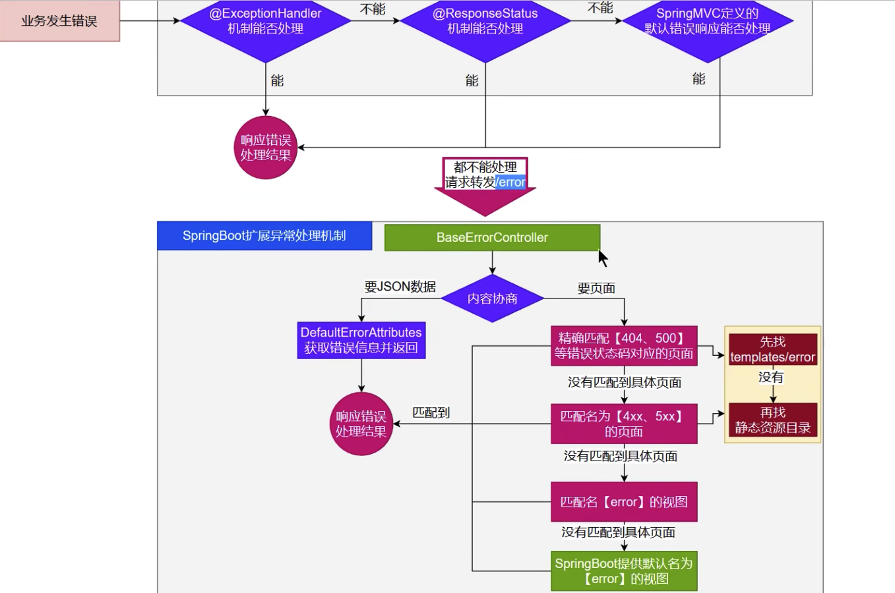
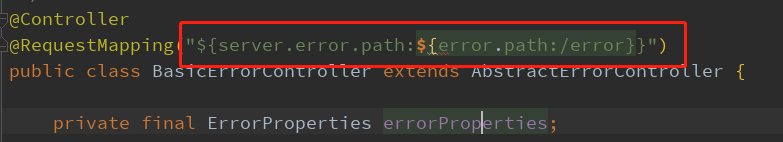
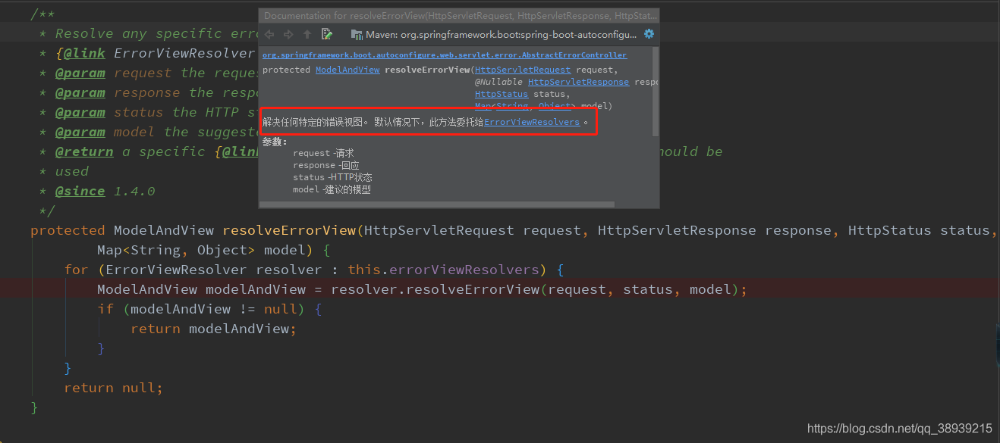
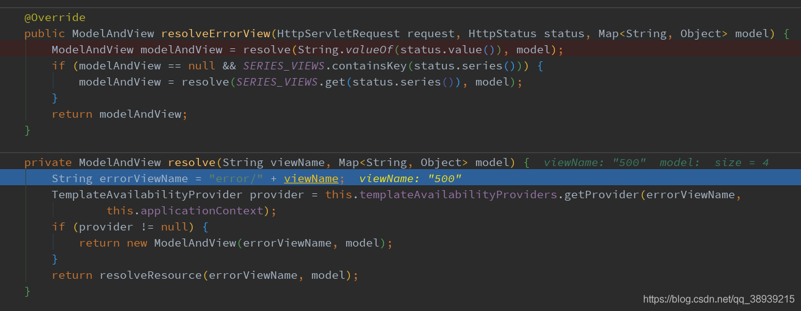
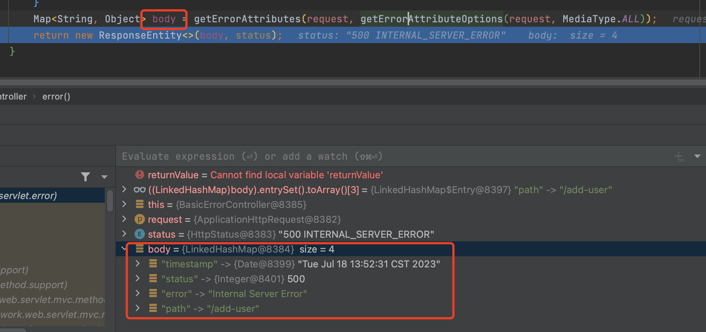

## sprintboot的错误处理

springboot的所有的错误处理都写在了ErrorMvcAutoConfiguration中，已经在自动装配中被装载到了应用！


#### 一. 错误处理的图解




#### 二、错误处理源码分析

我们回到`springboot请求处理源码分析`一文的`doDispatch方法中`，代码如下

```java
protected void doDispatch(HttpServletRequest request, HttpServletResponse response) throws Exception {
  // 封装一下Request请求
  HttpServletRequest processedRequest = request;
  // 初始化HandlerExecutionChain
  HandlerExecutionChain mappedHandler = null;
  boolean multipartRequestParsed = false;

  WebAsyncManager asyncManager = WebAsyncUtils.getAsyncManager(request);

  try {
    ModelAndView mv = null;
    Exception dispatchException = null;

    try {
      // 检查是否文件上传
      processedRequest = checkMultipart(request);
      multipartRequestParsed = (processedRequest != request);
      // 寻找到Request对应哪一个Hander（controller）方法
      mappedHandler = getHandler(processedRequest);
      if (mappedHandler == null) {
        noHandlerFound(processedRequest, response);
        return;
      }

      // Determine handler adapter for the current request.
      HandlerAdapter ha = getHandlerAdapter(mappedHandler.getHandler());

      // Process last-modified header, if supported by the handler.
      String method = request.getMethod();
      boolean isGet = "GET".equals(method);
      if (isGet || "HEAD".equals(method)) {
        long lastModified = ha.getLastModified(request, mappedHandler.getHandler());
        if (new ServletWebRequest(request, response).checkNotModified(lastModified) && isGet) {
          return;
        }
      }

      if (!mappedHandler.applyPreHandle(processedRequest, response)) {
        return;
      }

      // Actually invoke the handler.
      mv = ha.handle(processedRequest, response, mappedHandler.getHandler());

      if (asyncManager.isConcurrentHandlingStarted()) {
        return;
      }

      applyDefaultViewName(processedRequest, mv);
      mappedHandler.applyPostHandle(processedRequest, response, mv);
    }
    catch (Exception ex) {
      dispatchException = ex;
    }
    catch (Throwable err) {
      // As of 4.3, we're processing Errors thrown from handler methods as well,
      // making them available for @ExceptionHandler methods and other scenarios.
      dispatchException = new NestedServletException("Handler dispatch failed", err);
    }
    processDispatchResult(processedRequest, response, mappedHandler, mv, dispatchException);
  }
  catch (Exception ex) {
    triggerAfterCompletion(processedRequest, response, mappedHandler, ex);
  }
  catch (Throwable err) {
    triggerAfterCompletion(processedRequest, response, mappedHandler,
                           new NestedServletException("Handler processing failed", err));
  }
  finally {
    if (asyncManager.isConcurrentHandlingStarted()) {
      // Instead of postHandle and afterCompletion
      if (mappedHandler != null) {
        mappedHandler.applyAfterConcurrentHandlingStarted(processedRequest, response);
      }
    }
    else {
      // Clean up any resources used by a multipart request.
      if (multipartRequestParsed) {
        cleanupMultipart(processedRequest);
      }
    }
  }
}


```

调用`ha.handle(......)`执行目标方法，在执行过程中抛出的所有的异常都会被如下代码捕获，并把异常信息放到dispatchException

```java
catch (Exception ex) {
  dispatchException = ex;
}
```

随后会执行`processDispatchResult(......)`方法，代码如下

```java
private void processDispatchResult(HttpServletRequest request, HttpServletResponse response,
			@Nullable HandlerExecutionChain mappedHandler, @Nullable ModelAndView mv,
			@Nullable Exception exception) throws Exception {

		boolean errorView = false;

		if (exception != null) {
			if (exception instanceof ModelAndViewDefiningException mavDefiningException) {
				logger.debug("ModelAndViewDefiningException encountered", exception);
				mv = mavDefiningException.getModelAndView();
			}
			else {
				Object handler = (mappedHandler != null ? mappedHandler.getHandler() : null);
				mv = processHandlerException(request, response, handler, exception);
				errorView = (mv != null);
			}
		}

		// Did the handler return a view to render?
		if (mv != null && !mv.wasCleared()) {
			render(mv, request, response);
			if (errorView) {
				WebUtils.clearErrorRequestAttributes(request);
			}
		}
		else {
			if (logger.isTraceEnabled()) {
				logger.trace("No view rendering, null ModelAndView returned.");
			}
		}

		if (WebAsyncUtils.getAsyncManager(request).isConcurrentHandlingStarted()) {
			// Concurrent handling started during a forward
			return;
		}

		if (mappedHandler != null) {
			// Exception (if any) is already handled..
			mappedHandler.triggerAfterCompletion(request, response, null);
		}
	}
```

最终会执行`mappedHandler.triggerAfterCompletion(request, response, null);`这行代码

```java
void triggerAfterCompletion(HttpServletRequest request, HttpServletResponse response, @Nullable Exception ex) {
		for (int i = this.interceptorIndex; i >= 0; i--) {
			HandlerInterceptor interceptor = this.interceptorList.get(i);
			try {
				interceptor.afterCompletion(request, response, this.handler, ex);
			}
			catch (Throwable ex2) {
				logger.error("HandlerInterceptor.afterCompletion threw exception", ex2);
			}
		}
	}
```

遍历执行所有拦截器的`afterCompletion`方法，此时目标方法执行是有错误（异常）的，随后有一个拦截器会判断出现了异常，就把请求转发到了BasicErrorController中的/error地址！

`BasicErrorController`已经在`ErrorMvcAutoConfiguration`被初始化了！我们后续去看`BasicErrorController`的代码



 可以看到这个RequestMapping地址，该地址分为三种情况：

- 如果你在配置文件（properties、yml）配置了server.error.path的话，就会使用你配置的异常处理地址
- 如果没有就会使用你配置的error.path路径地址
- 如果还是没有，默认使用/error来作为发生异常的处理地址

在看下具体的方法


可以看到errorHtml()方法和error()方法的注解内容，第一个方法的注解标注了请求的类型，也就是说当请求来自页面时返回的是一个自定义页面或者error页面。第二个方法没有使用类型标注，返回的是一个ResponseEntity类型的对象。


在返回自定义页面或者error页面的时候，有个`resolveErrorView`方法



通过`resolver.resolveErrorView(request, status, model);`继续往里看



我们发现首先尝试去解析 <font color="red"> "error/"+状态码 ModelAndView </font>，即classpath;/templates/error/状态码.html，

如果在classpath;/templates/error/中没有对应状态码的html文件，就再调用resolveResource(...)方法，到静态资源文件夹classpath:/META-INF/resources/、classpath:/resources/、 classpath:/static/、classpath:/public/ 中找 `状态码.html`文件

如果都没有，怎么办？

会调用`new ModelAndView("error", model)`去初始化error视图，error视图在哪？

在`ErrorMvcAutoConfiguration`中做的初始化

```java
@Configuration(proxyBeanMethods = false)
	@ConditionalOnProperty(prefix = "server.error.whitelabel", name = "enabled", matchIfMissing = true)
	@Conditional(ErrorTemplateMissingCondition.class)
	protected static class WhitelabelErrorViewConfiguration {

		private final StaticView defaultErrorView = new StaticView();

		@Bean(name = "error")
		@ConditionalOnMissingBean(name = "error")
		public View defaultErrorView() {
			return this.defaultErrorView;
		}

		// If the user adds @EnableWebMvc then the bean name view resolver from
		// WebMvcAutoConfiguration disappears, so add it back in to avoid disappointment.
		@Bean
		@ConditionalOnMissingBean
		public BeanNameViewResolver beanNameViewResolver() {
			BeanNameViewResolver resolver = new BeanNameViewResolver();
			resolver.setOrder(Ordered.LOWEST_PRECEDENCE - 10);
			return resolver;
		}

	}
```


在返回一个ResponseEntity类型的对象的时候，有个`getErrorAttributes`方法，获取到返回的数据




