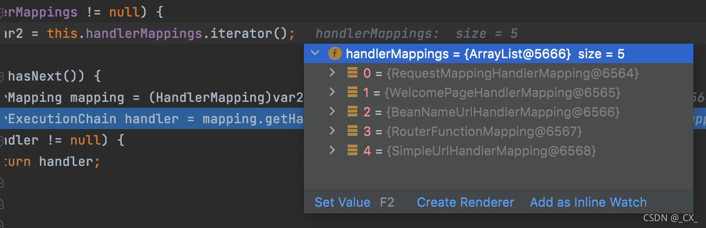
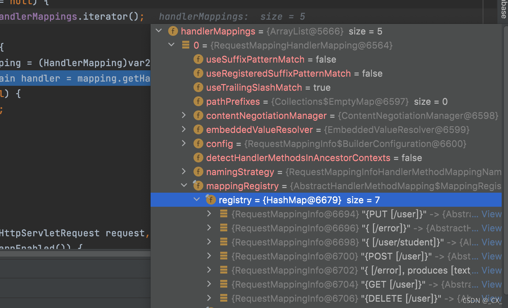
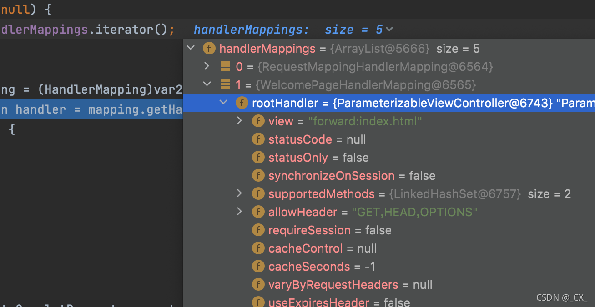

## springboot请求处理源码分析

我们已经知道了DispatcherServletAutoConfiguration已经被自动装配进行了加载。


在DispatcherServletAutoConfiguration中，创建了一个名为`dispatcherServlet`的bean

```java
@Bean(name = DEFAULT_DISPATCHER_SERVLET_BEAN_NAME)
public DispatcherServlet dispatcherServlet(WebMvcProperties webMvcProperties) {
  DispatcherServlet dispatcherServlet = new DispatcherServlet();
  dispatcherServlet.setDispatchOptionsRequest(webMvcProperties.isDispatchOptionsRequest());
  dispatcherServlet.setDispatchTraceRequest(webMvcProperties.isDispatchTraceRequest());
  dispatcherServlet.setThrowExceptionIfNoHandlerFound(webMvcProperties.isThrowExceptionIfNoHandlerFound());
  dispatcherServlet.setPublishEvents(webMvcProperties.isPublishRequestHandledEvents());
  dispatcherServlet.setEnableLoggingRequestDetails(webMvcProperties.isLogRequestDetails());
  return dispatcherServlet;
}
```

而，DispatcherServlet 继承 FrameworkServlet 继承 HttpServletBean 继承 HttpServlet，我们都知道，当一个请求发送给服务器时，服务器底层会找到发送请求的地址，并执行对应的Servlet 方法，在**HttpServlet**类中，将 四种请求的方法封装成为四种do* 方法，我们就从这里下手，这里就是处理请求的入口。

**FrameworkServlet 继承了HttpServlet，查找FrameworkServlet中重写的doGet和doPost方法等等**

```java
protected final void doGet(HttpServletRequest request, HttpServletResponse response) throws ServletException, IOException {
  this.processRequest(request, response);
}

protected final void doPost(HttpServletRequest request, HttpServletResponse response) throws ServletException, IOException {
  this.processRequest(request, response);
}

protected final void doPut(HttpServletRequest request, HttpServletResponse response) throws ServletException, IOException {
  this.processRequest(request, response);
}

protected final void doDelete(HttpServletRequest request, HttpServletResponse response) throws ServletException, IOException {
  this.processRequest(request, response);
}

```

**我们发现这么多的 do 方法中，都是在执行这个 processRequest 方法**

**进入到 processRequest方法中**

```java
protected final void processRequest(HttpServletRequest request, HttpServletResponse response) throws ServletException, IOException {
  // 初始化的过程
  long startTime = System.currentTimeMillis();
  Throwable failureCause = null;
  LocaleContext previousLocaleContext = LocaleContextHolder.getLocaleContext();
  LocaleContext localeContext = this.buildLocaleContext(request);
  RequestAttributes previousAttributes = RequestContextHolder.getRequestAttributes();
  ServletRequestAttributes requestAttributes = this.buildRequestAttributes(request, response, previousAttributes);
  WebAsyncManager asyncManager = WebAsyncUtils.getAsyncManager(request);
  asyncManager.registerCallableInterceptor(FrameworkServlet.class.getName(), new FrameworkServlet.RequestBindingInterceptor());
  this.initContextHolders(request, localeContext, requestAttributes);

  try {
    // 执行核心方法 doService
    this.doService(request, response);
  } catch (IOException | ServletException var16) {
    failureCause = var16;
    throw var16;
  } catch (Throwable var17) {
    failureCause = var17;
    throw new NestedServletException("Request processing failed", var17);
  } finally {
    this.resetContextHolders(request, previousLocaleContext, previousAttributes);
    if (requestAttributes != null) {
      requestAttributes.requestCompleted();
    }

    this.logResult(request, response, (Throwable)failureCause, asyncManager);
    this.publishRequestHandledEvent(request, response, startTime, (Throwable)failureCause);
  }

}

```

通过查看 processRequest 方法，我们发现此方法做了大量的初始化，并且执行了另一个核心方法 doService 方法

**查看这个doService方法，发现是一个抽象方法， 下层来实现的，于是我们来到了DispatcherServlet这个类中，果然发现了doService的实现方法**

```java
protected void doService(HttpServletRequest request, HttpServletResponse response) throws Exception {
  this.logRequest(request);
  Map<String, Object> attributesSnapshot = null;
  if (WebUtils.isIncludeRequest(request)) {
    attributesSnapshot = new HashMap();
    Enumeration attrNames = request.getAttributeNames();

    label95:
    while(true) {
      String attrName;
      do {
        if (!attrNames.hasMoreElements()) {
          break label95;
        }

        attrName = (String)attrNames.nextElement();
      } while(!this.cleanupAfterInclude && !attrName.startsWith("org.springframework.web.servlet"));

      attributesSnapshot.put(attrName, request.getAttribute(attrName));
    }
  }

  request.setAttribute(WEB_APPLICATION_CONTEXT_ATTRIBUTE, this.getWebApplicationContext());
  request.setAttribute(LOCALE_RESOLVER_ATTRIBUTE, this.localeResolver);
  request.setAttribute(THEME_RESOLVER_ATTRIBUTE, this.themeResolver);
  request.setAttribute(THEME_SOURCE_ATTRIBUTE, this.getThemeSource());
  if (this.flashMapManager != null) {
    FlashMap inputFlashMap = this.flashMapManager.retrieveAndUpdate(request, response);
    if (inputFlashMap != null) {
      request.setAttribute(INPUT_FLASH_MAP_ATTRIBUTE, Collections.unmodifiableMap(inputFlashMap));
    }

    request.setAttribute(OUTPUT_FLASH_MAP_ATTRIBUTE, new FlashMap());
    request.setAttribute(FLASH_MAP_MANAGER_ATTRIBUTE, this.flashMapManager);
  }

  // 上面的代码都是在进行初始化操作

  try {
    // 最终执行了这个方法
    this.doDispatch(request, response);
  } finally {
    if (!WebAsyncUtils.getAsyncManager(request).isConcurrentHandlingStarted() && attributesSnapshot != null) {
      this.restoreAttributesAfterInclude(request, attributesSnapshot);
    }

  }

}

```

我们发现这个方法的结构和processRequest 方法的结构大体相同，先做出初始化，然后去调用了另一个核心方法 doDispatch方法

**通过DispatcherServlet中重写的doService方法，我们可以看出是调用了doDispatch这个方法，到这里我们就能够知道，每次请求都会调用这个核心方法**

进入doDispatch方法

```java
protected void doDispatch(HttpServletRequest request, HttpServletResponse response) throws Exception {
  // 封装一下Request请求
  HttpServletRequest processedRequest = request;
  // 初始化HandlerExecutionChain
  HandlerExecutionChain mappedHandler = null;
  boolean multipartRequestParsed = false;

  WebAsyncManager asyncManager = WebAsyncUtils.getAsyncManager(request);

  try {
    ModelAndView mv = null;
    Exception dispatchException = null;

    try {
      // 检查是否文件上传
      processedRequest = checkMultipart(request);
      multipartRequestParsed = (processedRequest != request);
      // 寻找到Request对应哪一个Hander（controller）方法
      mappedHandler = getHandler(processedRequest);
      if (mappedHandler == null) {
        noHandlerFound(processedRequest, response);
        return;
      }

      // Determine handler adapter for the current request.
      HandlerAdapter ha = getHandlerAdapter(mappedHandler.getHandler());

      // Process last-modified header, if supported by the handler.
      String method = request.getMethod();
      boolean isGet = "GET".equals(method);
      if (isGet || "HEAD".equals(method)) {
        long lastModified = ha.getLastModified(request, mappedHandler.getHandler());
        if (new ServletWebRequest(request, response).checkNotModified(lastModified) && isGet) {
          return;
        }
      }

      if (!mappedHandler.applyPreHandle(processedRequest, response)) {
        return;
      }

      // Actually invoke the handler.
      mv = ha.handle(processedRequest, response, mappedHandler.getHandler());

      if (asyncManager.isConcurrentHandlingStarted()) {
        return;
      }

      applyDefaultViewName(processedRequest, mv);
      mappedHandler.applyPostHandle(processedRequest, response, mv);
    }
    catch (Exception ex) {
      dispatchException = ex;
    }
    catch (Throwable err) {
      // As of 4.3, we're processing Errors thrown from handler methods as well,
      // making them available for @ExceptionHandler methods and other scenarios.
      dispatchException = new NestedServletException("Handler dispatch failed", err);
    }
    processDispatchResult(processedRequest, response, mappedHandler, mv, dispatchException);
  }
  catch (Exception ex) {
    triggerAfterCompletion(processedRequest, response, mappedHandler, ex);
  }
  catch (Throwable err) {
    triggerAfterCompletion(processedRequest, response, mappedHandler,
                           new NestedServletException("Handler processing failed", err));
  }
  finally {
    if (asyncManager.isConcurrentHandlingStarted()) {
      // Instead of postHandle and afterCompletion
      if (mappedHandler != null) {
        mappedHandler.applyAfterConcurrentHandlingStarted(processedRequest, response);
      }
    }
    else {
      // Clean up any resources used by a multipart request.
      if (multipartRequestParsed) {
        cleanupMultipart(processedRequest);
      }
    }
  }
}

```

其中有个`getHandler()`方法

```java
@Nullable
protected HandlerExecutionChain getHandler(HttpServletRequest request) throws Exception {
  if (this.handlerMappings != null) {
    for (HandlerMapping mapping : this.handlerMappings) {
      HandlerExecutionChain handler = mapping.getHandler(request);
      if (handler != null) {
        return handler;
      }
    }
  }
  return null;
}

```

在方法的执行过程中我们注意到，有这样一个方法，叫handlerMapping 方法，这个方法的作用就是根据请求找到对应的映射，得到相应的 Handler（Controller）来处理这个请求

**寻找请求对应的handlerMappings的方法**

```java
@Nullable
protected HandlerExecutionChain getHandler(HttpServletRequest request) throws Exception {
  if (this.handlerMappings != null) {
    for (HandlerMapping mapping : this.handlerMappings) {
      HandlerExecutionChain handler = mapping.getHandler(request);
      if (handler != null) {
        return handler;
      }
    }
  }
  return null;
}

```

我们通过debug方式来查看，发现springboot中给出了五个HandlerMapping



再来分析 getHandler 方法，我们可以得出在寻找相关的Handler时，最先寻找的是RequestMappingHandlerMapping，即我们编写的Controller的优先级是最高的，这也解释了我在前面所讲的Controller的优先级是最高的。

**在HandlerMapping中我们可以找到我们在Controller层中编写的控制器，也进一步证明了我的猜想**



**解释了默认情况下的WelcomePageHandlerMapping，视图默认重定向index.html，这里解释了默认情况下的静态资源的index.html 作为欢迎页面**




再回到doDispatch方法中

```java
protected void doDispatch(HttpServletRequest request, HttpServletResponse response) throws Exception {
  // 封装一下Request请求
  HttpServletRequest processedRequest = request;
  // 初始化HandlerExecutionChain
  HandlerExecutionChain mappedHandler = null;
  boolean multipartRequestParsed = false;

  WebAsyncManager asyncManager = WebAsyncUtils.getAsyncManager(request);

  try {
    ModelAndView mv = null;
    Exception dispatchException = null;

    try {
      // 检查是否文件上传
      processedRequest = checkMultipart(request);
      multipartRequestParsed = (processedRequest != request);
      // 寻找到Request对应哪一个Hander（controller）方法
      mappedHandler = getHandler(processedRequest);
      if (mappedHandler == null) {
        noHandlerFound(processedRequest, response);
        return;
      }

      // Determine handler adapter for the current request.
      HandlerAdapter ha = getHandlerAdapter(mappedHandler.getHandler());

      // Process last-modified header, if supported by the handler.
      String method = request.getMethod();
      boolean isGet = "GET".equals(method);
      if (isGet || "HEAD".equals(method)) {
        long lastModified = ha.getLastModified(request, mappedHandler.getHandler());
        if (new ServletWebRequest(request, response).checkNotModified(lastModified) && isGet) {
          return;
        }
      }

      if (!mappedHandler.applyPreHandle(processedRequest, response)) {
        return;
      }

      // Actually invoke the handler.
      mv = ha.handle(processedRequest, response, mappedHandler.getHandler());

      if (asyncManager.isConcurrentHandlingStarted()) {
        return;
      }

      applyDefaultViewName(processedRequest, mv);
      mappedHandler.applyPostHandle(processedRequest, response, mv);
    }
    catch (Exception ex) {
      dispatchException = ex;
    }
    catch (Throwable err) {
      // As of 4.3, we're processing Errors thrown from handler methods as well,
      // making them available for @ExceptionHandler methods and other scenarios.
      dispatchException = new NestedServletException("Handler dispatch failed", err);
    }
    processDispatchResult(processedRequest, response, mappedHandler, mv, dispatchException);
  }
  catch (Exception ex) {
    triggerAfterCompletion(processedRequest, response, mappedHandler, ex);
  }
  catch (Throwable err) {
    triggerAfterCompletion(processedRequest, response, mappedHandler,
                           new NestedServletException("Handler processing failed", err));
  }
  finally {
    if (asyncManager.isConcurrentHandlingStarted()) {
      // Instead of postHandle and afterCompletion
      if (mappedHandler != null) {
        mappedHandler.applyAfterConcurrentHandlingStarted(processedRequest, response);
      }
    }
    else {
      // Clean up any resources used by a multipart request.
      if (multipartRequestParsed) {
        cleanupMultipart(processedRequest);
      }
    }
  }
}

```

getHandler()方法已经得到了需要哪个HandlerMapping去处理对应的请求了，下面就会调用`getHandlerAdapter()`方法获取对应的HandlerMapping的适配器HandlerAdapter，RequestMappingHandlerAdapter。springboot提供四种HandlerAdapter。


- RequestMappingHandlerAdapter 支持方法上标注 @RequestMapping
- HandlerFunctionAdapter 支持函数式编程

随后调用`ha.handle(......)`执行目标方法

```java
// Actually invoke the handle 
mv = ha.handle(processedRequest, response, mappedHandler.getHandler());
```

进入后发现执行 HandleInternal

```java
return handleInternal(request, response, (HandlerMethod) handler);
```

再深入发现进入了RequestMappingHandlerAdapter类中的handleInternal方法

```java
@Override
protected ModelAndView handleInternal(HttpServletRequest request,
                                      HttpServletResponse response, HandlerMethod handlerMethod) throws Exception {

  ModelAndView mav;
  checkRequest(request);

  // Execute invokeHandlerMethod in synchronized block if required.
  if (this.synchronizeOnSession) {
    HttpSession session = request.getSession(false);
    if (session != null) {
      Object mutex = WebUtils.getSessionMutex(session);
      synchronized (mutex) {
        mav = invokeHandlerMethod(request, response, handlerMethod);
      }
    }
    else {
      // No HttpSession available -> no mutex necessary
      mav = invokeHandlerMethod(request, response, handlerMethod);
    }
  }
  else {
    // No synchronization on session demanded at all...
    mav = invokeHandlerMethod(request, response, handlerMethod);
  }

  if (!response.containsHeader(HEADER_CACHE_CONTROL)) {
    if (getSessionAttributesHandler(handlerMethod).hasSessionAttributes()) {
      applyCacheSeconds(response, this.cacheSecondsForSessionAttributeHandlers);
    }
    else {
      prepareResponse(response);
    }
  }

  return mav;
}
```

其中`invokeHandlerMethod(.....)`方法，我们进去

```java
@Nullable
protected ModelAndView invokeHandlerMethod(HttpServletRequest request,
                                           HttpServletResponse response, HandlerMethod handlerMethod) throws Exception {

  ServletWebRequest webRequest = new ServletWebRequest(request, response);
  WebDataBinderFactory binderFactory = getDataBinderFactory(handlerMethod);
  ModelFactory modelFactory = getModelFactory(handlerMethod, binderFactory);

  ServletInvocableHandlerMethod invocableMethod = createInvocableHandlerMethod(handlerMethod);
  if (this.argumentResolvers != null) {
    invocableMethod.setHandlerMethodArgumentResolvers(this.argumentResolvers);
  }
  if (this.returnValueHandlers != null) {
    invocableMethod.setHandlerMethodReturnValueHandlers(this.returnValueHandlers);
  }
  invocableMethod.setDataBinderFactory(binderFactory);
  invocableMethod.setParameterNameDiscoverer(this.parameterNameDiscoverer);

  ModelAndViewContainer mavContainer = new ModelAndViewContainer();
  mavContainer.addAllAttributes(RequestContextUtils.getInputFlashMap(request));
  modelFactory.initModel(webRequest, mavContainer, invocableMethod);
  mavContainer.setIgnoreDefaultModelOnRedirect(this.ignoreDefaultModelOnRedirect);

  AsyncWebRequest asyncWebRequest = WebAsyncUtils.createAsyncWebRequest(request, response);
  asyncWebRequest.setTimeout(this.asyncRequestTimeout);

  WebAsyncManager asyncManager = WebAsyncUtils.getAsyncManager(request);
  asyncManager.setTaskExecutor(this.taskExecutor);
  asyncManager.setAsyncWebRequest(asyncWebRequest);
  asyncManager.registerCallableInterceptors(this.callableInterceptors);
  asyncManager.registerDeferredResultInterceptors(this.deferredResultInterceptors);

  if (asyncManager.hasConcurrentResult()) {
    Object result = asyncManager.getConcurrentResult();
    mavContainer = (ModelAndViewContainer) asyncManager.getConcurrentResultContext()[0];
    asyncManager.clearConcurrentResult();
    LogFormatUtils.traceDebug(logger, traceOn -> {
      String formatted = LogFormatUtils.formatValue(result, !traceOn);
      return "Resume with async result [" + formatted + "]";
    });
    invocableMethod = invocableMethod.wrapConcurrentResult(result);
  }

  invocableMethod.invokeAndHandle(webRequest, mavContainer);
  if (asyncManager.isConcurrentHandlingStarted()) {
    return null;
  }

  return getModelAndView(mavContainer, modelFactory, webRequest);
}
```

- invocableMethod.setHandlerMethodArgumentResolvers(this.argumentResolvers);把系统中所有的参数解析器获取到。

- invocableMethod.setHandlerMethodReturnValueHandlers(this.returnValueHandlers); 把系统中所有的返回值解析器获取到。

- invocableMethod.invokeAndHandle(webRequest, mavContainer); 执行 invokeForRequest 方法，断点就会直接到 Controller中去，所以 invokeForRequest 方法中就是最终的方法

  ```java
  public Object invokeForRequest(NativeWebRequest request, @Nullable ModelAndViewContainer mavContainer, Object... providedArgs) throws Exception {
    // 确定所有参数，将所有参数获取在 args 这个数组中，调用Controller中的方法时传入这个参数
    Object[] args = this.getMethodArgumentValues(request, mavContainer, providedArgs);
    if (logger.isTraceEnabled()) {
      logger.trace("Arguments: " + Arrays.toString(args));
    }
    // 通过反射来执行我们 Controller 中的方法
    return this.doInvoke(args);
  }
  
  ```

  getMethodArgumentValues方法会进入

  ```java
  protected Object[] getMethodArgumentValues(NativeWebRequest request, @Nullable ModelAndViewContainer mavContainer,Object... providedArgs) throws Exception {
  
    MethodParameter[] parameters = getMethodParameters(); //获取到方法上所有的请求参数，并不是用户提交的请求的参数
    if (ObjectUtils.isEmpty(parameters)) {
      return EMPTY_ARGS;
    }
  
    Object[] args = new Object[parameters.length];
    for (int i = 0; i < parameters.length; i++) { //遍历所有的参数
      MethodParameter parameter = parameters[i];
      parameter.initParameterNameDiscovery(this.parameterNameDiscoverer);
      args[i] = findProvidedArgument(parameter, providedArgs);
      if (args[i] != null) {
        continue;
      }
      if (!this.resolvers.supportsParameter(parameter)) {//遍历所有的ArgumentResolvers判断是不是支持该参数，如果全部不支持就抛出异常
        throw new IllegalStateException(formatArgumentError(parameter, "No suitable resolver"));
      }
      try {
        args[i] = this.resolvers.resolveArgument(parameter, mavContainer, request, this.dataBinderFactory);
      }
      catch (Exception ex) {
        // Leave stack trace for later, exception may actually be resolved and handled...
        if (logger.isDebugEnabled()) {
          String exMsg = ex.getMessage();
          if (exMsg != null && !exMsg.contains(parameter.getExecutable().toGenericString())) {
            logger.debug(formatArgumentError(parameter, exMsg));
          }
        }
        throw ex;
      }
    }
    return args;
  ```

  通过`resolveArgument`进入方法

  ```java
  @Override
  @Nullable
  public Object resolveArgument(MethodParameter parameter, @Nullable ModelAndViewContainer mavContainer,
                                NativeWebRequest webRequest, @Nullable WebDataBinderFactory binderFactory) throws Exception {
  
    HandlerMethodArgumentResolver resolver = getArgumentResolver(parameter); //遍历所有的ArgumentResolver，通过每个ArgumentResolver的supportsParameter返回true则可用，这儿只会获取到一个ArgumentResolver。
    if (resolver == null) {
      throw new IllegalArgumentException("Unsupported parameter type [" +
                                         parameter.getParameterType().getName() + "]. supportsParameter should be called first.");
    }
    return resolver.resolveArgument(parameter, mavContainer, webRequest, binderFactory);
  }
  ```

  随着调用`resolver.resolveArgument`方法，发现resolveArgument方法是HandlerMethodArgumentResolver接口的方法，实现的方法有很多，这儿就需要打断点自己去看了！

  

  

  断点测试代码如下：

  新建一个Vo

  ```java
  @Data
  public class UserVo {
  
      private Integer age;
  
      private String name;
  
      private Float score;
  }
  ```

  新建Controller

  ```java
  @PostMapping("/add-user")
  public String addUser(@RequestBody UserVo userInfo){
  
    System.out.println(userInfo);
  
    return "";
  }
  ```

  发送POST请求测试

  