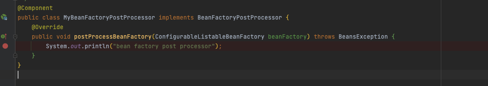

## 自己写一个BeanFactoryPostProcessor并打上断点进行测试


#### 写一个IndexController，代码如下

```java
@Slf4j
@RestController
public class IndexController {


    @GetMapping("/index")
    public String index(){

      
        return "";

    }

}
```


#### 自己写一个BeanFactoryPostProcessor，代码如下

```java
@Component
public class MyBeanFactoryPostProcessor implements BeanFactoryPostProcessor {
    @Override
    public void postProcessBeanFactory(ConfigurableListableBeanFactory beanFactory) throws BeansException {
        System.out.println("bean factory post processor");
    }
}
```


#### 给代码中的一行打上断点




#### debug方式运行代码，查看beanFactory中的数据

重点关注`beanDefinitionMap`和`beanDefinitionNames`这两个属性，他们中存储这所有待初始化的bean对象


看看上面写的indexController在不在上述两个属性中。