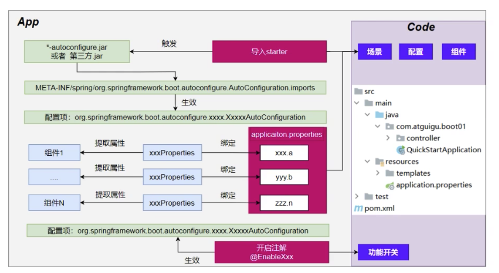

## springboot的自动配置原理

#### 术语

以`spring-boot-starter`开头的依赖，都是springboot的场景启动器。

#### 依赖流程以及自动装载、自动配置流程

1. 项目中引入`spring-boot-starter-web`依赖，即依赖了web的场景启动器。
2. web的场景启动器又依赖了，`spring-boot-starter-json`的json场景启动器、`spring-boot-starter-tomcat`的tomcat的场景启动器、`spring-webmvc`。

2. 每一个场景启动器都引入了一个`spring-boot-starter`的核心场景启动器。
3. 核心场景启动器，引入了`spring-boot-autoconfigure`依赖。
4. `spring-boot-autoconfigure`依赖，因为不是在本项目应用启动类所在包及其子包中，所以会找`spring-boot-autoconfigure`中的`META-INF/spring/org.springframework.boot.autoconfigure.AutoConfiguration.imports`文件中的所有类，加载到应用中。
5. 对`META-INF/spring/org.springframework.boot.autoconfigure.AutoConfiguration.imports`文件中的类，进行逐个加载，加载过程中大量使用`@ConditionalOnBean`、`@ConditionalOnProperty`等条件判断注解，判断该类是否要生效，**实现自动装载功能**。
6. 对需要生效的类，会使用`@EnableConfigurationProperties`加载对应的属性类，去加载应用配置文件中的配置，**实现自动配置功能**。

