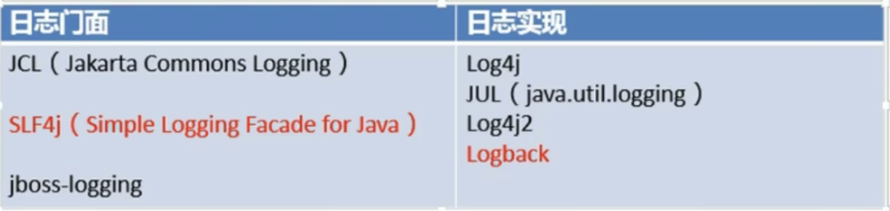

## springboot的日志架构

架构如下图：

> springboot3已经剔除了Log4j的日志实现！

日志门面概念：就是使用暴露了一堆日志的接口出来，我们想要写日志，就需要调用他们提供的接口去写。就好比连接数据库的jdbc，暴露出一堆接口，我们要使用mysql就需要使用jdbc的接口去操作建立连接、执行sql语句等。

日志实现概念：就是使用日志门面暴露的接口，帮我们封装好了一系列的实现，我们只要很简单的调用一下，就可以直接操作日志！就好比是mybatis，我们不用关心底层jdbc如何建立连接、如何执行sql语句，我们只要调用mybatis的方法就可以直接执行sql语句了！

**springboot中使用的日志组合是 SLF4J + Logback**