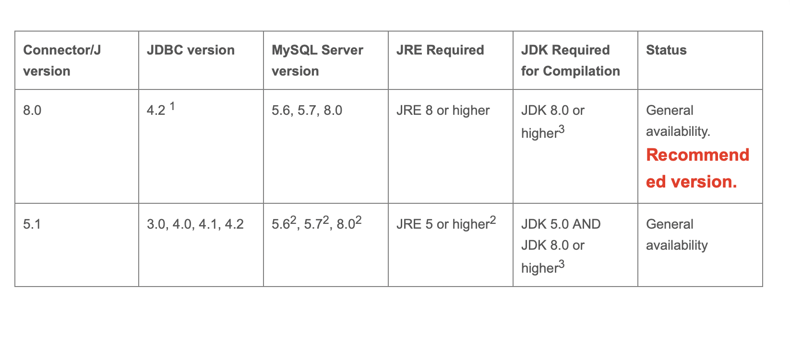

## springboot集成mysql+mybatis


版本参考：




#### 1、引入依赖

```xml
<!-- mysql的连接驱动 -->
<dependency>
    <groupId>mysql</groupId>
    <artifactId>mysql-connector-java</artifactId>
    <version>8.0.28</version>
</dependency>

<!-- mybatis的相关依赖 -->
<dependency>
    <groupId>org.mybatis.spring.boot</groupId>
    <artifactId>mybatis-spring-boot-starter</artifactId>
    <version>2.2.2</version> <!-- 如果使用springboot3.x的版本，这儿的版本也要对应升级 -->
</dependency>

<!-- 使用@Data注解的工具依赖 -->
<dependency>
    <groupId>org.projectlombok</groupId>
    <artifactId>lombok</artifactId>
    <version>1.18.24</version>
    <scope>provided</scope>
</dependency>

```


#### 2、新增项目配置

```yml
spring:
  datasource:
    password: root
    username: root
    driver-class-name: com.mysql.cj.jdbc.Driver
    url: jdbc:mysql://10.10.210.19:3306/user?useUnicode=true&characterEncoding=utf8&serverTimezone=Asia/Shanghai&zeroDateTimeBehavior=convertToNull

mybatis:
  config-location: classpath:/mybatis-config.xml
  mapper-locations: classpath:/mappers/*.xml
```

mybatis这样配置之后，就指定了mybatis的核心配置文件，原本需要在核心配置文件中配置的mysql的连接信息，也在上面进行了配置，所以在核心配置文件中就可以省略掉了！同时也指定了sql映射文件的路径，所以在核心配置文件中也可以省略掉了！


#### 3、根据配置中核心配置文件所在路径创建文件并写入

```xml
<?xml version="1.0" encoding="UTF-8"?>
            <!DOCTYPE configuration PUBLIC "-//mybatis.org//DTD Config 3.0//EN" "http://mybatis.org/dtd/mybatis-3-config.dtd">

<configuration>
  
</configuration>
```


#### 4、根据配置中sql映射文件所在路径创建sql映射文件并写入

```xml
<?xml version="1.0" encoding="UTF-8"?>
        <!DOCTYPE mapper PUBLIC "-//mybatis.org//DTD Mapper 3.0//EN" "http://mybatis.org/dtd/mybatis-3-mapper.dtd">
<mapper namespace="com.wangwei.shop.dao.xxxxxMapper"> <!-- 这儿关联那个dao层，即xml的代理接口文件全路径 -->
  <select id="xxxx" resultType="xxxx">
    sql语句
  </select>
</mapper>
```


#### 5、编写sql映射文件对应的代理接口文件

```java
略
```


#### 6、新增查询返回实体类

```java
略
```


#### 7、写个单元测试看看是否成功集成

- 在项目启动类上加一个注解

  ```java
  @MapperScan(basePackages = {"com.example.demo12.dao"})
  ```

  指定去扫描sql映射文件的所有代理接口文件，并加入到bean中。

  注意：<font color="red">可以不写这个注解，那就到具体的代理接口文件上加@Mapper注解</font>

  

- 编写单元测试文件

  ```java
  @Autowired
  private TeDao teDao;
  
  @Test
  void contextLoads() {
  
    List<TeEntity> entities = teDao.selectAll();
    System.out.println(entities);
  
  }
  ```

  能读出数据就表名集成成功！

  


