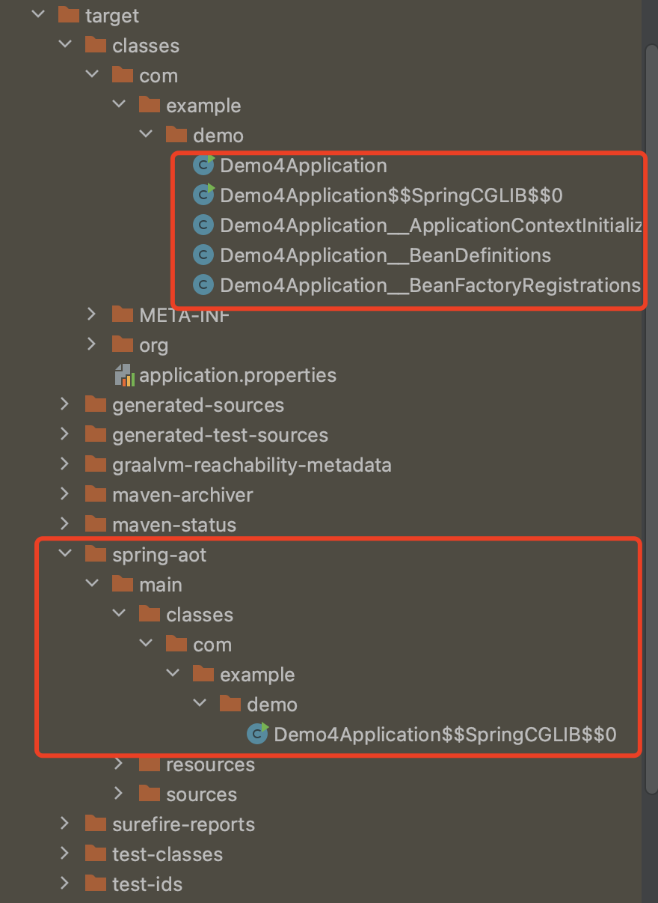

## springboot项目使用native-image打成可执行文件

>  spring boot3需要GraalVM 22.3以上的版本支持!
>
> 官方参考：https://docs.spring.io/spring-boot/docs/current/reference/html/native-image.html#native-image.developing-your-first-application.buildpacks.maven


<font color="green">***成功示例项目在project目录中！***</font>


#### 1、为什么springboot项目不能像普通java项目那样使用一行native-image命令就打成可执行文件

原因1：因为在我们讲AOT的时候就已经说明了，直接使用AOT编译成可执行文件会失去java的AOP、反射等功能，springboot中又大量使用反射、AOP等功能，所以springboot项目如果需要使用AOT就需要进行特殊处理！

原因2：springboot项目会有项目的配置文件，如果直接使用native-image打包的话，配置文件是不会被处理的！所以springboot项目如果需要使用AOT就需要进行特殊处理！


#### 2、创建一个springboot3的项目进行测试

- 创建springboot3.0版本以上的项目，java版本需要选择我们安装好的graalvm中的java17环境

  

  <font color="red">**注意：一定要选择上面的选项！**</font>

​		然后，别的依赖根据自己的情况选择


- 创建好项目之后，查看pom.xml文件中，是否存在如下的引入

  ```xml
  <parent>
      <groupId>org.springframework.boot</groupId>
      <artifactId>spring-boot-starter-parent</artifactId>
      <version>3.1.1</version>
  </parent>
  ```

  <font color="red">**因为，`spring-boot-starter-parent` 声明了 `native` profile，后面我们需要使用！**</font>


- 查看当前项目的插件是否只有如下2个

  ```xml
  <build>
    <plugins>
      <plugin>
        <groupId>org.graalvm.buildtools</groupId>
        <artifactId>native-maven-plugin</artifactId>
      </plugin>
      <plugin>
        <groupId>org.springframework.boot</groupId>
        <artifactId>spring-boot-maven-plugin</artifactId>
      </plugin>
    </plugins>
  </build>
  ```

  注意在spring-boot-maven-plugin除了版本的配置外，不需要有任何另外的配置！

​		

- 开发自己的功能

  写个controller等


- 查看没有引入`native-maven-plugin`的插件，如果没有就需要手动引入，同时需要添加configuration配置

  ```xml
  <plugin>
    <groupId>org.graalvm.buildtools</groupId>
    <artifactId>native-maven-plugin</artifactId>
    <version>0.9.21</version>
    
    <configuration>
      <!-- imageName用于设置生成的二进制文件名称 -->
      <imageName>${project.artifactId}</imageName>
      
      <!-- 指定使用native-image的入口类，填springboot的入口类全路径就行 -->
      <mainClass> com.example.boot3aot.Boot3AotApplication</mainClass>
      
      
    </configuration>
  </plugin>
  ```

  然后打开idea的maven视窗，找到插件中的native，查看native有哪些命令，如下：

  注意：<font color="blue">**参与编译的java一定要使用GraalVM的java**</font>

  ```shell
  mvn native:build #使用native-image打包项目为可执行文件
  
  #或者 
  
  mvn native:compile-no-fork #这个命令也是使用native-image打包项目为可执行文件
  ```

  <font color="red">**这个时候，编译成可执行文件是会成功的，但是执行可执行文件的时候会报错**</font>，错误如下：

  ```shell
  java.lang.IllegalArgumentException: Could not find class [com.example.boot3aot.Boot3AotApplication__ApplicationContextInitializer]
  	at org.springframework.util.ClassUtils.resolveClassName(ClassUtils.java:333)
  	at org.springframework.context.aot.AotApplicationContextInitializer.instantiateInitializer(AotApplicationContextInitializer.java:80)
  	at org.springframework.context.aot.AotApplicationContextInitializer.initialize(AotApplicationContextInitializer.java:71)
  	at org.springframework.context.aot.AotApplicationContextInitializer.lambda$forInitializerClasses$0(AotApplicationContextInitializer.java:61)
  	at org.springframework.boot.SpringApplication.applyInitializers(SpringApplication.java:603)
  	at org.springframework.boot.SpringApplication.prepareContext(SpringApplication.java:383)
  	at org.springframework.boot.SpringApplication.run(SpringApplication.java:307)
  	at org.springframework.boot.SpringApplication.run(SpringApplication.java:1302)
  	at org.springframework.boot.SpringApplication.run(SpringApplication.java:1291)
  	at com.example.boot3aot.Boot3AotApplication.main(Boot3AotApplication.java:10)
  Caused by: java.lang.ClassNotFoundException: com.example.boot3aot.Boot3AotApplication__ApplicationContextInitializer
  	at org.graalvm.nativeimage.builder/com.oracle.svm.core.hub.ClassForNameSupport.forName(ClassForNameSupport.java:123)
  	at org.graalvm.nativeimage.builder/com.oracle.svm.core.hub.ClassForNameSupport.forName(ClassForNameSupport.java:87)
  	at java.base@17.0.7/java.lang.Class.forName(DynamicHub.java:1322)
  	at java.base@17.0.7/java.lang.Class.forName(DynamicHub.java:1311)
  	at org.springframework.util.ClassUtils.forName(ClassUtils.java:283)
  	at org.springframework.util.ClassUtils.resolveClassName(ClassUtils.java:323)
  	... 9 common frames omitted
  ```

  报这个错是因为缺少一些spring boot的AOT元文件信息，需要先运行如下命令

  ```shell
  mvn clean package -Pnative
  ```

  使用上述命令打包后的项目，去target中看，是不是如下图的样子：

  

  再次运行

  ```shell
  mvn native:build #使用native-image打包项目为可执行文件
  
  #或者 
  
  mvn native:compile-no-fork #这个命令也是使用native-image打包项目为可执行文件
  ```

  运行编译出来的可执行文件，没有问题了！

