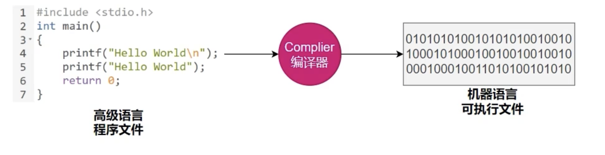

## 什么是编译、什么是AOT、什么是JIT、什么是解释器

#### 1、什么是编译

我们在上面说的AOT和JIT是不同的编译手段，那什么是编译呢？我们看下面的图

把我们写的代码，转换成机器执行的代码的过程就叫编译！

#### 2、AOT与JIT概念

- AOT：Ahead-Of-Time提前编译技术，在程序运行之前全部被编译成机器码，机器只要直接执行就可以了！
- 解释器：比如我的代码写了10行，机器要执行代码了，程序编译完第一行才能执行第一行，编译完第二行才能执行第二行，以此类推的！比如php、python等语言都是使用解释器的方式。
- JIT：Just in Time即时编译，在jvm中，解释器已经运行了一段时间，发现有些代码频繁被调用，需要提高这部分代码的执行效率，就会使用编译器将代码编译成机器码，存放起来，下次再调用到这部分代码就不需要再次编译，这整个过程叫JIT。

#### 3、AOT与JIT的对比

所谓的AOT牺牲了高级语言的一些特性，包括反射、切面等等