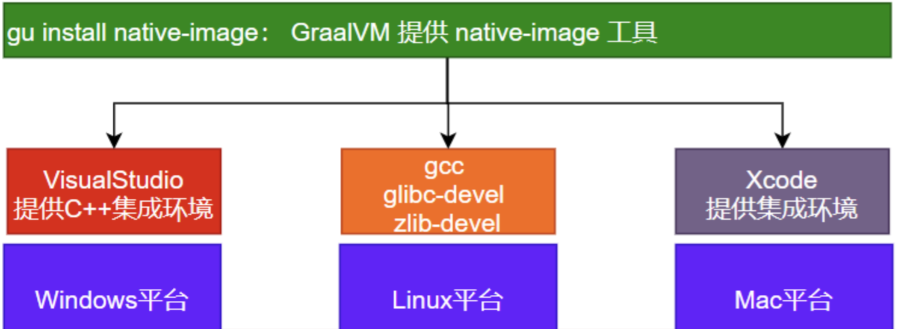

## native-image的作用

native-image是graalvm将java应用一次性编译成本地可执行文件的关键工具，但是它在各个平台需要依赖各个平台的环境，如下图

在linux平台，要使用native-image需要先安装好gcc、glibc-devel、zlib-devel

在windows平台，要使用native-image需要先安装好VisualStudio

在Mac平台，要使用native-image需要先安装好Xcode