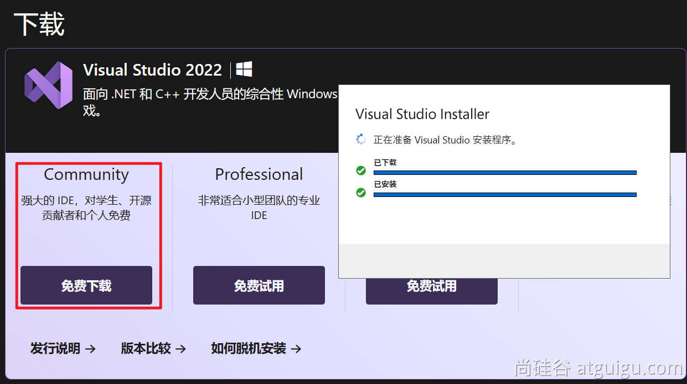
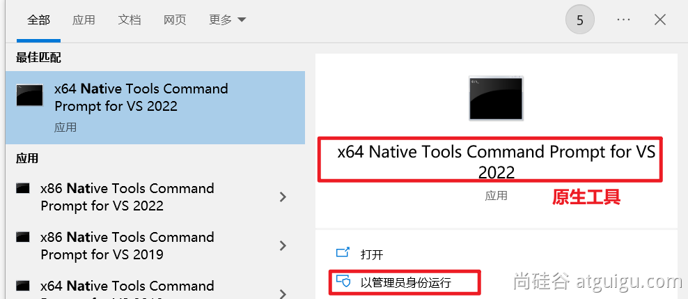

## 在Windows安装GraalVM


### 1. 安装native-image需要的VisualStudio

下载地址：https://visualstudio.microsoft.com/zh-hans/free-developer-offers/




别选中文





记住你安装的地址；


### 2. GraalVM 

#### 1. 安装

下载 GraalVM，下载地址：https://www.graalvm.org/downloads/#

注意选择java的版本和平台，然后解压到一个目录中


#### 2. 配置

修改 JAVA_HOME 与 Path，指向新bin路径


验证JDK环境为GraalVM提供的即可：


#### 3. 依赖

安装 native-image 依赖：

参考：https://www.graalvm.org/latest/reference-manual/native-image/#install-native-image

```shell
gu install native-image
```


#### 4. 验证

```shell
native-image
```


## 