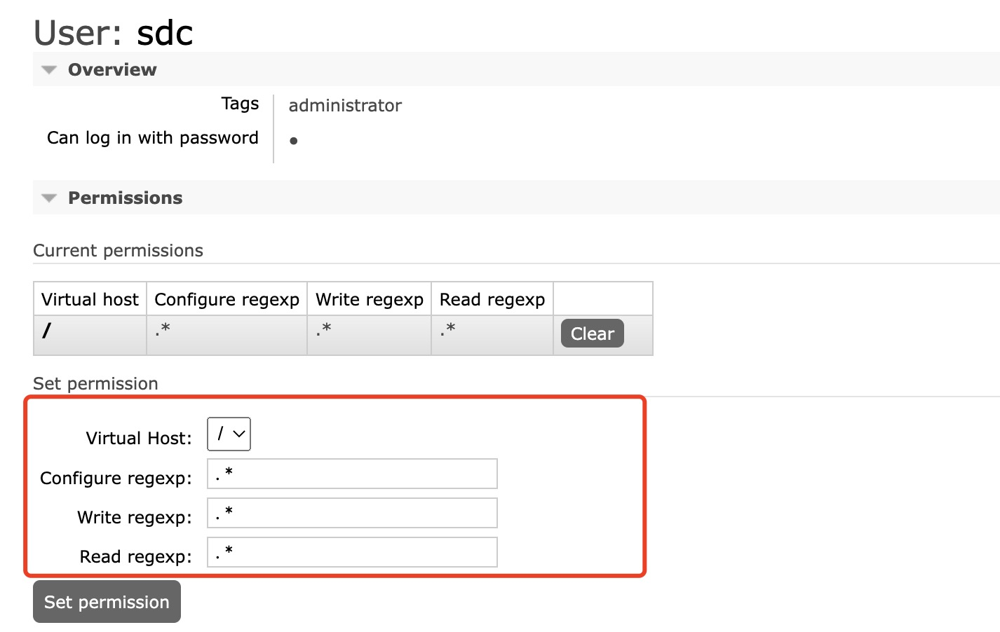

## docker安装RabbitMQ


#### 1、拉取镜像

```shell
docker pull rabbitmq:management
```


#### 2、RabbitMQ的端口及其作用

> RabbitMQ 可以开放很多端口，但是，需要我们知道的就只有如下4个端口。
>
> 更多开放端口：https://www.rabbitmq.com/networking.html

- 15672：RabbitMQ的提供web管理界面未使用ssl，需要的端口
- 5672：客户端与服务端不使用ssl方式的通讯端口，即服务端监听的非ssl的端口
- 5671：客户端与服务端使用ssl方式的通讯端口，即服务端监听的ssl的端口
- 15671：RabbitMQ的提供web管理界面使用ssl，需要的端口


#### 3、启动RabbitMQ

```shell
docker run -i -d -v /opt/rabbitmq:/var/lib/rabbitmq --name=rabbtimq -p 15672:15672 -p 5672:5672 镜像id
```


#### 4、打开浏览器

打开浏览器地址：http://localhost:15672

用户名：guest

密码：guest


#### 5、进入Admin管理中新增超级用户

用户名：sdc

密码：sdcsdc@7123

注意：新增的用户需要修改其对应的权限，才能去新增exchange、queue等



`.*`表示最大权限

#### 6、删除guest用户并重新登陆

