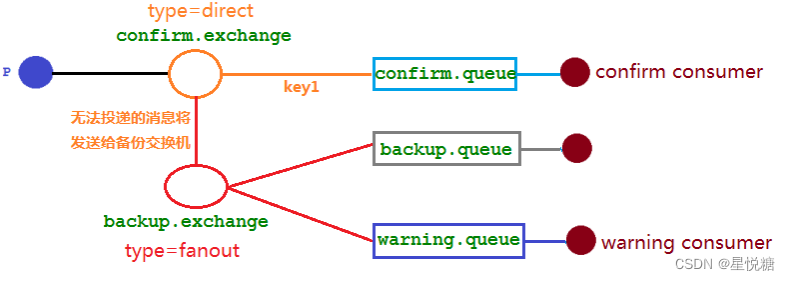

## 备份交换机概念

> 这样做的意义不是很大！只是介绍下概念。

备份交换机可以理解为 RabbitMQ 中交换机的“备胎”，当我们为某一个交换机声明一个对应的备份交换机时，就是为它创建一个备胎，当交换机接收到一条不可路由（无法投递到对应的队列）消息时，将会把这条消息转发到备份交换机中，由备份交换机来进行转发和处理，通常备份交换机的类型为 Fanout ，这样就能把所有消息都投递到与其绑定的队列中，然后我们在备份交换机下绑定一个队列，这样所有那些原交换机无法被路由的消息，就会都进 入这个队列了。当然，我们还可以建立一个报警队列，用独立的消费者来进行监测和报警。

大致架构如下：

